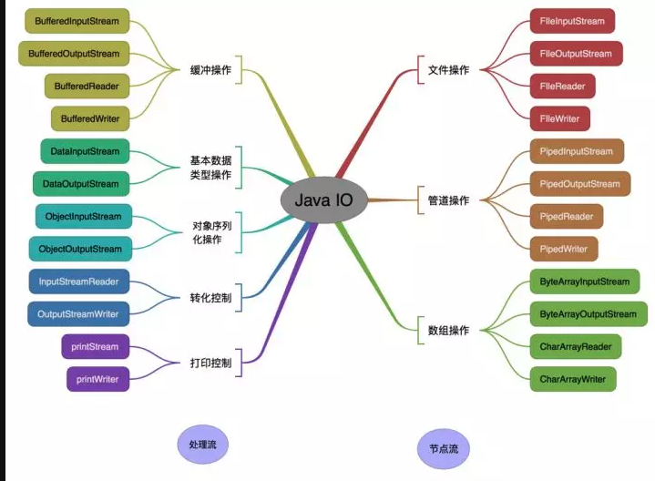
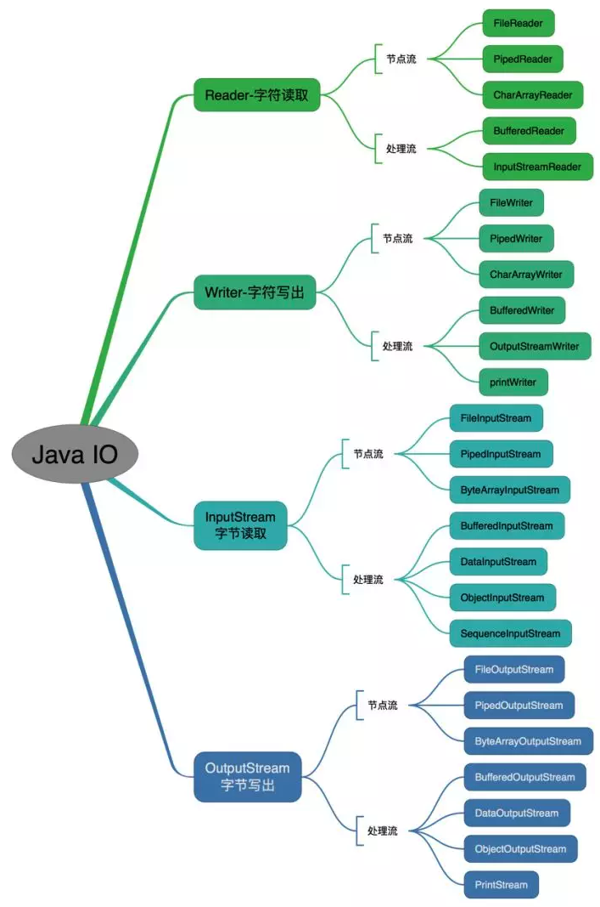

## 分类方式 



按照流的**角色划分为节点流和处理流**。

  - 节点流：直接与数据源相连，读入或读出。
  - 处理流：与节点流一块使用，在节点流的基础上，再套接一层，增加更多的功能，比如缓存，它的数据来源是节点流。

**在节点流/处理流内部，可以先按照操作对象分类，再按照面向字节/字符分类，最后按照输入还是输出分类。**

这样分类的原因是为了方便理解和记忆

- 先知道要从哪里操作，操作什么东西

  直接从数据源，还是从别的流读入的？

  如果直接是数据源，是文件还是其他什么，如果是从别的流读入的，是什么对象？

- 以什么单位进行操作

  是字节，还是字符(16位，java 内部使用UTF-16).

  字节流：以字节为单位，每次次读入或读出是8位数据。可以读任何类型数据。

  字符流：以字符为单位，每次读入或读出是16位数据。其只能读取字符类型数据。

  > java 默认UTF-16编码

- 最后在考虑是输入还是输出。

​        按照流的流向分，可以分为输入流和输出流，也就是读取和写入；


## 节点流

按操作对象分类

### 对文件进行操作(节点流）

- `FileInputStream`（字节输入流）
- `FileOutputStream`（字节输出流）
- `FileReader`（字符输入流）
- `FileWriter`（字符输出流）

### 对管道进行操作(节点流)

- `PipedInputStream`（字节输入流）,
- `PipedOutStream`（字节输出流），
- `PipedReader`（字符输入流），
- `PipedWriter`（字符输出流）。
  PipedInputStream的一个实例要和PipedOutputStream的一个实例共同使用，共同完成管道的读取写入操作。主要用于线程操作。

### 字节/字符数组流(节点流）

- `ByteArrayInputStream`
- `ByteArrayOutputStream`
- `CharArrayReader`
- `CharArrayWriter`
  是在内存中开辟了一个字节或字符数组。

> 除了上述三种是节点流，其他都是处理流，需要跟节点流配合使用。

## 处理流

附加了各种功能

### Buffered缓冲流(处理流)

- `BufferedInputStream`
- `BufferedOutputStream`
-  `BufferedReader`
-  `BufferedWriter`
是带缓冲区的处理流，缓冲区的作用的主要目的是：避免每次和硬盘打交道，提高数据访问的效率。

### 转化流（处理流）：
- `InputStreamReader`：把字节转化成字符；
- `OutputStreamWriter`：把字节转化成字符。

###  基本类型数据流（处理流）：用于操作基本数据类型值

- `DataInputStream`

- `DataOutputStream`
    因为平时若是我们输出一个8个字节的long类型或4个字节的float类型，那怎么办呢？
    
    可以一个字节一个字节输出，也可以把转换成字符串输出，但是这样转换费时间，若是直接输出该多好啊，因此这个数据流就解决了我们输出数据类型的困难。数据流可以直接输出float类型或long类型，提高了数据读写的效率。
    
### 打印流（处理流）

 - `PrintStream`
 - `PrintWriter`
    一般是打印到控制台，可以进行控制打印的地方。
 ### 对象流（处理流）

 - `ObjectInputStream`对象反序列化；
 - `ObjectOutputStream`对象序列化；
    把封装的对象直接输出，而不是一个个在转换成字符串再输出。


 ### 合并流（处理流）

 - `SequenceInputStream`：可以认为是一个工具类，将两个或者多个输入流当成一个输入流依次读取。


## 字节流和字符流的转换

1. 可对读取到的字节数据经过指定编码转换成字符；

2. 可对读取到的字符数据经过指定编码转换成字节；


 InputStreamReader:输入*流转到读流；*

```java
String fileName= "d:"+File.separator+"hello.txt";
File file=new File(fileName);
Reader read=new InputStreamReader(new FileInputStream(file));
char[] b=new char[100];
int len=read.read(b);
System.out.println(new String(b,0,len));
read.close();
```

OutputStreamWriter:*输出流转到写流；*

```java
String fileName= "d:"+File.separator+"hello.txt";
File file=new File(fileName);
Writer out=new OutputStreamWriter(new FileOutputStream(file));
out.write("hello");
out.close();
```

## IO类体系介绍

在类的继承体系上，与上边的分类方式答题是相反的,上面的方式是着眼于具体的使用过程，而类体系结构是抽象出来的概括，类体系结构中，越偏向于顶层的，离实际操作越远。

字节/字符  -> 输入/输出  -> 操作对象 

基于字节流的读写基类: InputStream和OutputStream

基于字符流的读写基类: Reader和Writer





## 装饰器模式

java Io流共涉及40多个类，这些类看上去很杂乱，但实际上很有规则，而且彼此之间存在非常紧密的联系， Java Io流的40多个类都是从如下4个抽象类基类中派生出来的。

- **InputStream/Reader**: 所有的输入流的基类，前者是字节输入流，后者是字符输入流。
- **OutputStream/Writer**: 所有输出流的基类，前者是字节输出流，后者是字符输出流。


## 使用实例

 **不使用FIle，将流中的字符转换大写小：**

```java
 public static void main(String[] args) throws IOException {
        String str = "ROLLENHOLT";
        ByteArrayInputStream input = new ByteArrayInputStream(str.getBytes());
        ByteArrayOutputStream output = new ByteArrayOutputStream();
        int temp = 0;
        while ((temp = input.read()) != -1) {
            char ch = (char) temp;
            output.write(Character.toLowerCase(ch));
        }
        String outStr = output.toString();
        input.close();
        output.close();
        System.out.println(outStr);
    }
```

**复制文件：**

```java
 public static void main(String[] args) throws IOException {
        if (args.length != 2) {
            System.out.println("命令行参数输入有误，请检查");
            System.exit(1);
        }
        File file1 = new File(args[0]);
        File file2 = new File(args[1]);

        if (!file1.exists()) {
            System.out.println("被复制的文件不存在");
            System.exit(1);
        }
        InputStream input = new FileInputStream(file1);
        OutputStream output = new FileOutputStream(file2);
        if ((input != null) && (output != null)) {
            int temp = 0;
            while ((temp = input.read()) != (-1)) {
                output.write(temp);
            }
        }
        input.close();
        output.close();
    }
```


**使用缓冲区从键盘上读入内容**

```java
public static void main(String[] args) throws IOException {

        BufferedReader buf = new BufferedReader(
                new InputStreamReader(System.in));
        String str = null;
        System.out.println("请输入内容");
        try{
            str = buf.readLine();
        }catch(IOException e){
            e.printStackTrace();
        }
        System.out.println("你输入的内容是：" + str);
    }
```


**将系统输出定向到文件：**

```java
public static void main(String[] args) throws IOException {
    File file = new File("/Users/xxx/Documents/hello.txt");
    // 此刻直接输出到屏幕
    System.out.println("hello");
    try {
        System.setOut(new PrintStream(new FileOutputStream(file)));
    } catch (FileNotFoundException e) {
        e.printStackTrace();
    }
    System.out.println("这些内容在文件中才能看到哦！");
}
```


**使用管道流在多个线程间通信**：

```java
/**
 * 消息发送类
 * */
class Send implements Runnable {
    private PipedOutputStream out = null;

    public Send() {
        out = new PipedOutputStream();
    }

    public PipedOutputStream getOut() {
        return this.out;
    }

    public void run() {
        String message = "hello , Rollen";
        try {
            out.write(message.getBytes());
        } catch (Exception e) {
            e.printStackTrace();
        }
        try {
            out.close();
        } catch (Exception e) {
            e.printStackTrace();
        }
    }
}

/**
 * 接受消息类
 */
class Recive implements Runnable {
    private PipedInputStream input = null;

    public Recive() {
        this.input = new PipedInputStream();
    }

    public PipedInputStream getInput() {
        return this.input;
    }

    public void run() {
        byte[] b = new byte[1000];
        int len = 0;
        try {
            len = this.input.read(b);
        } catch (Exception e) {
            e.printStackTrace();
        }
        try {
            input.close();
        } catch (Exception e) {
            e.printStackTrace();
        }
        System.out.println("接受的内容为 " + (new String(b, 0, len)));
    }
}

/**
 * 测试类
 */
class hello {
    public static void main(String[] args) throws IOException {
        Send send = new Send();
        Recive recive = new Recive();
        try {
            //管道连接
            send.getOut().connect(recive.getInput());
        } catch (Exception e) {
            e.printStackTrace();
        }
        new Thread(send).start();
        new Thread(recive).start();
    }
}
```


### 参考

https://blog.csdn.net/yhl_jxy/article/details/79272792

https://zhuanlan.zhihu.com/p/28286559


