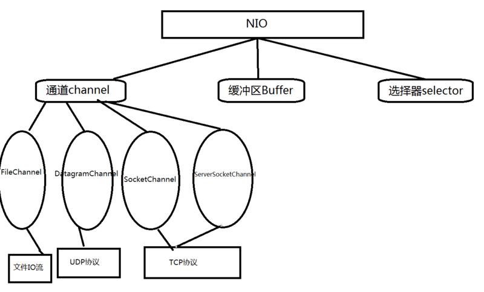
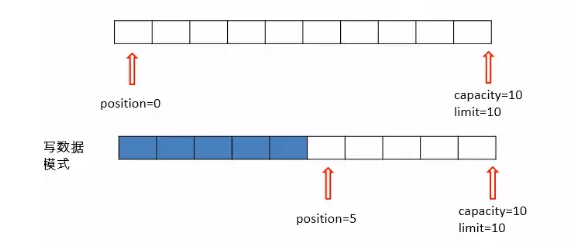

# Java NIO

> 底层是操作系统的IO多路复用，linux下，select poll epoll 

## NIO介绍

Java NIO 是 java 1.4, 之后新出的一套IO接口NIO中的N可以理解为Non-blocking，不单纯是New。

1. **NIO的特性/NIO与普通IO区别:**
   - 1)普通IO是面向流的，NIO是面向缓冲区的；
   - 2)普通IO流是阻塞的，NIO流是不阻塞的(轮询);
   - 3)NIO有选择器，而普通IO没有。
2. **读数据和写数据方式:**
   - 从通道进行数据读取 ：创建一个缓冲区，然后请求通道读取数据。
   - 从通道进行数据写入 ：创建一个缓冲区，填充数据，并要求通道写入数据。


 NIO提供了与传统BIO模型中的 `Socket` 和 `ServerSocket` 相对应的 `SocketChannel` 和 `ServerSocketChannel` 两种不同的套接字通道实现,两种通道都支持阻塞和非阻塞两种模式。

阻塞模式使用就像传统中的支持一样，比较简单，但是性能和可靠性都不好；

非阻塞模式正好与之相反。对于低负载、低并发的应用程序，可以使用同步阻塞I/O来提升开发速率和更好的维护性；对于高负载、高并发的（网络）应用，应使用 NIO 的非阻塞模式来开发。


## Java NIO核心组件



### 通道Channels

**和流不同，通道是双向的**。NIO可以通过Channel进行数据的读，写和同时读写操作。通道分为两大类：一类是网络读写（Selectable Channel），一类是用于文件操作（File Channel），我们使用的SocketChannel和ServerSocketChannel都是SelectableChannel的子类。

> 在网络读写中，通道channel其实是对连接的抽象

### Buffers

它是NIO与BIO的一个重要区别。BIO是将数据直接写入或读取到Stream对象中。而NIO的数据操作都是在缓冲区中进行的。缓冲区实际上是一个数组。Buffer最常见的类型是ByteBuffer，另外还有CharBuffer，ShortBuffer，IntBuffer，LongBuffer，FloatBuffer，DoubleBuffer。

###  多路复用器Selectors

NIO编程的基础。多路复用器提供选择已经就绪的任务的能力。就是`Selector`会不断地轮询注册在其上的通道（Channel），如果某个通道处于就绪状态，会被`Selector`轮询出来，然后通过`SelectionKey`可以取得就绪的`Channel集合`，从而进行后续的IO操作。服务器端只要提供一个线程负责Selector的轮询，就可以接入成千上万个客户端，这就是JDK NIO库的巨大进步。

> 通道应该注册在selector上，否则没有处理器。


## Buffer

Buffer的类型有哪些呢？请看下面。

- ByteBuffer
- CharBuffer
- DoubleBuffer
- FloatBuffer
- IntBuffer
- LongBuffer
- ShortBuffer

可以看到，8中基本类型当中，除了boolean类型，其他都有。

在Buffer中，有4个比较重要的索引(或者说是标记.)，这些索引高效的访问和操纵数据如下：

- mark 标记
- position 位置
- limit 界限
- capacity 容量

在默认的情况下，有如下描述：

capacity、limit都位于末尾，
position位于首部
调用mark方法能将mark标记设置为当前position的值，
调用put或者get方法写入数据的时候，position会向后移
调用reset方法 会将position设置为mark的值。
limit方法，可以设置limit值，在该值之后的数据将不可操作

写模式




flip()切换读模式：

```java
 public final Buffer flip() {
        limit = position;
        position = 0;
        mark = -1;
        return this;
    }
```


## Channel

Channel为管道，是双向的，在NIO中，有4中Channel，分别为：

- FileChannel 文件
- DatagramChannel UDP
- SocketChannel TCP client
- ServerSocketChannel TCP Server


#### FileChannel

```java
    public static void main(String[] args){
        FileChannel fc = null;
        try {
            fc = new RandomAccessFile("./1.txt","rw").getChannel();
            ByteBuffer bf = ByteBuffer.allocate(1024);
            fc.read(bf);
            bf.flip();
            while (bf.hasRemaining()){
                System.err.println((char) bf.get());
            }
            fc.close();
        } catch (FileNotFoundException e) {
            e.printStackTrace();
        } catch (IOException e) {
            e.printStackTrace();
        } finally {
            if (fc.isOpen()){
                try {
                    fc.close();
                } catch (IOException e) {
                    e.printStackTrace();
                }
            }
        }
    }
```


### DatagramChannel

UDP

### SocketChannel  ServerSocketChannel

**client**

```java
   public static void main(String[] args){
        SocketChannel socketChannel;
        try {
            socketChannel = SocketChannel.open();
            socketChannel.connect(new InetSocketAddress("192.168.0.114",3334));
            socketChannel.configureBlocking(false);
            ByteBuffer byteBuffer = ByteBuffer.allocate(1024);
            byteBuffer.put(new String("hello，我来自客户端").trim().getBytes("utf-8"));
            byteBuffer.flip();
            socketChannel.write(byteBuffer);
            byteBuffer.clear();
            new Thread(new ReadFromServer(socketChannel)).start();
        } catch (IOException e) {
            e.printStackTrace();
        }
    }

    static class ReadFromServer implements Runnable{
        private SocketChannel socketChannel;

        public ReadFromServer(SocketChannel socketChannel){
            this.socketChannel = socketChannel;
        }

        @Override
        public void run() {
            ByteBuffer byteBuffer = ByteBuffer.allocate(1024);
            while (true){
                try {
                    while (socketChannel.read(byteBuffer) != -1){
                        if (byteBuffer.get(0) != 0){
                            System.err.println(new String(byteBuffer.array()).trim());
                            return；
                        }
                    }
                } catch (IOException e) {
                    e.printStackTrace();
                }
            }

        }
    }
```

- 通过SocketChannel的open方法打开通道。
- 通过connet方法链接
- configureBlocking 设置为非阻塞
- write方法将buffer中的数据读到channel中
- 开启一个线程去检查服务器的返回结果
  

**Server**

```java
public static void main(String[] args){
        ServerSocketChannel serverSocketChannel;
        try {
            serverSocketChannel = ServerSocketChannel.open();
            serverSocketChannel.socket().bind(new InetSocketAddress(3334));
            while (true){
                SocketChannel socketChannel = serverSocketChannel.accept();
                socketChannel.configureBlocking(false);
                ByteBuffer byteBuffer = ByteBuffer.allocate(1024);
                socketChannel.read(byteBuffer);
                System.out.println(new String(byteBuffer.array()).trim());
                byteBuffer.clear();
                byteBuffer.put(new String("好的，我收到了").getBytes("utf-8"));
                byteBuffer.flip();
                socketChannel.write(byteBuffer);

            }
        } catch (IOException e) {
            e.printStackTrace();
        }
    }
```

- open打开通道
- channel.socket().bind 绑定端口
- read 读取channel中的数据
- write向channel中写入数据


### Selector

Selector.open()去创建selector对象，并且需要将channel注册到selector中，这里需要注意的是，这个通道必须设置为非阻塞的。

channel.register(selector，感兴趣的事件)。

- SelectionKey.OP_CONNECT
- SelectionKey.OP_ACCEPT
- SelectionKey.OP_READ
- SelectionKey.OP_WRITE

我们可以通过|操作符链接多种感兴趣的事件


注册了感兴趣的事件后，选择通道。

- select
- select(timeout)
- selectNow

如果调用select返回了一个或多个通道的话，我们就可以通过selector的`selectedKeys()`方法，访问"已选择键集(selected key set)"中的就绪通道，并且通过这个集合判断通道类型。做相应的操作。


## 参考

https://juejin.im/post/5af942c6f265da0b7026050c

https://segmentfault.com/a/1190000014932357

https://segmentfault.com/a/1190000012316621

https://blog.csdn.net/qq_21430549/article/details/52145008