# 垃圾收集(Garbage Collection,GC)

Java与C++之间有一堵由内存动态分配和垃圾收集技术所围成的“高墙”,墙外面的人想
进去,墙里面的人却想出来。

## 回收的区域

java堆

## 判断对象是否已死

### 引用计数法

给对象中添加一个引用计数器,每当有一个地方引用它时,计数器值就加1;当引用失效时,计数器值就减1;任何时刻计数器为0的对象就是不可能再被使用的。

> 无法解决两个对象成环互相引用,但实际都已不可达的问题.

redis中使用的引用计数法

### 可达性分析算法(Reachability Analysis)

这个算法的基本思路就是通过一系列的称为`GC Roots`的对象作为起始点,从这些节点开始向下搜索,搜索所走过的路径称为引用链(Reference Chain),当一个对象到GC Roots没有任何引用链相连(用图论的话来说,就是从GC Roots到这个对象不可达)时,则证明此对象是不可用的。

**关键点:“GC Roots”**

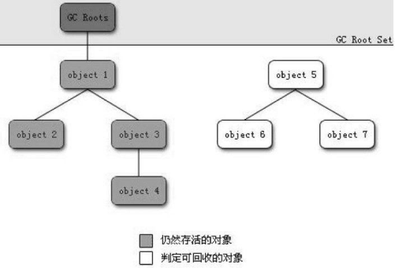

可以作为GC roots的是:

- 虚拟机栈(栈帧中的本地变量表)中引用的对象。
- 本地方法栈中JNI(即一般说的Native方法)引用的对象。
- 方法区中类静态属性引用的对象。
- 方法区中常量引用的对象。

可作为GC Roots的节点主要在全局性的引用(例如常量或类静态属性)与执行上下文(例如栈帧中的本地变量表)中

## 引用的分类

无论是引用计数,还是可达性分析,这里面都有一个重要的概念,引用.

**强软弱虚.**

- 强引用

  new

- 软引用

  软引用是用来描述一些还有用但并非必需的对象.

  对于软引用关联着的对象,在系统将要发生内存溢出异常之前,将会把这些对象列进回收范围之中进行第二次回收。

  SoftReference类

- 弱引用(Weak Reference)

  弱引用也是用来描述非必需对象的,但是它的强度比软引用更弱一些,被弱引用关联的对象只能生存到下一次垃圾收集发生之前。

  ThreadLocal中使用了弱引用

- 虚引用(Phantom(fantəm) Reference)

  虚引用也称为幽灵引用或者幻影引用,它是最弱的一种引用关系。一个对象是否有虚引用的存在,完全不会对其生存时间构成影响,也无法通过虚引用来取得一个对象实例。
  
  为一个对象设置虚引用关联的唯一目的就是能在这个对象被收集器回收时收到一个系统通知。在JDK 1.2之后,提供了PhantomReference类来实现虚引用。

## 方法区的回收

方法区(jdk1.7 HotSpot虚拟机中的永久代,1.8的元数据区)可以没有垃圾收集,Java虚拟机规范中确实说过可以不要求虚拟机在方法区实现垃圾收集,而且在方法区中进行垃圾收集的“性价比”一般比较低.

在堆中,尤其是在新生代中,常规应用进行一次垃圾收集一般可以回收70%~95%的空间,而永久代的垃圾收集效率远低于此。

永久代的垃圾收集主要回收两部分内容:**废弃常量和无用的类**。

**废弃常量**

就是没有任何String对象引用常量池中的“abc”常量,也没有其他地方引用了这个字面量

**无用的类**

- 该类所有的实例都已经被回收,也就是Java堆中不存在该类的任何实例。
- 加载该类的ClassLoader已经被回收。
- 该类对应的java.lang.Class对象没有在任何地方被引用,无法在任何地方通过反射访问该
  类的方法。

>  在大量使用反射、动态代理、CGLib等ByteCode框架、动态生成JSP以及OSGi这类频繁
> 自定义ClassLoader的场景都需要虚拟机具备类卸载的功能,以保证永久代不会溢出。

虚拟机可以对满足上述3个条件的无用类进行回收,这里说的仅仅是“可以”,而并不是和对象一样,不使用了就必然会回收。是否对类进行回收,HotSpot虚拟机提供了-Xnoclassgc参数进行控制,还可以使用-verbose:class以及-XX:+TraceClassLoading、-XX:+TraceClassUnLoading查看类加载和卸载信息.

其中-verbose:class和-XX:+TraceClassLoading可以在Product版的虚拟机中使用,-XX:+TraceClassUnLoading参数需要FastDebug版的虚拟机支持。

## 垃圾收集算法

### 标记-清除算法(Mark-Sweep)

先标记(可达性分析)再清除.

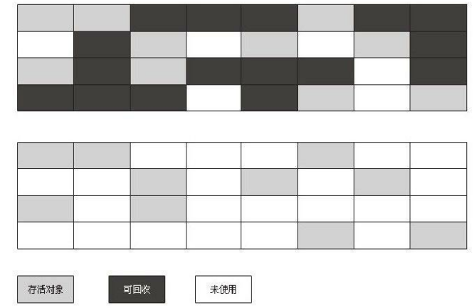

缺点:

一个是效率问题,标记和清除两个过程的效率都不高;

产生内存碎片,分配大对象还得进行GC

### 复制算法

为了解决效率问题,一种称为“复制”(Copying)的收集算法出现了,它将可用内存按容量划分为大小相等的两块,每次只使用其中的一块。当这一块的内存用完了,就将还存活着的对象复制到另外一块上面,然后再把已使用过的内存空间一次清理掉。这样使得每次都是对整个半区进行内存回收,内存分配时也就不用考虑内存碎片等复杂情况,只要移动堆顶指针,按顺序分配内存即可,实现简单,运行高效。只是这种算法的代价是将内存缩小为了原来的一半,未免太高了一点。

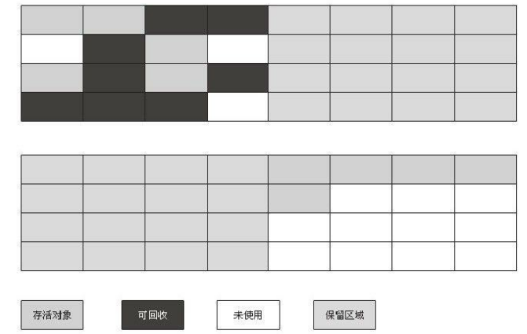

HotSpot虚拟机将新生代内存分为一块较大的Eden空间和两块较小的Survivor空间,每次使用Eden和其中一块Survivor 。
当回收时,将Eden和Survivor中还存活着的对象一次性地复制到另外一块Survivor空间上,最后清理掉Eden和刚才用过的Survivor空间。

当Survivor空间不够用时,需要依赖其他内存(这里指老年代)进行分配担保(Handle Promotion)。

如果另外一块Survivor空间没有足够空间存放上一次新生代收集下来的存活对象时,这些对象将直接通过分配担保机制进入老年代。

### 标记-整理算法

复制收集算法在对象存活率较高时就要进行较多的复制操作,效率将会变低。更关键的是,如果不想浪费50%的空间,就需要有额外的空间进行分配担保,以应对被使用的内存中所有对象都100%存活的极端情况,**所以在老年代一般不能直接选用这种算法。**

标记过程仍然与“标记-清除”算法一样,但后续步骤不是直接对可回收对象进行清理,而是让所有存活的对象都向一端移动,然后直接清理掉端边界以外的内存.

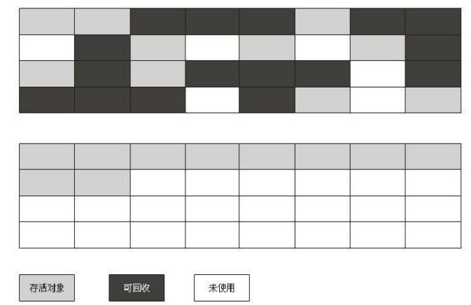

### 因地制宜 分代收集(Generational Collection)

新生代   复制算法+分配担保

老年代    标记-清理/标记-整理

## HotSpot的算法实现

全局安全点,程序跑到后自动挂起

安全区域

安全区域是指在一段代码片段之中，引用关系不会发生变化。在这个区域中的任意地方开始 GC 都是安全的。

## 垃圾收集器

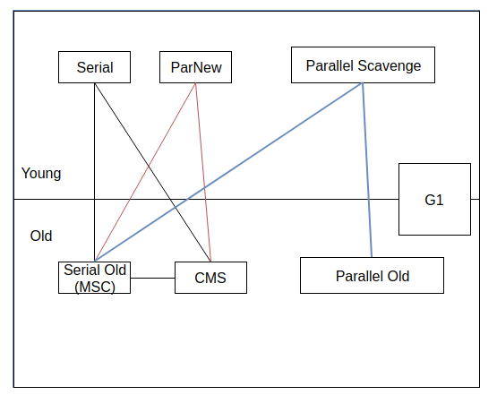

### 新生代 -- Serial收集器

**单线程的收集器**,但它的“单线程”的意义并不仅仅说明它只会使用一个CPU或一条收集线程去完成垃圾收集工作,
更重要的是在它进行垃圾收集时,必须暂停其他所有的工作线程,直到它收集结束。“StopThe World”

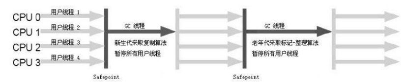

### 新生代 --  ParNew收集器

ParNew收集器其实就是Serial收集器的多线程版本,除了使用多条线程进行垃圾收集之外,其余行为包括Serial收集器可用的所有控制参数(例如:-XX:SurvivorRatio、-XX:PretenureSizeThreshold、-XX:HandlePromotionFailure等)、收集算法、Stop The World、对象分配规则、回收策略等都与Serial收集器完全一样,在实现上,这两种收集器也共用了相当多的代码。

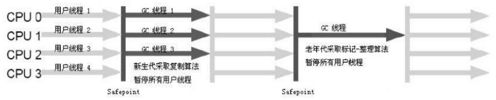

ParNew收集器除了多线程收集之外,其他与Serial收集器相比并没有太多创新之处,但它却是许多运行在Server模式下的虚拟机中首选的新生代收集器,其中有一个与性能无关但很重要的原因是,**除了Serial收集器外,目前只有它能与CMS收集器配合工作。**

> 参数控制：
>
> `-XX:+UseParNewGC` ParNew收集器
> `-XX:ParallelGCThreads` 限制线程数量

### 新生代 -- Parallel Scavenge收集器

Parallel Scavenge收集器是一个**新生代**收集器,它也是使用**复制算法**的收集器,又是**并行的多线程**收集器......看上去和ParNew都一样.

Parallel Scavenge收集器的目标则是达到一个可控制的吞吐量(Throughput),不关注用户停顿时间.

> 参数控制： `-XX:+UseParallelGC` 使用Parallel收集器+ 老年代串行
>
> 参数控制： `-XX:+UseParallelOldGC` 使用Parallel收集器+ 老年代并行

### 老年代 -- Serial Old收集器

SerialOld是Serial收集器的老年代版本,它同样是一个单线程收集器,使用“标记-整理”算法。这个收集器的主要意义也是在于给Client模式下的虚拟机使用。如果在Server模式下,那么它主要还有两大用途:一种用途是在JDK 1.5以及之前的版本中与Parallel Scavenge
收集器搭配使用 ,另一种用途就是作为CMS收集器的后备预案,在并发收集发生ConcurrentMode Failure时使用。这两点都将在后面的内容中详细讲解。

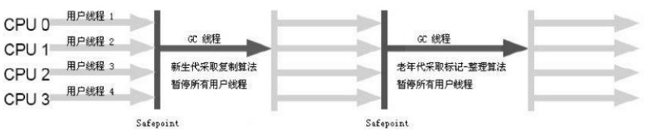	

### 老年代 -- Parallel Old收集器

Parallel Old是Parallel Scavenge收集器的老年代版本,使用多线程和“标记-整理”算法。

直到Parallel Old收集器出现后,“吞吐量优先”收集器终于有了比较名副其实的应用组合,在注重吞吐量以及CPU资源敏感的场合,都可以优先考虑Parallel Scavenge加Parallel Old收集器。

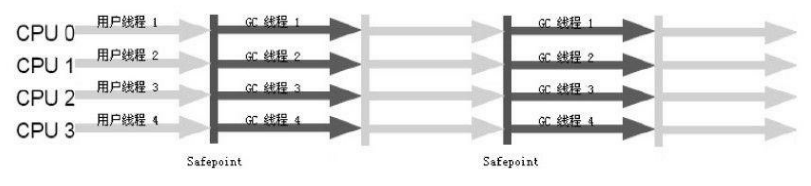

### 老年代 CMS收集器

#### 介绍

CMS(Concurrent Mark Sweep)收集器是一种以**获取最短回收停顿时间**为目标的收集器。目前很大一部分的Java应用集中在互联网站或者B/S系统的服务端上,这类应用尤其重视服务的响应速度,希望系统停顿时间最短,以给用户带来较好的体验。CMS收集器就非常符合这类应用的需求。

从名字(包含“Mark Sweep”)上就可以看出,**CMS收集器**是基于“**标记—清除**”算法实现

- 初始标记(CMS initial mark)    **Stop**

  仅仅只是标记一下GC Roots能直接关联到的对象,速度很快

- 并发标记(CMS concurrent mark)

  GC RootsTracing的过程,可和用户程序同时运行.

- 重新标记(CMS remark)            **Stop**

- 并发清除(CMS concurrent sweep)

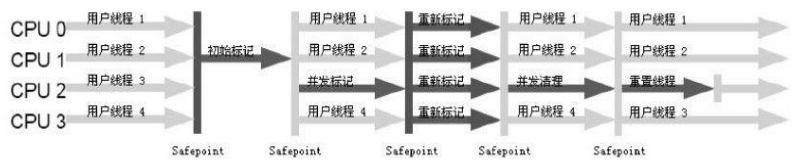

  CMS 收集器无法处理浮动垃圾（**Floating Garbage**），**可能出现 Concurrent Mode Failure失败而导致另一次 Full GC 的产生。**

> 由于 CMS 并发清理阶段用户线程还在运行着，伴随程序运行自然就还会有新的垃圾不断产生，这一部分垃圾出现在标记过程之后，CMS 无法在当次收集中处理掉它们，只好留待下一次 GC 时再清理掉。这一部分垃圾就称为“浮动垃圾”。

也是由于在垃圾收集阶段用户线程还需要运行，那也就还需要预留有足够的内存空间给用户线程使用，**因此 CMS 收集器不能像其他收集器那样等到老年代几乎完全被填满了再进行收集，需要预留一部分空间提供并发收集时的程序运作使用。**在 JDK 1.5 的默认设置下，CMS 收集器当老年代使用了 68%的空间后就会被激活，这是一个偏保守的设置，如果在应用中老年代増长不是太快，可以适当调高参数-XX: CmsInitiatingOccupancyFraction 的值来提高触发百分比，以便降低内存回收次数从而获取更好的性能，在 JDK1.6 中，CMS 收集器的启动阈值已经提升至 92%。要是 CMS 运行期间预留的内存无法满足程序需要，就会出现次`Concurrent Mode Failure`失败，这时虚拟机将启动后备预案：临时启用 Serialold 收集器来重新进行老年代的垃圾收集，这样停顿时间就很长了。所以说参数-XX: `CmsInitiatingOccupancyFraction`设置得太高很容易导致大量`Concurrent Mode Failure`失败，性能 反而降低.      

####   老年代回收扫描区域    

Remark阶段主要是通过扫描堆来判断对象是否存活。那么准确判断对象是否存活，需要扫描哪些对象？CMS对老年代做回收，Remark阶段仅扫描老年代是否可行？结论是不可行，原因如下：                       

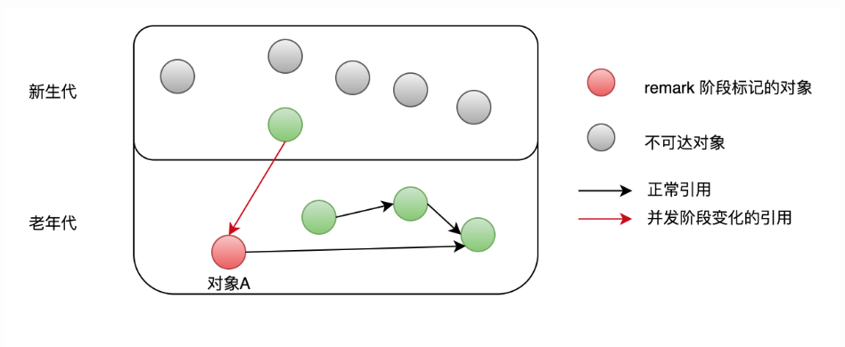

如果仅扫描老年代中对象，即以老年代中对象为根，判断对象是否存在引用，上图中，对象A因为引用存在新生代中，它在Remark阶段就不会被修正标记为可达，GC时会被错误回收。 新生代对象持有老年代中对象的引用，这种情况称为**“跨代引用”**。因它的存在，Remark阶段必须扫描整个堆来判断对象是否存活，包括图中灰色的不可达对象。

灰色对象已经不可达，但仍然需要扫描的原因：**新生代GC和老年代的GC是各自分开独立进行的**，只有Minor GC时才会使用根搜索算法，标记新生代对象是否可达，也就是说虽然一些对象已经不可达，但在Minor GC发生前不会被标记为不可达，CMS也无法辨认哪些对象存活，只能全堆扫描（新生代+老年代）。

### G1收集器

Garbage-first  化整为零

#### 特点

**并行与并发**：G1 能充分利用多 CPU、多核环境下的硬件优势，使用多个 CPU (CPU 或者 CPU 核心）来缩短 Stop-The- World 停顿的时间，部分其他收集器原本需要停顿 Java 线程执行的 GC 动作，G1 收集器仍然可以通过并发的方式让 Java 程序继续执行。

**分代收集**：与其他收集器一样，分代概念在 G1 中依然得以保留。虽然 G1 可以不需要其他收集器配合就能独立管理整个 GC 堆，但它能够采用不同的方式去处理新创建的对象和已经存活了一段时间、熬过多次 GC 的旧对象以获取更好的收集效果。

**空间整合**：与 CMS 的“标记一清理”算法不同，G1 从整体来看是基于“标记一整理”算法实现的收集器，从局部（两个 Region 之间）上来看是基于“复制”算法实现的，但无论如何，这两种算法都意味着 G1 运作期间不会产生内存空间碎片，收集后能提供规整的可用内存。这种特性有利于程序长时间运行，分配大对象时不会因为无法找到连续内存空间而提前触发下次 GC。

**可预测的停顿**：这是 G1 相对于 CMS 的另一大优势，降低停顿时间是 G1 和 CMS 共同的关注点，但 G1 除了追求低停顿外，还能建立可预测的停顿时间模型，能让使用者明确指定在个长度为 M 毫秒的时间片段内，消耗在垃圾收集上的时间不得超过 N 毫秒，这几乎已经是实时 Java (RTSJ）的垃圾收集器的特征了。

#### 可预测的回收时间

G1 收集器之所以能建立可预测的停顿时间模型，是因为它可以有计划地避免在整个 Java 堆中进行全区域的垃圾收集。G1 跟踪各个 Region。里面的垃圾堆积的价值大小（回收所获得的空间大小以及回收所需时间的经验值），在后台维护一个优先列表，每次根据允许的收集时间，优先回收价值最大的 Region（这也就是 Garbage- First 名称的来由）。这种使用 Region 划分内存空间以及有优先级的区域回收方式，保证了 G1 收集器在有限的时间内可以获取尽可能高的收集效率。

#### region

　G1将Java堆分成多个分区。分区的大小可以依据堆的尺寸而改变，但必须是2的幂，同时最小为1MB，最大为32MB。由此得出可能的分区尺寸是1 MB、2MB、4 MB、8 MB、16 MB和32MB。所有分区的大小都一样，在JVM运行过程中它们的尺寸也不会发生变化。分区尺寸是基于Java堆内存的初始值和最大值的平均数来进行计算的，这样对于这个平均堆尺寸就会有2000个左右的分区。举个例子，对一个16G的Java堆使用-Xmx16g -Xms16g命令行选项，G1就会选择采用16GB/2000 = 8MB的分区尺寸。

G1同样也使用分代收集策略，将堆分为Eden, Survivior, Old等，只不过是按照逻辑划分的，每个Region逻辑上属于一个分代区域，并且在物理上不连续，当一个Old的Region收集完成后会变成新可用Region并可能成为下一个Eden Region。当申请的对象大于Region大小的一半时，会被放入一个Humongous Region(巨型区域)中。当一个Region中是空的时，称为可用Region或新Region。

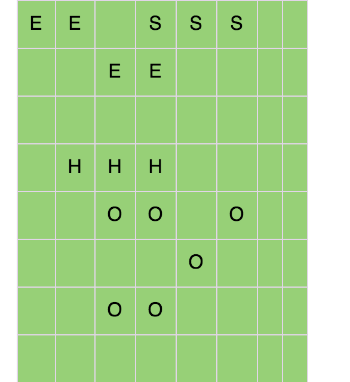

> E指Eden, S是Survivor, H指Humongous, O是Old, 空白区域是可用分区。

#### Card table

point-out

**Minor GC存在一个问题就是，老年代的对象可能引用新生代的对象**，在标记存活对象的时候，就需要扫描老年代的对象，如果该对象拥有对新生代对象的引用，那么这个引用也会被作为 GC Roots。这相当于就做了**全堆扫描**。

HotSpot 给出的解决方案是 一项叫做 **卡表** 的技术。如下图所示:

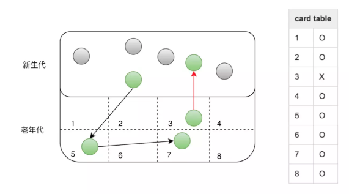

卡表的具体策略是**将老年代的空间分成大小为 512B的若干张卡，并且维护一个卡表，卡表本省是字节数组，数组中的每个元素对应着一张卡，其实就是一个标识位，这个标识位代表对应的卡是否可能存有指向新生代对象的引用**，如果可能存在，那么我们认为这张卡是脏的，即**脏卡**。如上图所示，卡表3被标记为脏。

> 卡表还有另外的作用，标识并发标记阶段哪些块被修改过

**在进行Minor GC的时候，我们便可以不用扫描整个老年代，而是在卡表中寻找脏卡，并将脏卡中的老年代指向新生代的引用加入到 Minor GC的GC Roots里，当完成所有脏卡的扫描之后，Java 虚拟机便会将所有脏卡的标识位清零。这样虚拟机以空间换时间，避免了全表扫描**

#### Remembered set

point-in

在 G1 收集器中，**Region之间的对象引用**以及**其他收集器中的新生代与老年代之间的对象引用**，**虚拟机都是使用 Remembered Set 来避免全堆扫描的**。G1 中每个 Region都有所属的 Remembered Set，虚拟机发现程序在对 Reference类型的数据进行写操作时，会产生一个 Write Barrier 暂时中断写操作，检查 Reference 引用的对象是否处于不同的Region 之中（在分代的例子中就是检查是否老年代中的对象引用了新生代中的对象），如果是，便通过 CardTable把相关引用信息记录到被引用对象所属的 Region 的 Remembered Set之中。当进行内存回收时，**在 GC 根节点的枚举范围中加入 Remembered Set即可保证不对全堆扫描也不会有遗漏**。

待补充

https://tech.meituan.com/2016/09/23/g1.html

#### 步骤

初始标记（Initial Marking）

并发标记（Concurrent Marking）

最终标记（Final Marking)

筛选回收（Live Data Counting and Evacuation)

## 内存分配和回收策略

新生代GC(Minor GC):指发生在新生代的垃圾收集动作,因为Java对象大多都具备朝生夕灭的特性,所以Minor GC非常频繁,一般回收速度也比较快。
老年代GC(Major GC/Full GC):指发生在老年代的GC,出现了Major GC,经常会伴随至少一次的Minor GC(但非绝对的,在Parallel Scavenge收集器的收集策略里就有直接进行Major GC的策略选择过程)。Major GC的速度一般会比Minor GC慢10倍以上。

### 对象优先在Eden分配

大多数情况下,对象在新生代Eden区中分配。当Eden区没有足够空间进行分配时,虚拟
机将发起一次Minor GC。

虚拟机提供了-XX:+PrintGCDetails这个收集器日志参数,告诉虚拟机在发生垃圾收集行为时打印内存回收日志,并且在进程退出的时候输出当前的内存各区域分配情况。

**实验**

Xms20M、-Xmx20M、-Xmn10M这3个参数限制了Java堆大小为20MB,不可扩展,其中10MB分配给新生代,剩下的10MB分配给老年代。-XX:SurvivorRatio=8决定了新生代中Eden区与一个Survivor区的空间比例是8:1

### 大对象直接进入老年代

所谓的大对象是指,需要大量连续内存空间的Java对象,最典型的大对象就是那种很长的字符串以及数组(笔者列出的例子中的byte[]数组就是典型的大对象)。

虚拟机提供了一个**-XX:PretenureSizeThreshold**参数,令大于这个设置值的对象直接在老年代分配。这样做的目的是避免在Eden区及两个Survivor区之间发生大量的内存复制(复习一下:新生代采用复制算法收集内存)。

### 长期存活的对象将进入老年代

虚拟机给每个对象定义了一个对象年龄(Age)计数器。如果对象在Eden出生并经过第一次Minor GC后仍然存活,并且能被
Survivor容纳的话,将被移动到Survivor空间中,并且对象年龄设为1。对象在Survivor区中每“熬过”一次Minor GC,年龄就增加1岁,当它的年龄增加到一定程度(默认为15岁),就将会被晋升到老年代中。对象晋升老年代的年龄阈值,可以通过参数

**-XX:MaxTenuringThreshold**设置。

### 动态对象年龄判定

为了能更好地适应不同程序的内存状况,虚拟机并不是永远地要求对象的年龄必须达到了MaxTenuringThreshold才能晋升老年代,如果在Survivor空间中相同年龄所有对象大小的总和大于Survivor空间的一半,年龄大于或等于该年龄的对象就可以直接进入老年代,无须等到MaxTenuringThreshold中要求的年龄。

### 空间分配担保

