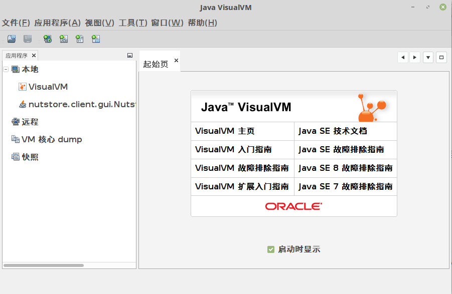
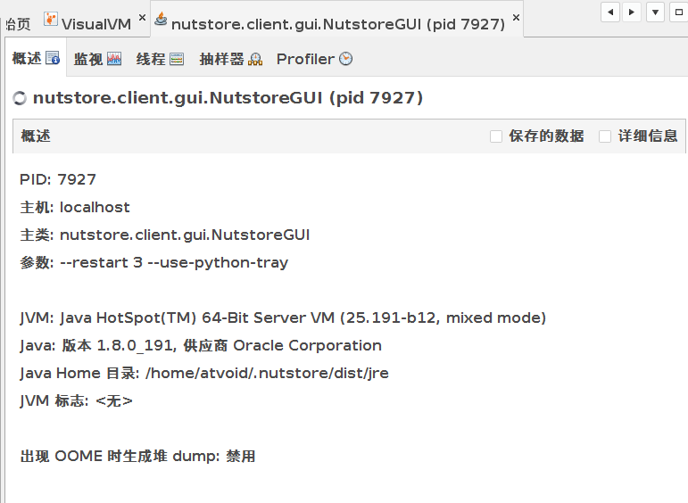
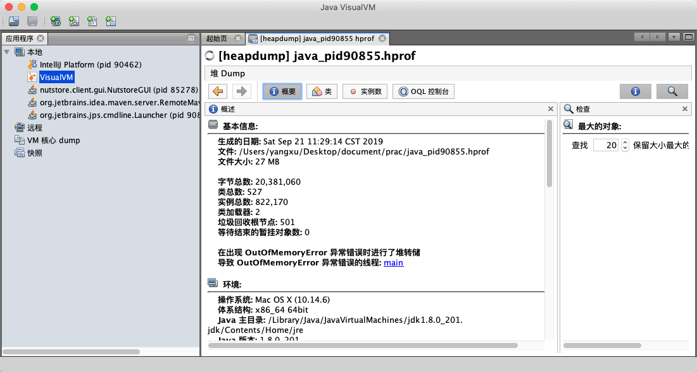
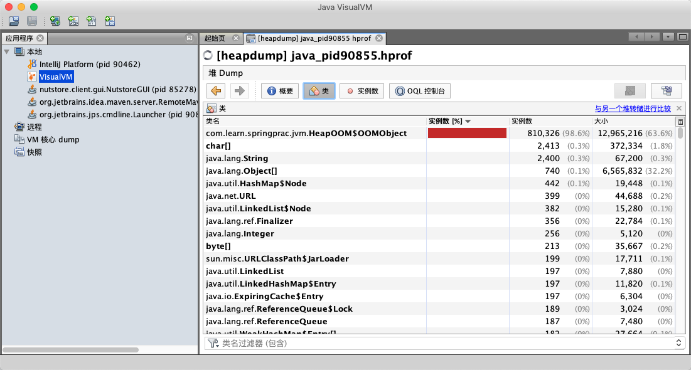

# VisualVM

VisualVM(All-in-One Java Troubleshooting Tool)是到目前为止随JDK发布的功能最强大
的运行监视和故障处理程序,并且可以预见在未来一段时间内都是官方主力发展的虚拟机故
障处理工具。


## linux 下使用

### 启动

```shell
$ /usr/java/jdk1.8.0_201/bin/jvisualvm 
```




查看坚果云的java进程




## 分析堆转储文件

点击装入文件







## Btrace插件

BTrace 是一个很“有趣”的VisualVM插件,本身也是可以独立运行的程序。它的作用是在不停止目标程序运行的前提下,通过HotSpot虚拟机的HotSwap技术 动态加入原本并不存在的调试代码。这项功能对实际生产中的程序很有意义:经常遇到程序出现问题,但排查错误的一些必要信息,譬如方法参数、返回值等,在开发时并没有打印到日志之中,以至于不得不停掉服务,通过调试增量来加入日志代码以解决问题。当遇到生产环境服务无法随便停止时,缺一两句日志导致排错进行不下去是一件非常郁闷的事情。