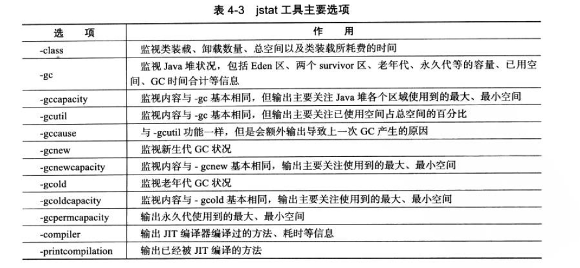
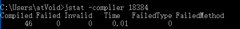
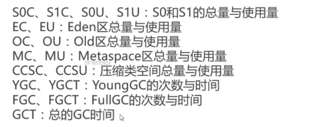
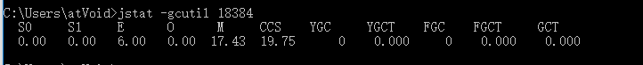
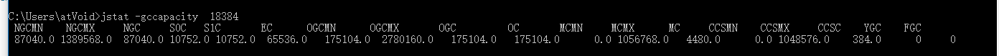

## jstat

> jstat (JVM Statistics Monitoring Tool)

可以监视虚拟机各种运行状态信息，显示本地或远程虚拟机进程中的**类装载，内存，垃圾收集，JIT编译**等运行数据

```
jstat [option vmid [interval [s|ms] [count]]   ]
```

- option 常见的都是使用-gcutil查看gc情况，其他可选项见下图。
- vmid ： VM的进程号，即当前运行的java进程号。 本地虚拟机与lvmid一致
- interval : 间隔时间，单位为秒或毫秒
- count：打印次数，如果缺省则打印无数次。


option选项代表着用户希望查询的虚拟机信息，主要分为3类：类加载、垃圾收集和运行期编译状况。具体选项见下图：




### 类加载信息

```shell
$ jstat -class 18384 1000 1 #类加载统计
```
结果：


- Loaded : 加载class的数量

- Bytes : class字节大小

- Unloaded : 未加载class的数量

- Bytes : 未加载class的字节大小

- Time : 加载时间


### JIT编译信息

```shell
$ jstat -compiler 18384
```

结果



- Compiled : 编译数量
- Failed : 编译失败数量
- Invalid : 无效数量
- Time : 编译耗时
- FailedType : 失败类型
- FailedMethod : 失败方法的全限定名


### GC信息

```shell
$ jstat -gc 2764 250 20  #查询进程2764垃圾收集情况 250ms一次  一共20次
```
 结果： 单位 KB

```
 S0C    S1C    S0U    S1U      EC       EU        OC         OU       MC     MU    CCSC   CCSU   YGC     YGCT    FGC    FGCT     GCT   
6144.0 6656.0 5696.0  0.0   118272.0 85783.7   261632.0   220132.9  21888.0 21500.3 2432.0 2260.8    122    1.032   1      0.226    1.258
```



```shell
$ jstat -gcutil 18384 # 查看gc的统计信息，关注点 主要是 已使用/总空间的占比情况。
```

结果：



| 参数 | 描述                                                     |
| ---- | -------------------------------------------------------- |
| S0   | 年轻代中第一个survivor（幸存区）已使用的占当前容量百分比 |
| S1   | 年轻代中第二个survivor（幸存区）已使用的占当前容量百分比 |
| E    | 年轻代中Eden已使用的占当前容量百分比                     |
| O    | old代已使用的占当前容量百分比                            |
| M    | 元空间(MetaspaceSize)已使用的占当前容量百分比            |
| CCS  | 压缩使用比例                                             |
| YGC  | 年轻代垃圾回收次数                                       |
| YGCT | 新生代垃圾回收消耗时间                                   |
| FGC  | 老年代垃圾回收次数                                       |
| FGCT | 老年代垃圾回收消耗时间                                   |
| GCT  | 垃圾回收消耗总时间                                       |


```shell
$ jstat -gccapacity  18384 20 20  # 单位KB 堆内存使用情况统计
```

结果：


| 参数  | 描述               |
| ----- | ------------------ |
| NGCMN | 新生代最小容量     |
| NGCMX | 新生代最大容量     |
| NGC   | 当前新生代容量     |
| S0C   | 第一个幸存区大小   |
| S1C   | 第二个幸存区的大小 |
| EC    | 伊甸园区的大小     |
| OGCMN | 老年代最小容量     |
| OGCMX | 老年代最大容量     |
| OGC   | 当前老年代大小     |
| OC    | 当前老年代大小     |
| MCMN  | 最小元数据容量     |
| MCMX  | 最大元数据容量     |
| MC    | 当前元数据空间大小 |
| CCSMN | 最小压缩类空间大小 |
| CCSMX | 最大压缩类空间大小 |
| CCSC  | 当前压缩类空间大小 |
| YGC   | 年轻代gc次数       |
| FGC   | 老年代GC次数       |


## 参考

https://www.cnblogs.com/ityouknow/p/5714703.html

https://mp.weixin.qq.com/s?__biz=MzI4NDY5Mjc1Mg==&mid=2247483966&idx=1&sn=dfa3375d36aa2c0c25a775522e381e62&chksm=ebf6da41dc815357e0d53c73865a23f41219e75bac5a4d510bfa31cc51594b59a20e2e4f6cb8&scene=21#wechat_redirect


