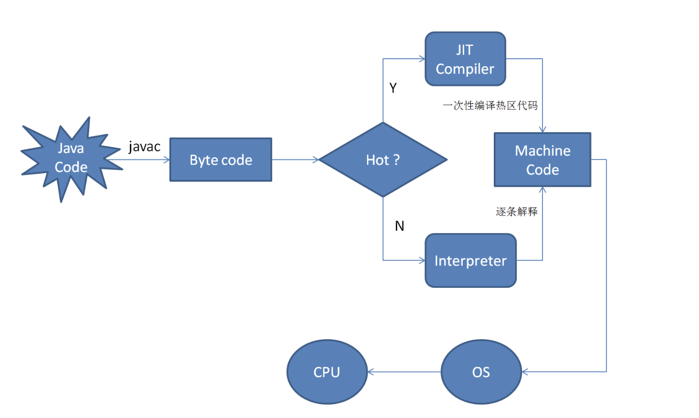

# JIT


## JIT简介

JIT 是 just in time 的缩写, 也就是即时编译编译器。使用即时编译器技术，能够加速 Java 程序的执行速度。

首先，我们大家都知道，通常通过 javac 将程序源代码编译，转换成 java 字节码，JVM 通过解释字节码将其翻译成对应的机器指令，逐条读入，逐条解释翻译。很显然，经过解释执行，其执行速度必然会比可执行的二进制字节码程序慢很多。为了提高执行速度，引入了 JIT 技术。

在运行时 JIT 会把翻译过的机器码保存起来，以备下次使用，因此从理论上来说，采用该 JIT 技术可以接近以前纯编译技术。


## JIT过程




## 为什么不直接编译

1. 编译是有成本的,应该只编译需要的	

  - 编译的时间开销

    ​	首先，如果这段代码本身在将来只会被执行一次，那么从本质上看，编译就是在浪费精力。因为将代码翻译成 java 字节码相对于编译这段代码并执行代码来说，要快很多。

    ​	当然，如果一段代码频繁的调用方法，或是一个循环，也就是这段代码被多次执行，那么编译就非常值得了。
  
    可以说 Java 本身是一种半编译半解释执行的语言.
  
    ​	而且,编译后可不是一定比解释的快!
  
  - 编译的空间开销
    
    ​	对一般的Java方法而言，编译后代码的大小相对于字节码的大小，膨胀比达到10x是很正常的。
  
2. 最优化
  
    有些优化只有执行后才知道,当 JVM 执行某一方法或遍历循环的次数越多，就会更加了解代码结构，那么 JVM 在编译代码的时候就做出相应的优化。
    
    
    - example1
    
      增加寄存器,不再从主存取值.
    
    ```java
    public class RegisterTest {
     private int sum;
     public void calculateSum(int n) {
        for (int i = 0; i < n; ++i) {
          sum += i;
        }
     }
    }
    ```
    
    在某些时刻，sum 变量居于主存之中，但是从主存中检索值是开销很大的操作，需要多次循环才可以完成操		作。正如上面的例子，如果循环的每一次都是从主存取值，性能是非常低的。相反，编译器加载一个寄存器		给 sum 并赋予其初始值，利用寄存器里的值来执行循环，并将最终的结果从寄存器返回给主存。这样的优		化策略则是非常高效的。但是线程的同步对于这种操作来说是至关重要的，因为一个线程无法得知另一个线		程所使用的寄存器里变量的值，线程同步可以很好的解决这一问题，有关于线程同步的知识，我们将在后续		文章中进行讲解。
    
    寄存器的使用是编译器的一个非常普遍的优化。  

## 参考

https://www.ibm.com/developerworks/cn/java/j-lo-just-in-time/index.html

知乎:

https://www.zhihu.com/question/26913901/answer/35303563

https://www.zhihu.com/question/37389356


https://juejin.im/post/5b3782b1e51d4558dc4ae4a7

http://blog.reverberate.org/2012/12/hello-jit-world-joy-of-simple-jits.html

