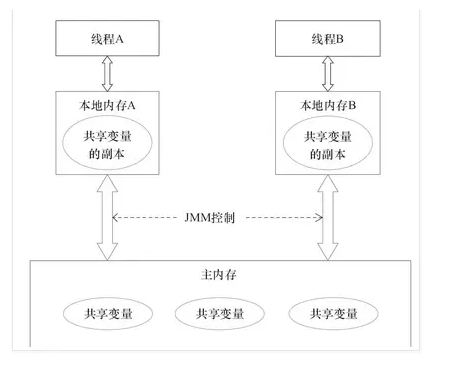

### Java 内存模型（Java Memory Model）

> JMM属于语言级的内存模型，它确保在不同的编译器和不同的处理器平台之上，通过禁止特定类型的编译器重排序和处理器重排序，为程序员提供一致的内存可见性保证。

注意，线程本地内存只是一个抽象概念，它涵盖了缓存、写缓冲区、寄存器以及其他的硬件和编译器优化。

JMM8种操作

补充

https://www.jianshu.com/p/26385b1b9a8c