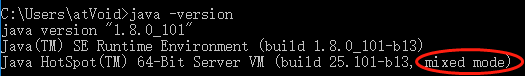

### JVM参数

#### 标准参数

```java
java -version
java -help 
```


#### -X 参数(非标准参数)

```
-Xint
-Xcomp
-Xmixed
```
-Xmixed


#### -XX 参数（非标准化参数）

> 相对不稳定可能改变，主要用于JVM调优和debug

-XX:[+-]<name> 表示启用或者禁用name属性

```
-XX:+UseConcMarkSweepGc  #启用CMS垃圾收集器
-XX:+UseG1GC   #启用G1垃圾收集器
```

-XX:<key>=<value> 表示name属性的值是value

```
-XX:MaxGCPauseMillis=500
 XX:GCTimeRatio=19
```

注意

-Xms 等价于-XX:InitialHeapSize  其实是-XX参数

-Xmx 等价于-XX:MaxHeapSize  其实是-XX参数

-Xss   等价于-XX:ThreadStackSize  其实是-XX参数

-XX:MetaspaceSize 元数据区大小

-XX:MaxMetaspaceSize  元数据区最大值


