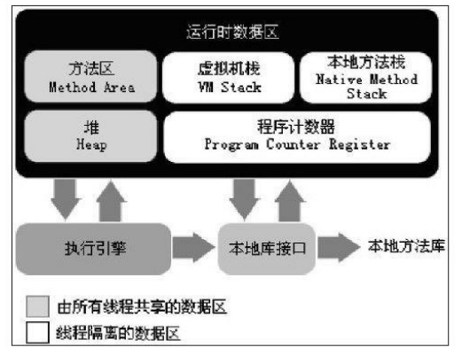
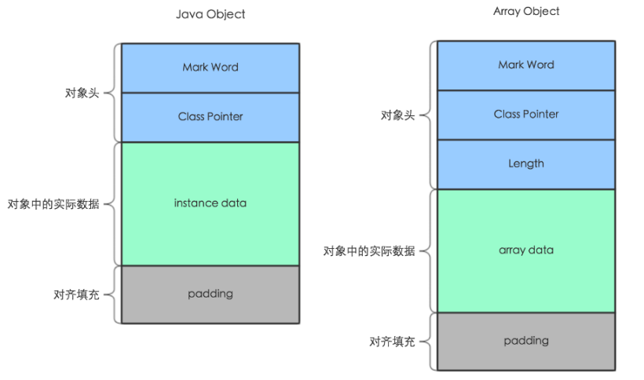
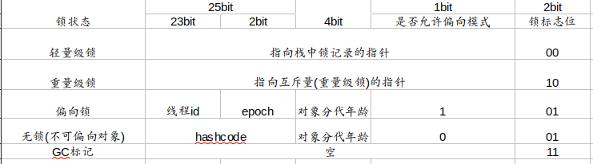
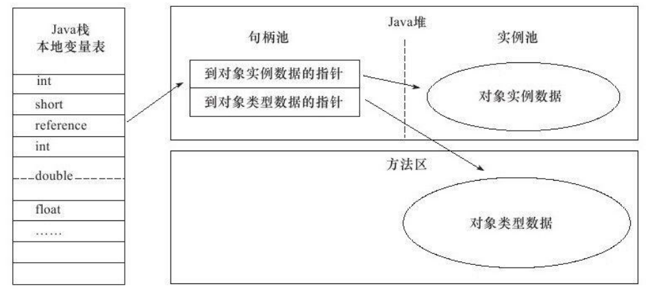
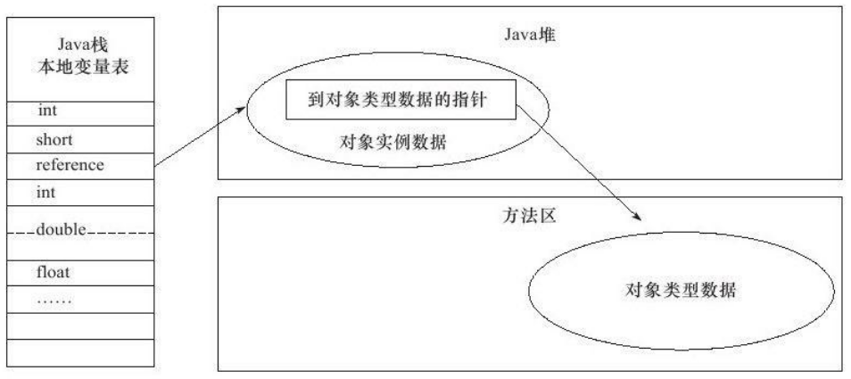

## JVM内存组成

> JDK 1.8

### 线程独有--程序计数器

程序计数器(Program Counter Register)是一块较小的内存空间,它可以看作是当前线程所执行的字节码的行号指示器。在虚拟机的概念模型里(仅是概念模型,各种虚拟机可能会通过一些更高效的方式去实现),字节码解释器工作时就是通过改变这个计数器的值来选
取下一条需要执行的字节码指令,分支、循环、跳转、异常处理、线程恢复等基础功能都需要依赖这个计数器来完成。

如果线程正在执行的是一个Java方法,这个计数器记录的是正在执行的虚拟机字节码指令的地址;如果正在执行的是Native方法,这个计数器值则为空(Undefined)。此内存区域是唯一一个在Java虚拟机规范中**没有规定任何OutOfMemoryError情况的区域**。

### 线程独有--Java虚拟机栈

与程序计数器一样,Java虚拟机栈(Java Virtual Machine Stacks)也是线程私有的,它的生命周期与线程相同。虚拟机栈描述的是Java方法执行的内存模型:

每个方法在执行的同时都会创建一个栈帧(Stack Frame )用于存储局部变量表、操作数栈、动态链接、方法出口
等信息。每一个方法从调用直至执行完成的过程,就对应着一个栈帧在虚拟机栈中入栈到出栈的过程。

**SF/OOM**

在Java虚拟机规范中,对这个区域规定了两种异常状况:如果线程请求的栈深度大于虚拟机所允许的深度,将抛出StackOverflowError异常;如果虚拟机栈可以动态扩展(当前大部分的Java虚拟机都可动态扩展,只不过Java虚拟机规范中也允许固定长度的虚拟机栈),如
果扩展时无法申请到足够的内存,就会抛出OutOfMemoryError异常。

### 线程独有--本地方法栈

本地方法栈(Native Method Stack)与虚拟机栈所发挥的作用是非常相似的,它们之间的区别不过是虚拟机栈为虚拟机执行Java方法(也就是字节码)服务,而本地方法栈则为虚拟机使用到的Native方法服务。

### 共享 -- 堆

对于大多数应用来说,Java堆(Java Heap)是Java虚拟机所管理的内存中最大的一块。
Java堆是被所有线程共享的一块内存区域,在虚拟机启动时创建。此内存区域的唯一目的就是存放对象实例,几乎所有的对象实例都在这里分配内存。这一点在Java虚拟机规范中的描述是:所有的对象实例以及数组都要在堆上分配 ,但是随着JIT编译器的发展与逃逸分析技术逐渐成熟,栈上分配、标量替换 优化技术将会导致一些微妙的变化发生,所有的对象都分配在堆上也渐渐变得不是那么“绝对”了。

### 共享 -- 方法区(非堆)

#### 简介

方法区(Method Area)与Java堆一样,是各个线程共享的内存区域,它用于存储已被虚拟机加载的类信息、常量、静态变量、即时编译器编译后的代码等数据。虽然Java虚拟机规范把方法区描述为堆的一个逻辑部分,但是它却有一个别名叫做Non-Heap(非堆),目的应
该是与Java堆区分开来。

####  元数据区
快

MetaSpace

- CCS 启用短指针

- CodeCache 

#### 运行时常量池

运行时常量池(Runtime Constant Pool)是方法区的一部分。Class文件中除了有类的版本、字段、方法、接口等描述信息外,还有一项信息是常量池(Constant Pool Table),用于存放编译期生成的各种字面量和符号引用,这部分内容将在类加载后进入方法区的运行时常
量池中存放。

#### 异常

根据Java虚拟机规范的规定,当方法区无法满足内存分配需求时,将抛出
OutOfMemoryError异常。

### 共享 -- 直接内存

直接内存(Direct Memory)并不是虚拟机运行时数据区的一部分,也不是Java虚拟机规范中定义的内存区域。但是这部分内存也被频繁地使用,而且也可能导致OutOfMemoryError异常出现,所以我们放到这里一起讲解。
在JDK 1.4中新加入了NIO(New Input/Output)类,引入了一种基于通道(Channel)与缓冲区(Buffer)的I/O方式,它可以使用Native函数库直接分配堆外内存,然后通过一个存储在Java堆中的DirectByteBuffer对象作为这块内存的引用进行操作。这样能在一些场景中显著
提高性能,因为避免了在Java堆和Native堆中来回复制数据。显然,本机直接内存的分配不会受到Java堆大小的限制,但是,既然是内存,肯定还是会受到本机总内存(包括RAM以及SWAP区或者分页文件)大小以及处理器寻址空间的限制。服务器管理员在配置虚拟机参数时,会根据实际内存设置-Xmx等参数信息,但经常忽略直接内存,使得各个内存区域总和大于物理内存限制(包括物理的和操作系统级的限制),从而导致动态扩展时出现OutOfMemoryError异常。

## 内存中的对象

### 对象的创建

#### 检查类加载

虚拟机遇到一条new指令时,首先将去检查这个指令的参数是否能在常量池中定位到一个类的符号引用,并且检查这个符号引用代表的类是否已被加载、解析和初始化过。如果没有,那必须先执行相应的类加载过程.

#### 分配内存

从java堆中划分一块区域:

- 指针碰撞
- 记录表,标记那块可以用

保证并发安全:

   - CAS CAS配上失败重试的方式保证更新操作的原子性

   - TLAB

     另一种是把内存分配的动作按照线程划分在不同的空间之中进行,即每个线程在Java堆中预先分配一小块内
     存,称为本地线程分配缓冲(Thread Local Allocation Buffer,TLAB).

#### 初始化对象头

例如这个对象是哪个类的实例、如何才能找到类的元数据信息、对象的哈希码、对象的GC分代年龄等信息。这些信息存放在对象的对象头(Object Header)之中。根据虚拟机当前的运行状态的不同,如是否启用偏向锁等,对象头会有不同的设置方式。

#### 初始化对象

在上面工作都完成之后,从虚拟机的视角来看,一个新的对象已经产生了,但从Java程序的视角来看,对象创建才刚刚开始——<init>方法还没有执行,所有的字段都还为零。所以,一般来说(由字节码中是否跟随invokespecial指令所决定),执行new指令之后会接着
执行<init>方法,把对象按照程序员的意愿进行初始化,这样一个真正可用的对象才算完全产生出来。

### 对象的内存布局

- 对象头
- 实例数据
- 对其填充

#### 对象头

- markword

  

- 类型指针kclass

  对象头的另外一部分是类型指针,即对象指向它的类元数据的指针,虚拟机通过这个指针来确定这个对象是哪个类的实例。

  并不是所有的虚拟机实现都必须在对象数据上保留类型指针,换句话说,查找对象的元数据信息并不一定要经过对象本身

#### 实例数据

#### 对齐

对齐填充并不是必然存在的,也没有特别的含义,它仅仅起着占位符的作用。
由于HotSpot VM的自动内存管理系统要求对象起始地址必须是8字节的整数倍,换句话说,
就是对象的大小必须是8字节的整数倍。

### 对象的访问定位

建立对象是为了使用对象,我们的Java程序需要通过栈上的reference数据来操作堆上的具体对象。由于reference类型在Java虚拟机规范中只规定了一个指向对象的引用,并没有定义这个引用应该通过何种方式去定位、访问堆中的对象的具体位置,所以对象访问方式也是取决于虚拟机实现而定的。目前主流的访问方式有使用句柄和直接指针两种。

#### 句柄

如果使用句柄访问的话,那么Java堆中将会划分出一块内存来作为句柄池,reference中存储的就是对象的句柄地址,而句柄中包含了对象实例数据与类型数据各自的具体地址信息.

#### 直接指针(快)

如果使用直接指针访问,那么Java堆对象的布局中就必须考虑如何放置访问类型数据的
相关信息,而reference中存储的直接就是对象地址

#### 对比

这两种对象访问方式各有优势,使用句柄来访问的最大好处就是reference中存储的是稳定的句柄地址,在对象被移动(垃圾收集时移动对象是非常普遍的行为)时只会改变句柄中的实例数据指针,而reference本身不需要修改。

使用直接指针访问方式的最大好处就是速度更快,它节省了一次指针定位的时间开销,由于对象的访问在Java中非常频繁,因此这类开销积少成多后也是一项非常可观的执行成本。就本书讨论的主要虚拟机Sun HotSpot而言,它是使用第二种方式进行对象访问的

## 内存溢出

在Java虚拟机规范的描述中,除了程序计数器外,虚拟机内存的其他几个运行时区域都
有发生OutOfMemoryError(下文称OOM)异常的可能

### 模拟java堆溢出

限制Java堆的大小为20MB,不可扩展(将堆的最小值-Xms参数与最大值-Xmx参数设置为一样即可避免堆自动扩展),通过参数-XX:
+HeapDumpOnOutOfMemoryError可以让虚拟机在出现内存溢出异常时Dump出当前的内存堆
转储快照以便事后进行分析 。

### 模拟虚拟机栈和本地方法栈溢出

**由于在HotSpot虚拟机中并不区分虚拟机栈和本地方法栈,**因此,对于HotSpot来说,虽然-Xoss参数(设置本地方法栈大小)存在,但实际上是无效的,栈容量只由-Xss参数设定。

如果线程请求的栈深度大于虚拟机所允许的最大深度,将抛出StackOverflowError异常。
如果虚拟机在扩展栈时无法申请到足够的内存空间,则抛出OutOfMemoryError异常。

### 处理

##### 内存溢出自动导出

-XX:+HeapDumpOnOutOfMemoryError  虚拟机出现OOM的时候·自动生成dump文件。

-XX:HeapDumpPath=./

##### 使用jmap命令手动导出

jmp -dump:format=b,file=heap.hprof 18384

##### 使用MAP工具分析