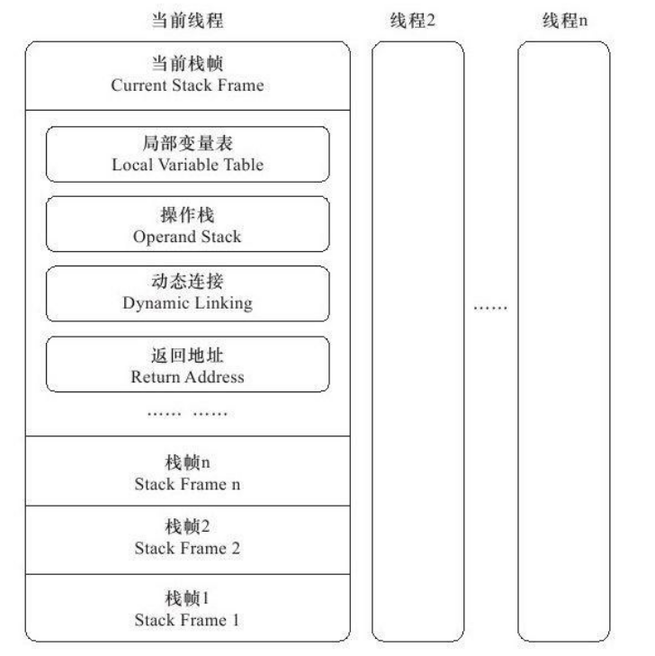
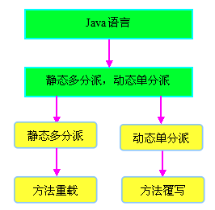
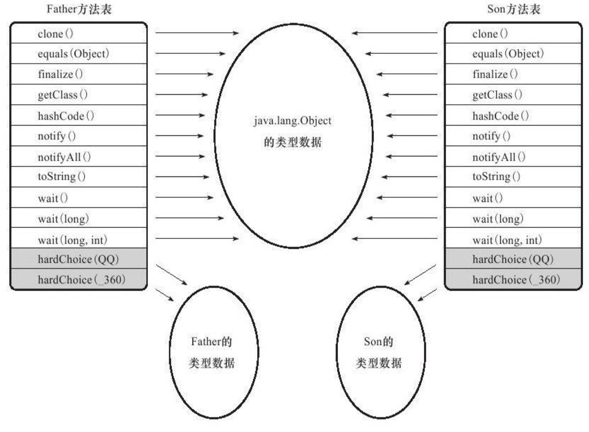

## 概述

在Java虚拟机规范中制定了虚拟机字节码执行引擎的概念模型,这个概念模型成为各种虚拟机执行引擎的统一外观(Facade)。在不同的虚拟机实现里面,执行引擎在执行Java代码的时候可能会有解释执行(通过解释器执行)和编译执行(通过即时编译器产生本地代码执行)两种选择 ,也可能两者兼备,甚至还可能会包含几个不同级别的编译器执行引擎。

## 运行时栈帧结构

栈帧(Stack Frame)是用于支持虚拟机进行方法调用和方法执行的数据结构,它是虚拟机运行时数据区中的虚拟机栈(Virtual Machine Stack) 的栈元素。

栈帧存储了方法的**局部变量表**、**操作数栈**、**动态连接和方法返回地**址等信息。每一个方法从调用开始至执行完成的过程,都对应着一个栈帧在虚拟机栈里面从入栈到出栈的过程。

一个线程中的方法调用链可能会很长,很多方法都同时处于执行状态。对于执行引擎来
说,在活动线程中,只有位于栈顶的栈帧才是有效的,称为当前栈帧(Current Stack Frame),与这个栈帧相关联的方法称为当前方法(Current Method)。执行引擎运行的所有字节码指令都只针对当前栈帧进行操作,在概念模型上,典型的栈帧结构如图



### 局部变量表

局部变量表(Local Variable Table)是一组变量值存储空间,用于存放**方法参数**和**方法内部定义的局部变量**。

在Java程序编译为Class文件时,就在方法的Code属性的max_locals数据项中确定了该方法所需要分配的局部变量表的最大容量。

### 操作数栈

操作数栈(Operand Stack)也常称为操作栈,它是一个后入先出(Last In First Out,LIFO)栈。同局部变量表一样,操作数栈的最大深度也在编译的时候写入到Code属性的max_stacks数据项中。

操作数栈的每一个元素可以是任意的Java数据类型,包括long和double。32位数据类型所占的栈容量为1,64位数据类型所占的栈容量为2。在方法执行的任何时候,操作数栈的深度都不会超过在`max_stacks`数据项中设定的最大值。

当一个方法刚刚开始执行的时候,这个方法的操作数栈是空的,在方法的执行过程中,会有各种字节码指令往操作数栈中写入和提取内容,也就是出栈/入栈操作。例如,在做算术运算的时候是通过操作数栈来进行的,又或者在调用其他方法的时候是通过操作数栈来进行参数传递的。

**demo**

整数加法的字节码指令`iadd`在运行的时候操作数栈中最接近栈顶的两个元素已经存入了两个int型的数值,当执行这个指令时,会将这两个int值出栈并相加,然后将相加的结果入栈。

### 动态连接

每个栈帧都包含一个指向运行时常量池 中该栈帧所属方法的引用,持有这个引用是为了支持方法调用过程中的动**态连接(Dynamic Linking)**。

> 我们知道Class文件的常量池中存有大量的符号引用,字节码中的方法调用指令就以常量池中指向方法的符号引用作为参数。这些**符号引用一部分会在类加载阶段或者第一次使用的时候就转化为直接引用**,这种转化称为静态解析。另外一部分将**在每一次运行期间转化为直接引用,这部分称为动态连接**。

### 方法返回地址

方法退出的过程实际上就等同于把当前栈帧出栈,因此退出时可能执行的操作有:恢复上层方法的局部变量表和操作数栈,把返回值(如果有的话)压入调用者栈帧的操作数栈中,调整PC计数器的值以指向方法调用指令后面的一条指令等。


## 方法调用

**方法调用并不等同于方法执行,方法调用阶段唯一的任务就是确定被调用方法的版本(即调用哪一个方法)。**

> 在程序运行时,进行方法调用是最普遍、最频繁的操作,但前面已经讲过,Class文件的编译过程中不包含传统编译中
> 的连接步骤,一切方法调用在Class文件里面存储的都只是符号引用,而不是方法在实际运行时内存布局中的入口地址(相当于之前说的直接引用)。这个特性给Java带来了更强大的动态扩展能力,但也使得Java方法调用过程变得相对复杂起来,需要在类加载期间,甚至到运行期间才能确定目标方法的直接引用。

### 解析

所有方法调用中的目标方法在Class文件里面都是一个常量池中的符号引用,在类加载的解析阶段,会将其中的一部分符号引用转化为直接引用,这种解析能成立的前提是:**方法在程序真正运行之前就有一个可确定的调用版本,并且这个方法的调用版本在运行期是不可改变的。**换句话说,调用目标在程序代码写好、编译器进行编译时就必须确定下来。这类方法的调用称为解析(Resolution)。

在Java语言中符合“编译期可知,运行期不可变”这个要求的方法：

- 静态方法
- 私有方法、final方法

前者与类型直接关联,后者在外部不可被访问,这两种方法各自的特点决定了它们都不可能通过继承或别的方式重写其他版本,因此它们都适合在类加载阶段进行解析。

在Java虚拟机里面提供了5条方法调用字节码指令：

- invokestatic:调用静态方法。
- invokespecial:调用实例构造器<init>方法、私有方法和父类方法。

只要能被invokestatic和invokespecial指令调用的方法,都可以在解析阶段中确定唯一的调用版本,符合这个条件的有静态方法、私有方法、实例构造器、父类方法4类,它们在类加载的时候就会把符号引用解析为该方法的直接引用。

invokevirtual:调用所有的虚方法。
invokeinterface:调用接口方法,会在运行时再确定一个实现此接口的对象。
invokedynamic:先在运行时动态解析出调用点限定符所引用的方法,然后再执行该方法。

在此之前的4条调用指令,分派逻辑是固化在Java虚拟机内部的,而invokedynamic指令的分派逻辑是由用户所设定的引导方法决定的。

### 分派

众所周知,Java是一门面向对象的程序语言,因为Java具备面向对象的3个基本特征:`继承`、`封装`和`多态`。分派调用过程将会揭示多态性特征的一些最基本的体现,如“重载”和“重写”在Java虚拟机之中是如何实现的。

#### 静态分派

所有依赖静态类型来定位方法执行版本的分派动作称为静态分派。静态分派的典型应用是方法重載。静态分派发生在编译阶段，因此确定静态分派的动作实际上不是由虚拟机来执行的。另外，编译器虽然能确定出方法的重载版本，但在很多情况下这个重载版本并不是“唯一的”，往往只能确定一个“更加合适的”版本。

```java
 /**
     *方法静态分派演示
     *@author zzm
     */
    public class StaticDispatch{
        static abstract class Human{
        }
        static class Man extends Human{
        }
        static class Woman extends Human{
        }
        public void sayHello(Human guy){
            System.out.println("hello,guy!");
        }
        public void sayHello(Man guy){
            System.out.println("hello,gentleman!");
        }
        public void sayHello(Woman guy){
            System.out.println("hello,lady!");
        }
        public static void main(String[]args){
            Human man=new Man();
            Human woman=new Woman();
            StaticDispatch sr=new StaticDispatch();
            sr.sayHello(man);
            sr.sayHello(woman);
        }
    }

```

hello,guy!
hello,guy!


```java
Human man=new Man();
```

我们把上面代码中的“Human”称为变量的`静态类型(Static Type)`,或者叫做的外观类型(Apparent Type),后面的“Man”则称为变量的`实际类型(Actual Type)`。

main()里面的两次sayHello()方法调用,在方法接收者已经确定是对象“sr”的前提下,使用哪个重载版本,就
完全取决于传入参数的数量和数据类型。

代码中刻意地定义了两个静态类型相同但实际类型不同的变量,但**虚拟机(准确地说是编译器)在重载时是通过参数的静态类型而不是实际类型作为判定依据的**。并且静态类型是编译期可知的,因此,在编译阶段,Javac编译器会根据参数的静态类型决定使用哪个重载版本,所以选择了sayHello(Human)作为调用目标,并把这个方法的符号引用写到main()方法里的两条invokevirtual指令的参数中。


#### 动态分派

了解了静态分派,我们接下来看一下动态分派的过程,它和多态性的另外一个重要体现 ——重写(Override)有着很密切的关联。

```java
    /**
     *方法动态分派演示
     *@author zzm
     */
    public class DynamicDispatch{
        static abstract class Human{
            protected abstract void sayHello();
        }
        static class Man extends Human{
            @Override
            protected void sayHello(){
                System.out.println("man say hello");
            }
        }
        static class Woman extends Human{
            @Override
            protected void sayHello(){
                System.out.println("woman say hello");
            }
        }
        public static void main(String[]args){
            Human man=new Man();
            Human woman=new Woman();
            man.sayHello();
            woman.sayHello();
            man=new Woman();
            man.sayHello();
        }
```

man say hello
woman say hello
woman say hello

`invokevirtual`指令的运行时解析过程大致分为以下几个步骤:

1. 找到操作数栈顶的第一个元素所指向的对象的实际类型,记作C。

2. 如果在类型C中找到与常量中的描述符和简单名称都相符的方法,则进行访问权限校验,如果通过则返回这个方法的直接引用,查找过程结束;如果不通过,则返回java.lang.IllegalAccessError异常。
   
3. 否则,按照继承关系从下往上依次对C的各个父类进行第2步的搜索和验证过程。

4. 如果始终没有找到合适的方法,则抛出java.lang.AbstractMethodError异常。

 由于**invokevirtual指令执行的第一步就是在运行期确定接收者的实际类型**,所以两次调用中的invokevirtual指令把常量池中的类方法符号引用解析到了不同的直接引用上,这个过程就是Java语言中方法重写的本质。我们把这种在运行期根据实际类型确定方法执行版本的分派过程称为动态分派。


#### 单分派与多分派

前面给出：方法的接受者（亦即方法的调用者）与方法的参数统称为方法的宗量。但分派是根据一个宗量对目标方法进行选择，多分派是根据多于一个宗量对目标方法进行选择。

为了方便理解，下面给出一段示例代码：

```java
class Eat{  
}  
class Drink{  
}  

class Father{  
    public void doSomething(Eat arg){  
        System.out.println("爸爸在吃饭");  
    }  
    public void doSomething(Drink arg){  
        System.out.println("爸爸在喝水");  
    }  
}  

class Child extends Father{  
    public void doSomething(Eat arg){  
        System.out.println("儿子在吃饭");  
    }  
    public void doSomething(Drink arg){  
        System.out.println("儿子在喝水");  
    }  
}  

public class SingleDoublePai{  
    public static void main(String[] args){  
        Father father = new Father();  
        Father child = new Child();  
        father.doSomething(new Eat());  
        child.doSomething(new Drink());  
    }  
}  
```

爸爸在吃饭
儿子在喝水

我们首先来看编译阶段编译器的选择过程，即静态分派过程。这时候选择目标方法的依据有两点：一是方法的接受者（即调用者）的静态类型是 Father 还是 Child，二是方法参数类型是 Eat 还是 Drink。因为是根据两个宗量进行选择，所以 Java 语言的静态分派属于多分派类型。

再来看运行阶段虚拟机的选择，即动态分派过程。由于编译期已经了确定了目标方法的参数类型（编译期根据参数的静态类型进行静态分派），因此唯一可以影响到虚拟机选择的因素只有此方法的接受者的实际类型是 Father 还是 Child。因为只有一个宗量作为选择依据，所以 Java 语言的动态分派属于单分派类型。



#### **虚拟机动态分派的实现**

由于动态分派是非常频繁的动作，而且动态分派的方法版本选择过程需要运行时在类的方法元数据中搜索合适的目标方法，因此在虚拟机的实际实现中基于性能的考虑，大部分实现都不会真正地进行如此频繁的搜索。面对这种情况，最常用的“稳定优化”手段就是为类在方法区中建立一个虚方法表（Vritual Method Table，也称为 vtable，与此对应的，在 invokeinterface执行时也会用到接口方法表一 Inteface Method Table，简称 sitable），使用虚方法表索引来代替元数据查找以提高性能。

在JVM加载类的同时，会在方法区中为这个类存放很多信息,其中就有一个数据结构叫方法表。它以数组的形式记录了当前类及其所有超类的可见方法字节码在内存中的直接地址 。



虚方法表中存放着各个方法的实际入口地址。如果某个方法在子类中没有被重写，那子类的虚方法表里面的地址入口和父类相同方法的地址入口是一致的，都指向父类的实现入口。如果子类中重写了这个方法，子类方法表中的地址将会替换为指向子类实现版本的入口地址。

Son 重写了来自 Fathera 的全部方法，因此 Son的方法表没有指向 Father 类型数据的箭头。但是 Son 和 Father 都没有重写来自 Object的方法，所以它们的方法表中所有从 Object 继承来的方法都指向了 Object的数据类型。

为了程序实现上的方便，**具有相同签名的方法，在父类、子类的虚方法表中都应当具有一样的索引序号这样当类型变换时，仅需要变更查找的方法表，就可以从不同的虚方法表中按索引转换出所需的入口地址**。

方法表一般在类加载的连接阶段进行初始化，准备了类的变量初始值后，虚拟机会把该类的方法表也初始化完毕。

Demo

https://zhuanlan.zhihu.com/p/24317613

### 动态语言支持

在介绍 Java 虚拟机的动态类型语言支持之前，我们要先弄明白动态类型语言是什么？它与 Java 语言、Java 虚拟机有什么关系？了解 JDK1.7 提供动态类型语言支持的技术背景，对理解这个语言特性是很有必要的。

什么是动态类型语言？动态类型语言的关键特征是它的类型检查的主体过程是在运行期而不是编译期，满足这个特征的语言有很多，常用的包括：APL、Clojure、Erlang、Groovy、Javascript、Jython、Lisp、Lua、PHP、Prolog、Python、Ruby、Smalltalk 和 Tcl 等。相对的，在编译期就进行类型检查过程的语言（如 C+和 Java 等）就是最常用的静态类型语言.


```java
public static void main（String[]args）{ int[][][]array=new int[1][0][-1]； }
```

这段代码能够正常编译，但运行的时候会报`NegativeArraySizeException`异常。在Java虚拟机规范中明确规定了`NegativeArraySizeException`是一个运行时异常，通俗一点来说，运行时异常就是只要代码不运行到这一行就不会有问题。与运行时异常相对应的是连接时异常， 例如很常见的`NoClassDefFoundError`便属于连接时异常，即使会导致连接时异常的代码放在 一条无法执行到的分支路径上，类加载时（Java的连接过程不在编译阶段，而在类加载阶段）也照样会抛出异常。


