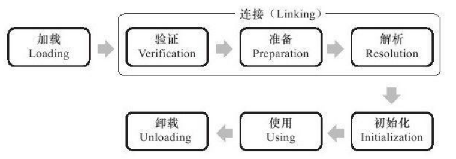

## 类加载时机

#### 对类进行初始化的条件

有且只有5种情况必须立即对类进行“初始化”(而加载、验证、准备自然需要在此之前开始):

1)遇到`new`、`getstatic`、`putstatic`或`invokestatic`这4条字节码指令时,如果类没有进行过初始化,则需要先触发其初始化。生成这4条指令的最常见的Java代码场景是:使用**new关键字实例化对象**的时候、**读取或设置一个类的静态字段**(被final修饰、已在编译期把结果放入常量池的静态字段除外)的时候,以及**调用一个类的静态方法**的时候。
2)使用**java.lang.reflect**包的方法对类进行反射调用的时候,如果类没有进行过初始化,则需要先触发其初始化。
3)当初始化一个类的时候,如果发现**其父类还没有进行过初始化**,则需要先触发其父类的初始化。
4)当虚拟机启动时,用户需要指定一个要执行的主类(**包含main()方法的那个类**),虚拟机会先初始化这个主类。
5)当使用JDK1.7的动态语言支持时,如果一个java.lang.invoke.MethodHandle实例最后的解析结果REF_getStatic、REF_putStatic、REF_invokeStatic的方法句柄,并且这个方法句柄所对应的类没有进行过初始化,则需要先触发其初始化。

> 动态类型语言的关键特征是它的类型检查的主体过程是在运行期而不是编译期进行的，满足这个特征的语言有很多，常用的包括：APL、Clojure、Erlang、Groovy、JavaScript、Jython、Lisp、Lua、PHP、Prolog、Python、Ruby、Smalltalk 和 Tcl 等等。那相对地，在编译期就进行类型检查过程的语言，如 C++ 和 Java 等就是最常用的静态类型语言。

## 类加载阶段

### 阶段概述

类从被加载到虚拟机内存中开始,到卸载出内存为止,它的整个生命周期包括:加载(Loading)、验证(Verification)、准备(Preparation)、解析(Resolution)、初始化(Initialization)、使用(Using)和卸载(Unloading)7个阶段。其中验证、准备、解析3个部分统称为连接(Linking),这7个阶段的发生顺序如图7-1所示。

**加载、验证、准备、初始化和卸载这5个阶段的顺序是确定的**,类的加载过程必须按照这种顺序按部就班地**开始**,而解析阶段则不一定:它在某些情况下可以在初始化阶段之后再开始,这是为了支持Java语言的运行时绑定(也称为动态绑定或晚期绑定)。

> 按部就班地“开始”,而不是按部就班地“进行”或“完成”,强调这点是因为这些阶段通常都是互相交叉地混合式进行的,通常会在一个阶段执行的过程中调用、激活另外一个阶段。

### 加载

**加载是类加载(Class Loading)过程的一个阶段**,不要混淆这两个看起来很相似的名词。在加载阶段,虚拟机需要完成以下3件事情:

- 通过一个类的全限定名来获取定义此类的二进制字节流。
- 将这个字节流所代表的静态存储结构转化为方法区的运行时数据结构。
- 在内存中生成一个代表这个类的java.lang.Class对象,作为方法区这个类的各种数据
  的访问入口。

> 通过一个类的全限定名来获取定义此类的二进制字节流,没有指明二进制字节流要从一个Class文件中获取,准确地说是根本没有指明要从哪里获取、怎样获取。
>
> 从ZIP包中读取,这很常见,最终成为日后JAR、EAR、WAR格式的基础。
> 从网络中获取,这种场景最典型的应用就是Applet。
> 运行时计算生成,这种场景使用得最多的就是动态代理技术,在java.lang.reflect.Proxy中,就是用了ProxyGenerator.generateProxyClass来为特定接口生成形式为*$Proxy"的代理类的二进制字节流。

### 验证

验证是连接阶段的第一步，这一阶段的目的是为了确保 Classi 文件的字节流中包含的信息符合当前虛拟机的要求，并且不会危害虚拟机自身的安全。

Java 语言本身是相对安全的语言（依然是相对于 C/C++ 来说）,使用纯粹的 Java 代码无法做到诸如访问数组边界以外的数据、将一个对象转型为它并未实现的类型、跳转到不存在的代码行之类的事情，如果这样做了，编译器拒绝编译。但Class文件并不一定要求用 Java 源码编译而来，可以使用任何途径产生，甚至包括用十六进制编辑器直接编写来产生 Class 文件。在字节码语言层面上，上述 Java 代码无法做到的事情都是可以实现的，至少语义上是可以表达出来的。虛拟机如果不检查输入的字节流，对其完全信任的话，很可能会因为载入了有害的字节流而导致系统崩溃，所以验证是虚拟机对自身保护的一项重要工作

验证阶段是非常重要的，这个阶段是否严谨，直接决定了 Java 虚拟机是否能承受恶意代

码的攻击，从执行性能的角度上讲，验证阶段的工作量在虚拟机的类加载子系统中又占了相当大的一部分。

#### 文件格式验证

#### 元数据验证

#### 字节码验证

#### 符号引用验证

最后一个阶段的校验发生在虚拟机将符号引用转化为直接引用的时候，这个转化动作将在连接的第三阶段解析阶段中发生。符号引用验证可以看做是对类自身以外（常量池中的各种符号引用）的信息进行匹配性校验.

### 准备

准备阶段是**正式为类变量分配内存并设置类变量初始值**的阶段，这些变量所使用的内存**都将在方法区中进行分配**。这个阶段中有两个容易产生混淆的概念需要强调一下，首先，这时候进行内存分配的仅包括类变量（被 **static 修饰的变量**），而不包括实例变量，实例变量将会在对象实例化时随着对象一起分配在 Java 堆中。其次，这里所说的初始值“通常情况”下是数据类型的零值.

### 解析

解析阶段是虚拟机将**常量池内的符号引用替换为直接引用的过程**.

**符号引用（Symbolic References**）：符号引用以一组符号来描述所引用的目标，符号可以是任何形式的字面量，只要使用时能无歧义地定位到目标即可。符号引用与虚拟机实现的内存布局无关，引用的目标并不ー定已经加载到内存中。各种虚拟机实现的内存布局可以各不相同，但是它们能接受的符号引用必须都是一致的，因为符号引用的字面量形式明确定义在 Java 虚拟机规范的 Class 文件格式中。

**直接引用（Direct References）**：直接引用可以是直接指向目标的指针、相对偏移量或是个能间接定位到目标的句柄。直接引用是和虚拟机实现的内存布局相关的，同一个符号引用在不同虚拟机实例上翻译出来的直接引用一般不会相同。如果有了直接引用，那引用的目标必定已经在内存中存在。

### 初始化

类初始化

## 类加载器

虚拟机设计团队把类加载阶段中的“通过一个类的全限定名来获取描述此类的二进制字节流”这个动作放到 Java 虚拟机外部去实现，以便让应用程序自己决定如何去获取所需要的类。实现这个动作的代码模块称为“类加载器”。

### 相等的类

类加载器虽然只用于实现类的加载动作，但它在 Java 程序中起到的作用却远远不限于类加载阶段。**对于任意一个类，都需要由加载它的类加载器和这个类本身一同确立其在 Java 虚拟机中的唯一性**，每一个类加载器，都拥有一个独立的类名称空间。这句话可以表达得更通俗一些：**比较两个类是否“相等”，只有在这两个类是由同一个类加載器加载的前提下才有意义**，否则，即使这两个类来源于同一个 CIass文件，被同一个虚拟机加载，只要加载它们的类加载器不同，那这两个类就必定不相等。

这里所指的“相等”，包括代表类的 Class对象的 `equals()`方法、`isAssignableFrom()`方法、`isInstance()`方法的返回结果，也包括使用 `instance of `关键字做对象所属关系判定等情况。如果没有注意到类加载器的影响，在某些情况下可能会产生具有迷惑性的结果.

## 双亲委派模型

图中展示的类加载器之间的这种层次关系，称为类加载器的双亲委派模型（Parents Delegation Model）。双亲委派模型要求除了顶层的启动类加载器外，其余的类加载器都应当有自己的父类加载器。这里类加载器之间的父子关系一般不会以继承（Inheritance）的关系来实现，而是都使用组合（Composition）关系来复用父加载器的代码。

### 双亲委派模型的工作过程

如果一个类加载器收到了类加载的请求，它首先不会自己去尝试加载这个类，而是把这个请求委派给父类加载器去完成，每一个层次的类加载器都是如此，因此所有的加载请求最终都应该传送到顶层的启动类加载器中，只有当父加载器反馈自己无法完成这个加载请求（它的搜索范围中没有找到所需的类）时，子加载器才会尝试自己去加载。

使用双亲委派模型来组织类加载器之间的关系，有一个显而易见的好处就是 Java 类随着它的类加载器一起具备了一种带有优先级的层次关系。

例如类 java.lang.Object，它存放在 rt.jar 之中,无论哪一个类加载器要加载这个类,最终都是委派给处于模型最顶端的启动类加載器进行加载，因此 Object 类在程序的各种类加载器环境中都是同一个类.

## 破坏双亲委派模型

### 模型自身的缺陷--基础类反调用

双亲委派很好地解决了各个类加载器的基础类的统一问题（越基础的类由越上层的加载器进行加载），基础类之所以称为“基础”，是因为它们总是作为被用户代码调用的 API，但世事往往没有绝对的完美，如果基础类又要调用回用户的代码，那该怎么办？

这并非是不可能的事情，一个典型的例子便是 JNDI 服务，JNDI 现在已经是 Java 的标准服务，它的代码由启动类加载器去加載（在 JDK1.3 时放进去的 rt.jar），但 JNDI 的目的就是对资源进行集中管理和查找，它需要调用由独立厂商实现并部署在应用程序的 ClassPath 下的 JNDI接口提供者（SPI, Service Provider Interface）的代码，但启动类加载器不可能认识”这些代码

为了解决这个问题，Java 设计团队只好引入了ー个不太优雅的设计：线程上下文类加载器（Thread Context Classloader）。这个类加载器可以通过 java.lang.Thread 类的 setContextClassLoader()方法进行设置，如果创建线程时还未设置，它将会从父线程中继承，如果在应用程序的全局范围内都没有设置过的话，那这个类加载器默认就是应用程序类加载器.

有了线程上下文类加载器，就可以做一些“舞弊”的事情了，JNDI 服务使用这个线程上下文类加载器去加载所需要的 SPI 代码，也就是**父类加载器请求子类加载器去完成类加载的动作**，这种行为实际上就是打通了双亲委派模型的层次结构来逆向使用类加载器，实际上已经违背了双亲委派模型的一般性原则，但这也是无可奈何的事情。Java 中所有涉及 SPI 的加载动作基本上都采用这种方式，例如 JNDI、JDBC、JCE、JAXB 和 JBI 等。

### 热部署

osgi

