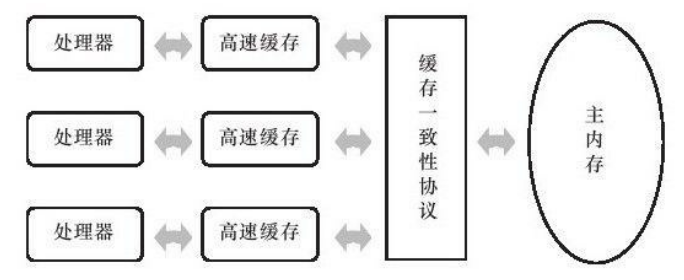
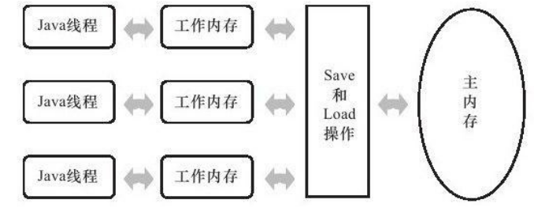
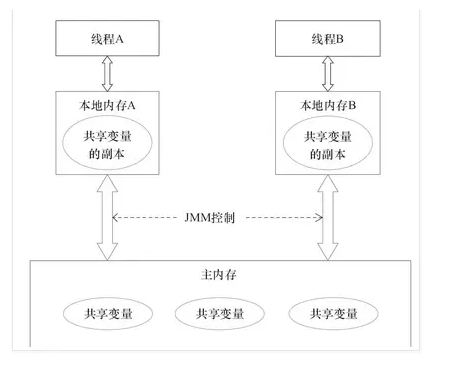
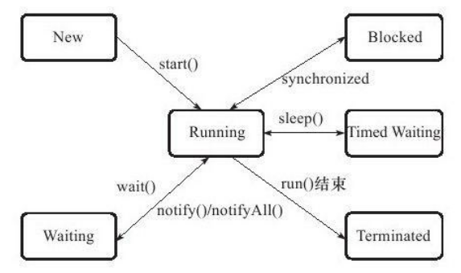

## 高速缓存

**优点**

现代计算机系统不得不加入读写速度尽可能接近处理器运算速度的`高速缓存(Cache)`来作为内存与处理器之间的缓冲:将运算需要使用到的数据复制到缓存中,让运算能快速进行,当运算结束后再从缓存同步回内存之中,这样处理器就无须等待缓慢的内存读写了。

> cpu的高速缓存一般也有多层

**问题**

基于高速缓存的存储交互很好地解决了处理器与内存的速度矛盾,但是也为计算机系统带来更高的复杂度,因为它引入了一个新的问题:缓存一致性(Cache Coherence)。在多处理器系统中,每个处理器都有自己的高速缓存,而它们又共享同一主内存(Main Memory)。

当多个处理器的运算任务都涉及同一块主内存区域时，为了解决一致性的问题,需要各个处理器访问缓存时都遵循一些协议,在读写时要根据协议来进行操作,这类协议有MSI、MESI(Illinois Protocol)、MOSI、Synapse、Firefly及
Dragon Protocol等。

**这也就是缓存一致性协议**




## 乱序优化

除了增加高速缓存之外,为了使得处理器内部的运算单元能尽量被充分利用**,处理器可能会对输入代码进行乱序执行(Out-Of-Order Execution)优化**,处理器会在计算之后将乱序执行的结果重组,保证该结果与顺序执行的结果是一致的,但并不保证程序中各个语句计算的先后顺序与输入代码中的顺序一致。

与处理器的乱序执行优化类似,Java虚拟机的即时编译器中也有类似的指令重排序(Instruction Reorder)优化。


## Java 内存模型（Java Memory Model）

Java内存模型的主要目标是定义程序中各个变量的访问规则,即在虚拟机中将变量存储到内存和从内存中取出变量这样的底层细节。

此处的**变量(Variables)与Java编程中所说的变量有所区别,它包括了实例字段、静态字段和构成数组对象的元素,但不包括局部变量与方法参数,因为后者是线程私有的** ,不会被共享,自然就不会存在竞争问题。


### 主内存与工作内存

Java内存模型规定了所有的变量都存储在`主内存(Main Memory)`中(此处的主内存与介绍物理硬件时的主内存名字一样,两者也可以互相类比,但此处仅是虚拟机内存的一部分)。每条线程还有自己的`工作内存`(Working Memory,**可与前面讲的处理器高速缓存类比**),**线程的工作内存中保存了被该线程使用到的变量的主内存副本拷贝**。

线程对变量的所有操作(读取、赋值等)都必须在工作内存中进行,而不能直接读写主内存中的变量 。
不同的线程之间也无法直接访问对方工作内存中的变量,线程间变量值的传递均需要通过主内存来完成,线程、主内存、工作内存三者的交互关系如图



### JMM

JMM属于语言级的内存模型，它确保在不同的编译器和不同的处理器平台之上，通过禁止特定类型的编译器重排序和处理器重排序，为程序员提供一致的内存可见性保证。



注意，线程本地内存只是一个抽象概念，它涵盖了缓存、写缓冲区、寄存器以及其他的硬件和编译器优化。

### JMM8种操作

- `lock(锁定)`:作用于主内存的变量,它把一个变量标识为一条线程独占的状态。

- `unlock(解锁)`:作用于主内存的变量,它把一个处于锁定状态的变量释放出来,释放
  后的变量才可以被其他线程锁定。

- `read(读取)`:作用于主内存的变量,它把一个变量的值从主内存传输到线程的工作内
  存中,以便随后的load动作使用。

- `load(载入)`:作用于工作内存的变量,它把read操作从主内存中得到的变量值放入工
  作内存的变量副本中。

- `use(使用)`:作用于工作内存的变量,它把工作内存中一个变量的值传递给执行引
  擎,每当虚拟机遇到一个需要使用到变量的值的字节码指令时将会执行这个操作。

- `assign(赋值)`:作用于工作内存的变量,它把一个从执行引擎接收到的值赋给工作内
  存的变量,每当虚拟机遇到一个给变量赋值的字节码指令时执行这个操作。

- `store(存储)`:作用于工作内存的变量,它把工作内存中一个变量的值传送到主内存
  中,以便随后的write操作使用。

- `write(写入)`:作用于主内存的变量,它把store操作从工作内存中得到的变量的值放入
  主内存的变量中。


## volatile

关键字volatile可以说是Java虚拟机提供的最轻量级的同步机制,但是它并不容易完全被正确、完整地理解,以至于许多程序员都习惯不去使用它,遇到需要处理多线程数据竞争问题的时候一律使用synchronized来进行同步。


### 可见性

当一个变量定义为volatile之后,它将具备两种特性,第一是保证此变量对所有线程的可见性,这里的“可见性”是指**当一条线程修改了这个变量的值,新值对于其他线程来说是可以立即得知的**。

而普通变量不能做到这一点,普通变量的值在线程间传递均需要通过主内存来完成,例如,线程A修改一个普通变量的值,然后向主内存进行回写,另外一条线程B在线程A回写完成了之后再从主内存进行读取操作,新变量值才会对线程B可见。


**辨析**

关于volatile变量的可见性,经常会被开发人员误解

论据：**volatile变量对所有线程是立即可见的,对volatile变量所有的写操作都能立刻反应到其他线程之中,换句话说,volatile变量在各个线程中是一致的**。

结论：所以基于volatile变量的运算在并发下是安全。

这句话的论据部分并没有错,但是其论据并不能得出“基于volatile变量的运算在并发下是安全的”这个结论。


**并不是原子性**

Java里面的运算并非原子操作,导致volatile变量的运算在并发下一样是不安全的

由于volatile变量只能保证可见性,在不符合以下两条规则的运算场景中,我们仍然要通过加锁(使用synchronized或java.util.concurrent中的原子类)来保证原子性。

- 运算结果并不依赖变量的当前值,或者能够确保只有单一的线程修改变量的值。
- 变量不需要与其他的状态变量共同参与不变约束。


### 禁止特定重排序

使用volatile变量的第二个语义是禁止指令重排序优化,**普通的变量仅仅会保证在该方法的执行过程中所有依赖赋值结果的地方都能获取到正确的结果,而不能保证变量赋值操作的顺序与程序代码中的执行顺序一致**。


```java
Map configOptions;
char[]configText;
//此变量必须定义为volatile
volatile boolean initialized=false;
//假设以下代码在线程A中执行
//模拟读取配置信息,当读取完成后将initialized设置为true以通知其他线程配置可用
configOptions=new HashMap();
configText=readConfigFile(fileName);
processConfigOptions(configText,configOptions);
initialized=true;
//假设以下代码在线程B中执行
//等待initialized为true,代表线程A已经把配置信息初始化完成
while(!initialized){
sleep();
}
//使用线程A中初始化好的配置信息
doSomethingWithConfig();
```

如果定义initialized变量时没有使用volatile修饰,就可能会**由于指令重排序的优化,导致位于线程A中最后一句的代码“initialized=true”被提前执行**(这里虽然使用Java作为伪代码,但所指的重排序优化是机器级的优化操作,提前执行是指这句话对应的汇编代码被提前执行),这样在线程B中使用配置信息的代码就可能出现错误,而volatile关键字则可以避免此类情况的发生 。


## long 与 double

Java内存模型要求lock、unlock、read、load、assign、use、store、write这8个操作都具有原子性,但是对于64位的数据类型(long和double),在模型中特别定义了一条相对宽松的规定:**允许虚拟机将没有被volatile修饰的64位数据的读写操作划分为两次32位的操作来进行**,即允许虚拟机实现选择可以不保证64位数据类型的load、store、read和write这4个操作的原子性,这点就是所谓的long和double的非原子性协定(Nonatomic Treatment of double and long Variables)。


如果有多个线程共享一个并未声明为volatile的long或double类型的变量,并且同时对它们进行读取和修改操作,那么某些线程可能会读取到一个既非原值,也不是其他线程修改值的代表了“半个变量”的数值。


不过这种读取到“半个变量”的情况非常罕见(在目前商用Java虚拟机中不会出现),因为Java内存模型虽然允许虚拟机不把long和double变量的读写实现成原子操作,但允许虚拟机选择把这些操作实现为具有原子性的操作,而且还“强烈建议”虚拟机这样实现。在实际开发中,目前各种平台下的商用虚拟机几乎都选择把64位数据的读写操作作为原子操作来对待,因此我们在编写代码时一般不需要把用到的long和double变量专门声明为volatile。


## java的线程

Java语言定义了5种线程状态,在任意一个时间点,一个线程只能有且只有其中的一种状态

- `新建(New)`:

  创建后尚未启动的线程处于这种状态。

- 运行(Runable):

  Runable包括了操作系统线程状态中的Running和Ready,也就是处于此状态的线程有可能正在执行,也有可能正在等待着CPU为它分配执行时间。

- 无限期等待(Waiting):处于这种状态的线程不会被分配CPU执行时间,它们要等待被
  其他线程显式地唤醒。以下方法会让线程陷入无限期的等待状态:
  
  - 没有设置Timeout参数的Object.wait()方法。
  - 没有设置Timeout参数的Thread.join()方法。
  - LockSupport.park()方法。
  
- 限期等待(Timed Waiting):处于这种状态的线程也不会被分配CPU执行时间,不过无须等待被其他线程显式地唤醒,在一定时间之后它们会由系统自动唤醒。以下方法会让线程进入限期等待状态:
  
  - Thread.sleep()方法。
  - 设置了Timeout参数的Object.wait()方法。
  - 设置了Timeout参数的Thread.join()方法。
  - LockSupport.parkNanos()方法。
  - LockSupport.parkUntil()方法。

 - 阻塞(Blocked):
   
    线程被阻塞了,**“阻塞状态”与“等待状态”的区别是:“阻塞状态”在等待着获取到一个排他锁**,这个事件将在另外一个线程放弃这个锁的时候发生;而“等待状态”则是在等待一段时间,或者唤醒动作的发生。在程序等待进入同步区域的时候,线程将进入这种状态。
 - 结束(Terminated):已终止线程的线程状态,线程已经结束执行。





## 线程安全与锁

