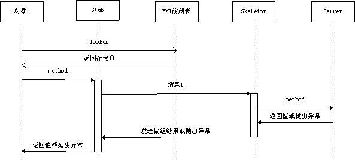

## RMI

>  Remote Method Invocation 一种机制能够让在某个 Java 虚拟机上的对象调用另一个 Java 虚拟机中的对象上的方法的机制。

##### 一句话概述

分布式对象间的通讯

##### RMI原理

##### Demo

见code文件

[^参考]http://www.cnblogs.com/xt0810/p/3640167.html
[^参考]http://www.cnblogs.com/dongguacai/p/5617698.html

##### RMI的局限性

1、只能实现JAVA系统之间的调用，不是跨语言的（使用SOAP等），而WebService可以实现跨语言实现系统之间的调用。

2、RMI使用了JAVA默认的序列化方式，对于性能要求比较高的系统，可能需要其他的序列化方案来解决。

