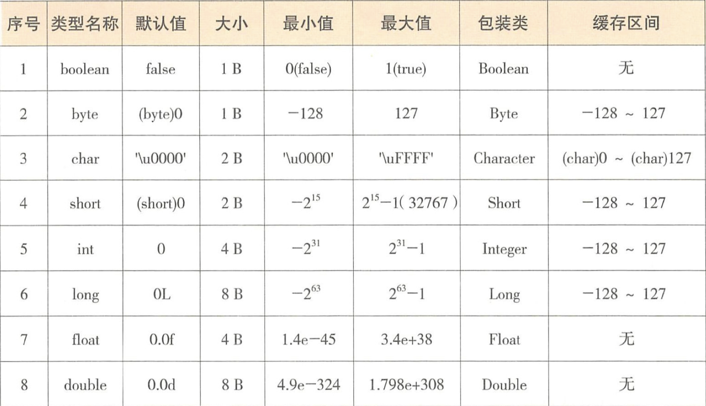

# 基本数据类型与包装类型

## 基本数据类型

### 介绍

虽然 Java 是面向对象编程语言，－切皆是对象，但是为了兼容人类根深蒂固的 数据处理习惯，加快常规数据的处理速度，**提供了 9 种基本数据类型，它们都不具备对象的特性，没有属性和行为。基本数据类型是指不可再分的原子数据类型，内存中直接存储此类型的值**，通过内存地址即可直接访问到数据，并且此内存区域只能 存放这种类型的值。


Java 的 9 种基本数据类型包括 boolean、 byte 、 char、 short、 int、 long、 float、 double 和 refvar.

前 8 种数据类型表示生活中的真假、字符、整数和小数，最后一种 refvar 是面向对象世界中的引用变量，也叫引用句柄。

### 表格



**默认值**

默认值虽然都与 0 有关，但是它们之间是存在区别的 。 

- boolean 的默认值以 0 表示的 false ,

  JVM 并没有针对 boolean 数据类型进行赋值的专用字节码指令， boolean flag= false 就是用 ICONST_0 ，即常数 0 来进行赋值， 

- byte 的默认值以一个字节的 0 表示，在默认值的表示上使用了强制类型转化， 

- float 的默认值以单精度浮点数 0.0f表示，浮点数的0.0使用后缀 f和 d 区别标识； 

- char 的默认值只能是单引号的'＼u0000' 表示NULL 

  注意不是 null ,它就是一个空的不可见字符，在码表中是第一个，其码值为 0 ，与 `\n` 换行之类的不可见控制符的理解角度是一样的。注意，不可以用双引号方式对 char 进行赋值，那是字符串的表示方式。

- 在代码中直接出现的没有任何上下文的 0和 0.0 分别默认为 int 和 double 类型

  可以使用 JDK10的类型推断证明 var a=0; Long b=a;代码编译出错，因为在自动装箱时， 0 默认是 int 类型，自动装箱为 Integer ，无法转化为 Long 类型。

**符号**

所有数值类型都是有符号的,见上面的表格.

因为浮点数无法表示零值，所以表示范围分为两个区间，正数区间和负数区间。表中的 float 和 double 的最小值与最大值均指正数区间，它们对应的包装类并没有缓存任何数值。

**引用类型**

引用分成两种数据类型,引用变量本身和引用指向的对象。

为了强化这两个概念的区分，可以把用变量（ Reference Variable ）称为 refvar ，而把引用指向的实际对象（ Referred Object ）简称为 refobj。

**refvar** -- 4B

refvar是基本的数据类型，它的默认值是 null 存储 `refobj `的首地址，可以直接使用双等号==进行等值判断。

而平时使用 `refvar.hashCode() `返回的值，只是对象的某种哈希计算，可能与地址有关，与 refvar 本身存储的内存单元地址是两回事。

作为一个引用变量，不管它是指向包装类、集合类、字符串类还是自定义类，refvar 均占用` 4B` 空间。

> 注意它与真正对象 refobj 之间的区别。无论 refobj 是多么小的对象，最小占用的存储空间是 12 B（用于存储基本信息，称为对象头），但由于存储空间分配必须是 8B的倍数，所以初始分配的空间至少是16 B。

一个 refvar 至多存储一个 refobj 的首地址，一个 refobj 可以被多个 refvar 存储下它的首地址，即一个堆内对象可以被多个 refvar 引用指向。如果 refobj 没有被任何 refvar 指向，那么它退早会被垃圾回收。而 refvar 的内存释放，与其他基本数据类型类似。

**int 与 Integer**

**基本数据类型 int 占用 4 个字节 ,而对应的包装类 Integer 实例对象占用 16 个字节**。这里可能会有人问 Integer 里边的代码就只占用 16B ？这是因为字段属性除成员属性 int value 外 , 其他的如 `MAX _VALUE`、 `MIN_VALUE` 等都是静态成员变量,在类加载时就分配了内存,与实例对象容量无关。

此外，类定义中的方法代码不占用实例对象的任何空间。IntegerCache 是 Integer 的静态内部类 ， 容量占用也与实例对象无关。

由于 refobj 对象的基础大小是 12B,再加上 int 是 4B ,所以 Integer 实例对象占用16B ， 按此推算 Double 对象占用的存储容量是 24B,示例代码如下 。

**对象头**


(1) 对象头（Object Header)

对象头占用 12 个字节，存储内容包括对象标记（markOop）和类元信息（klass oop).

对象标记存储对象本身运行时的数据，如哈希码、GC 标记、锁信息、线程关联信息等，这部分数据在 64 位 JVM 上占用 8 个字节，称为“Mark Word“。为了存储更多的状态信息，对象标记的存储格式是非固定的（具体与 JWM 的实现有关）。

类元信息存储的是对象指向它的类元数据（即 Klass）的首地址，占用 4 个字节，与 refvar 开销一致

 (2) 实例数据（Instance Data)

存储本类对象的实例成员变量和所有可见的父类成员变量。如 Integer 的实例成员只有一个 `private int value`，占用 4 个字节，所以加上对象头为 16 个字节；

再如，RefObjDemo 对象大小为 48 个字节，一个子类 RefobjSon 继承 Refobjdemo，即使子类内部是空的，new RefObjSon的对象也是占用 48 个字节。

(3) 对齐填充（Padding)

对象的存储空间分配单位是 8 个字节，如果一个占用大小为 16 个字节的对象增加一个成员变量 byte 类型，此时需要占用 17 个字节，但是也会分配 24 个字节进行对齐填充操作。


## 包装类型

前 8 种基本数据类型都有相应的包装类，因为 Java 的设计理念是一切皆是对象，在很多情况下，需要以对象的形式操作，比如 hashCode()获取哈希值，或者 getClass()获取类等。

包装类的存在解决了基本数据类型无法做到的事情：泛型类型参数、序列化、类型转换、高频区间数据缓存。

尤其是最后一项，我们都知道 Integer 会缓存-128~127 之间的值，对于 Integer var=？在-128~127 之间的赋值，Integer 对象由 `IntegerCache. cache` 产生，会复用已有对象，这个区间内的 Integer 值可以直接使用==进行判断，但是**这个区间之外的所有数据都会在堆上产生，并不会复用已有对象这是一个大问题。因此，推荐所有包装类对象之间值的比较全部使用 `equals()`方法**。

**事实上，除` Float` 和` Double` 外，其他包装数据类型都会缓存**

6 个包装类直接赋值时，就是调用对应包装类的静态工厂方法 valueOf (），以 Integer 为例，源码如下

```java
public static Integer valueOf(int i) {
        if (i >= IntegerCache.low && i <= IntegerCache.high)
            return IntegerCache.cache[i + (-IntegerCache.low)];
        return new Integer(i);
    }
```


如上源代码，赋值数据i在缓存区间内直接返回缓存中的 Integer 对象，否则就会 newー个对象。

在 JDK9 直接把 new 的构造方法过时，推荐使用 valueOf(), 合理利用缓存，提升程序性能。各个包装类的缓存区间如下

-  Boolean：使用静态 final 变量定义，valueof（）就是返回这两个静态值。

- Byte：表示范围是-128~127, 全部缓存。

- Short：表示范围是-32768~32767, 缓存范围是-128-127

- Character：表示范围是 0~65535, 缓存范围是 0~127

- Long：表示范围是-2^63-2^63-1，缓存范围是-128~127。

- Integer：表示范围是-2^31,2^31-1 。

  

最后详细介绍 Integer，因为它是 Java 数据世界里应用最广的数据类型，缓存范围是-128~127。但它是唯一可以修改缓存范围的包装类，在 VM options 加入参数-XX: AutoboxCacheMax=7777 即可设置最大缓存值为 7777

**规范**

- 所有的 POJO 类属性必须使用包装数据类型。

- RPC 方法的返回值和参数必须使用包装数据类型。
- 所有的局部变量推荐使用基本数据类型。


