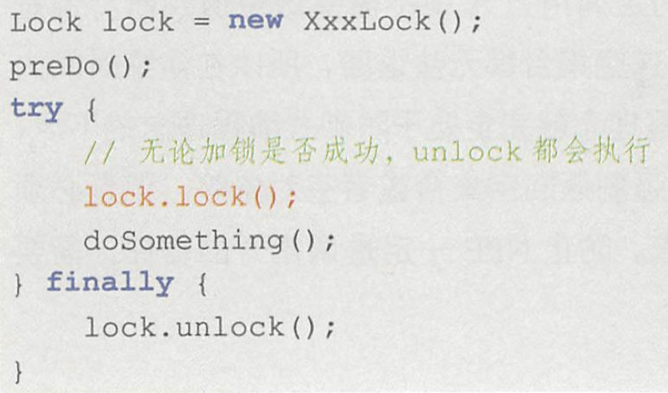

# try catch finally

## 理解

**在不抛出异常的情况下**

程序执行完 try 里面的代码块之后，该方法并不会立即结束，而是继续试图去寻找该方法有没有 finally 的代码块，
如果没有 finally 代码块，整个方法在执行完 try 代码块后返回相应的值来结束整个方法；
如果有 finally 代码块，此时程序执行到 try 代码块里的 return 语句之时并不会立即执行 return，而是先去执行 finally 代码块里的代码.
若 finally 代码块里没有 return 或没有能够终止程序的代码，程序将在执行完 finally 代码块代码之后再返回 try 代码块执行 return 语句来结束整个方法；
若 finally 代码块里有 return 或含有能够终止程序的代码，方法将在执行完 finally 之后被结束，不再跳回 try 代码块执行 return。
**在抛出异常的情况下**

原理也是和上面的一样的，你把上面说到的 try 换成 catch 去理解就 OK 了.

也就是,就算你在catch抛出异常,finally中有return.也就直接return了.


> 在finally 的角度看来,try和catch在某种程度上是等价的.
>
> try catcth 在抛出异常/return 之前会寻找finally. 
>
> 如果finally中没有return/抛出异常等终结语句,那么就会返回原处执行.
>
> 如果finally中有return/抛出异常等终结语句,那么就会直接结束.


## return 的坑

### finally 会改变返回值吗?

我们知道怎样都会执行finally，但是执行了finally对我们的正返回值有没有影响呢.

```java
 public static void main(String[] args) {
        System.out.println(getStr());
    }
    static String getStr(){
        String res = "";
        try{
            System.out.println("try");
            res = "tryRes";
            return res;
        }catch (Exception e){

        }finally {
          System.out.println("finally");
          res = "finRes";
        }
        return res;
    }
```

在finally修改了str字符串，但是通过输出结果我们得到的还是tryRes

所有我们得到结论：**虽然finally方法会被执行,但是返回结果不会被改变**，也就是如果finally是在return之后执行的那么他会把返回结果先保存起来，然后不管finally代码执行了什么，都不会影响到返回结果，等finally执行完成在返回结果。

**但如果finally中有return语句,那么会覆盖掉try的return语句.改变返回值**

### catch 会改变返回值吗?

```java
static String getStr2(){
        String res = "";
        try{
            System.out.println("try");
            res = "tryRes";
            res.charAt(100);
            return res;
        }catch (Exception e){
            System.out.println("catch");
            res = "catchRes";
            return res;
        }finally {
            System.out.println("finally");
            res = "finRes";
        }

    }
```

catch可以改变返回值.这里catch和try是一样的,都不会被finally影响. 

### 总结

try语句在返回前，将其他所有的操作执行完，保留好要返回的值，而后转入执行finally中的语句，而后分为以下三种情况：

    情况一：如果finally中有return语句，则会将try中的return语句”覆盖“掉，直接执行finally中的return语句，得到返回值，这样便无法得到try之前保留好的返回值。
    
    情况二：如果finally中没有return语句，也没有改变要返回值，则执行完finally中的语句后，会接着执行try中的return语句，返回之前保留的值。
    
    情况三：如果finally中没有return语句，但是改变了要返回的值，这里有点类似与引用传递和值传递的区别，分以下两种情况，：
    
        1）如果return的数据是基本数据类型或文本字符串，则在finally中对该基本数据的改变不起作用，try中的return语句依然会返回进入finally块之前保留的值。
    
        2）如果return的数据是引用数据类型，而在finally中对该引用数据类型的属性值的改变起作用，try中的return语句返回的就是在finally中改变后的该属性的值。


> finally 的意义是做处理,而不是return. 

## 变式

### try-catch

### try-finally

## try 与 lock

try代码块与锁的关系，lock 方法可能会抛出 unchecked 异常，如果放在 try 代码块中，必然触发 finally 中的 unlock 方法执行。对未加锁的对象解锁会抛出 unchecked 异常，如Illegalmonitorstateexception

虽然是因为加锁失败而造成程序中断的，但是真正加锁失败的原因可能会被后者覆盖。

**所以在 try 代码块之前调用 lock()方法，避免由于加锁失败导致 finally 调用 unlock 抛出异常。**

警示代码中的红色代码应该移到 try 代码块的上方，如下所示。

