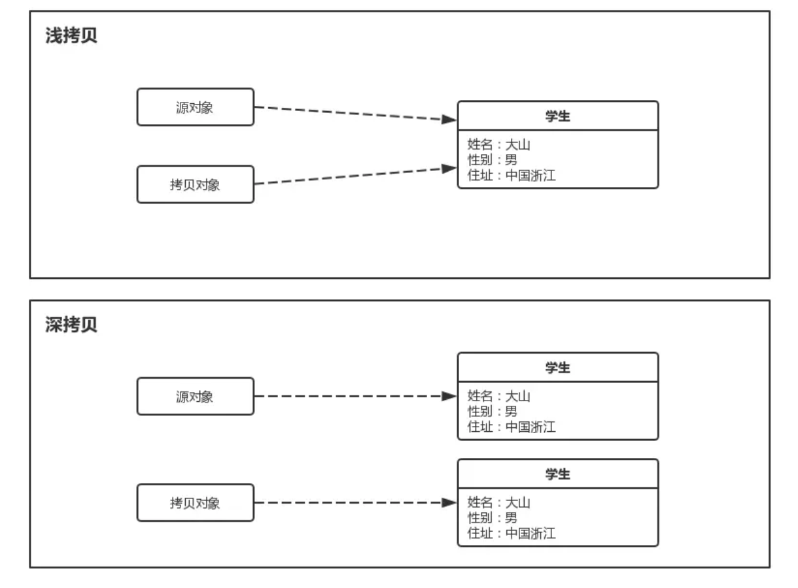

# 深拷贝与浅拷贝




## Object.clone()

在 Java 中，所有的 Class 都继承自 Object ，而在 Object 上，存在一个 clone() 方法，它被声明为了 `protected `，所以我们可以在其子类中，使用它。

可以看到，它的实现非常的简单，它限制所有调用 clone() 方法的对象，都必须实现 `Cloneable` 接口，否者将抛出 `CloneNotSupportedException` 这个异常。最终会调用 `internalClone()` 方法来完成具体的操作。而 `internalClone()` 方法，实则是一个 **native** 的方法。对此我们就没必要深究了，只需要知道它可以 `clone()` 一个对象得到一个新的对象实例即可。

## 浅拷贝

Student.java

```java
public class Student implements Cloneable {

    private String name;
    private int age;
    private Teacher teacher;

    public Student(String name, int age, Teacher teacher) {
        this.name = name;
        this.age = age;
        this.teacher = teacher;
    }
}
```

Teacher.java

```java
public class Teacher implements Cloneable {

    private String name;
    private String course;

    public Teacher(String name, String course) {
        this.name = name;
        this.course = course;
    }
}
```

Student类中包含有name，age和Teacher对象。


克隆对象实现Cloneable接口（该接口是一个标记接口），在克隆的方法里面调用super.clone(),就会返回克隆后的对象。

```java
public class Student implements Cloneable {

    private String name;
    private int age;
    private Teacher teacher;

    public Student(String name, int age, Teacher teacher) {
        this.name = name;
        this.age = age;
        this.teacher = teacher;
    }

    public Student clone() {
        Student student = null;
        try {
            student = (Student) super.clone();
        } catch (CloneNotSupportedException e) {
            e.printStackTrace();
        }
        return student;
    }
}
```

测试

```java
 public static void main(String args[]) throws IOException, ClassNotFoundException {
        Teacher teacher = new Teacher("王老师", "英语");
        Student student = new Student("小明", 11, teacher);

        Student clone = student.clone();
        clone.setName("小强");
        clone.setAge(20);
        clone.getTeacher().setName("李老师");

        System.out.println(student.getName() + " " + student.getAge());
        System.out.println(clone.getName() + " " + clone.getAge());
        System.out.println(clone.getTeacher() == student.getTeacher());
    }复制代码
```

输出：

```
小明 11
小强 20
true
```

从上面结果可知，克隆出来的Student对象里的name和age是新的，但是teacher是和原来的共享的，这就是浅克隆。


## 深拷贝

### 逐层实现clone接口

Student.java

```java
public class Student implements Cloneable {

    private String name;
    private int age;
    private Teacher teacher;

    public Student(String name, int age, Teacher teacher) {
        this.name = name;
        this.age = age;
        this.teacher = teacher;
    }

    public Student clone() {

        Student student = null;
        try {
            student = (Student) super.clone();
            // 这里手动调用Teacher的clone方法
            Teacher teacher = this.teacher.clone();
            student.setTeacher(teacher);
        } catch (CloneNotSupportedException e) {
            e.printStackTrace();
        }
        return student;
    }
}
```

Teacher.java

```java
public class Teacher implements Cloneable {

    private String name;
    private String course;

    public Teacher(String name, String course) {
        this.name = name;
        this.course = course;
    }

    public Teacher clone() {

        Teacher clone = null;
        try {
            clone = (Teacher) super.clone();
        } catch (CloneNotSupportedException e) {
            e.printStackTrace();
        }
        return clone;
    }
}复制代码
```

要实现深克隆的话，克隆对象里面的对象类型也必须实现Cloneable接口并调用clone()。

测试：

```java
public static void main(String args[]) throws IOException, ClassNotFoundException {
    Teacher teacher = new Teacher("王老师", "英语");
    Student student = new Student("小明", 11, teacher);

    Student clone = student.clone();
    clone.setName("小强");
    clone.setAge(20);
    clone.getTeacher().setName("李老师");

    System.out.println(student.getName() + " " + student.getAge());
    System.out.println(clone.getName() + " " + clone.getAge());
    System.out.println(clone.getTeacher() == student.getTeacher());
}
```

输出：

```
小明 11
小强 20
false
```

这时，两个对象的中的Teacher就不是同一个对象了，实现了深克隆，但是**如果要克隆的对象继承链比较长的话要实现深克隆，就必须逐层地实现Cloneable，这个过程是比较麻烦的**，不过还有一种方法可以简便地实现深克隆。


### 序列化

比如使用Gson序列化

```java
static Gson  gson = new Gson();
    public static void main(String[] args) {
        // 测试gson反序列化实现深拷贝
        useGson();
    }

    private static void  useGson(){
        Teacher teacher = new Teacher("王老师", "英语");
        Student student = new Student("小明", 11, teacher);

        Student clone = gson.fromJson(gson.toJson(student),Student.class);
        clone.setName("小强");
        clone.setAge(20);
        clone.getTeacher().setName("李老师");

        System.out.println(student.getName() + " " + student.getAge());
        System.out.println(clone.getName() + " " + clone.getAge());
        System.out.println(clone.getTeacher() == student.getTeacher());
    }
```

