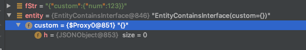

# 序列化与反序列化
## 背景

在目前eclp系统内部,主要存在`gson`,`fastjson`两种序列化框架,他们对于普通简单实体类的处理是可以兼容的,不过在进行序列化/反序列化时仍然存在一些**不同的行为和限制**.尤其涉及以下几个方面的时候:

- 实体类布尔属性命名使用is前缀
- 实体类属性包含时间类型,如Date
- 实体类属性包含接口
- 实体类包含内部类

> 普通简单实体类指的是只使用基本包装类型和get/set方法的实体类.


> Gson
>
> Gson（又称Google Gson）是Google公司发布的一个开放源代码的Java库，主要用途为序列化Java对象为JSON字符串，或反序列化JSON字符串成Java对象。
>
> fastjson
>
> fastjson是阿里巴巴的开源JSON解析库，它可以解析JSON格式的字符串，支持将Java Bean序列化为JSON字符串，也可以从JSON字符串反序列化到JavaBean。

## 尽量避免发生问题的原则

为了保证线上安全,在进行序列化/反序列化的时候尽量避免踩到不同框架差异的坑,应当注意一下两点:

- 优先级规则1: 如果是自己系统内部,尽量在序列化端和反序列化端使用同一框架
- 优先级规则2: 如果遭遇特殊情况,无法保证两端框架一致,那应该尽力追求**json报文的中立性**

> 中立性指的是同时能被两种框架正确解析,实现json报文中立性,往往需要遵守一些规范.

当然,即使两端使用统一框架,比如同时使用Gson或者同时使用Fastjson.如果要进行切换,比如全部从Gson切换为Fastjson,还是需要注意一些差异,比如实体类含有接口属性.这个后面有详细分析.

## 差异分析

### 查找属性方式的不同

Gson与Jackson或fastjson不同的是, **它的序列/反序列化是用通过读取类的属性进行**的,也就是说, 跟getter/setter没什么关系

```java
class Person{
    // 属性名带is
    Boolean isStudent;
    // 方法使用idea自动生成
    public Boolean getStudent() {
        return isStudent;
    }

    public void setStudent(Boolean student) {
        isStudent = student;
    }
}
```

分别使用gson/fastjson序列化

```
{"isStudent":true} //gson
{"student":true}   //fastjson
```

如果把fastjson序列化的结果输入gson进行反序列化,就是导致属性丢失.gson认为`Person`并没有student这个属性.

**建议规范**

- 不要对布尔类型使用is命名

  对于is开头的属姓名,logbok会生成携带is的get/set方法,而idea会忽略is前缀.这可能会导致fastjson和gson行为不同.

- 对外暴露的实体类属性,建议统一使用包装类型.

### 处理时间类型的不同

gson默认将时间序列化为字符串,fastjson则默认将其序列化为unix时间戳.

```java
@Data
class Entity{
    Date date;
}
```

分别使用gson/fastjson序列化

```
{"date":"Sep 27, 2019 6:34:46 PM"}  //gson
{"date":1569580486000}              //fastjson
```

很明显,这两者默认是无法通用的.

将`{"date":1569580486000}  `使用gson反序列化会有如下错误:

```
Failed to parse date ["1569580486000"]: Invalid time zone indicator '8'
```

将`{"date":"Sep 27, 2019 6:34:46 PM”}`使用fastjson反序列化会有如下错误:

```
Caused by: java.lang.NumberFormatException: For input string: "Sep 27, 2019 6:34:46 PM"
	at java.lang.NumberFormatException.forInputString(NumberFormatException.java:65)
```

可以使用JSONFiled指定fastjson的行为,这样达到中间兼容的格式.

```java
@Data
class Entity{
    @JSONField(format="yyyy-MM-dd HH:mm:ss")
    Date date;
}
//{"date":"2019-09-27 18:37:44"}
```

这样可以gson可以反序列化fastjson的结果.

如果要让fastjson成功反序列化gson生辰的`Sep 27, 2019 6:34:46 PM` 那只能自定义反序列化处理器.

```java
public class DateDeserializer extends DateCodec {

    public DateDeserializer() {
    }

    public <T> T cast(DefaultJSONParser parser, Type clazz, Object fieldName, Object val) {
        SimpleDateFormat sdf = new SimpleDateFormat("MMM d, yyyy K:m:s a", Locale.ENGLISH);
        if (val == null) {
            return null;
        } else {
            if (val instanceof String) {
                String strVal = (String) val;
                if (strVal.length() == 0) {
                    return null;
                } else if (strVal.equals("0000-00-00")) {
                    parser.setDateFormat("yyyy-MM-dd");
                } else if (strVal.endsWith("AM") || strVal.endsWith("PM")) {
                    parser.setDateFomrat(sdf);
                    try {
                        val = sdf.parse(strVal).getTime();
                    } catch (ParseException e) {
                        throw new RuntimeException("转换英国格式的日期异常", e);
                    }
                }
            }
        }
        return super.cast(parser, clazz, fieldName, val);
    }
}
```

使用

```java
 ParserConfig parserConfig = new ParserConfig();
 parserConfig.putDeserializer(Date.class, new DateDeserializer());
 JSON.parseObject(message, SoMainParam.class,parserConfig, JSON.DEFAULT_PARSER_FEATURE);
```


**建议规范**

- 对实体类的时间类型,增加@JSONField注解.Gson会忽略它,不会有影响,如果有一天用到Fastjson可以派上用场.

### 反序列化接口类型的不同

gson fastjson对反序列化接口的处理不同.

```java
public interface CustomInterface {
    int getNum();
}

public class CustomImpl implements CustomInterface {
    int num = 123;
    @Override
    public int getNum() {
        return num;
    }
}

@Data
class EntityContainsInterface{
    CustomInterface custom;
}
```

分别使用gson/fastjson序列化EntityContainsInterface

```
{"custom":{"num":123}}  //gson
{"custom":{"num":123}}  //fastjson
```

结果是一致的,但是在反序列化的时候.

#### gson默认不允许反序列化接口

```java
Caused by: java.lang.UnsupportedOperationException: Interface can't be instantiated! 
```

在源码中可以看到

```java
  static void assertInstantiable(Class<?> c) {
        int modifiers = c.getModifiers();
        if (Modifier.isInterface(modifiers)) {
            throw new UnsupportedOperationException("Interface can't be instantiated! Interface name: " + c.getName());
        } else if (Modifier.isAbstract(modifiers)) {
            throw new UnsupportedOperationException("Abstract class can't be instantiated! Class name: " + c.getName());
        }
    }
```

如果是接口/抽象类.gson直接抛出`UnsupportedOperationException`异常,这是不支持的操作.

**我们在一般情况下,实在是没必要在对外暴露的实体类中使用接口**


#### fastjson对接口反序列化的处理

还是上面的例子.如果你使用fastjson反序列化,那么不会报错.



但是注意看这个custom属性其实是一个代理类.

使用`System.getProperties().put("sun.misc.ProxyGenerator.saveGeneratedFiles", "true"); `在本地导出这个代理类可以发现它实际是jdk的动态代理.

```java
public final class $Proxy0 extends Proxy implements CustomInterface {
}
public class Proxy implements java.io.Serializable {
   /**
     * the invocation handler for this proxy instance.
     * @serial
     */
    protected InvocationHandler h;
}    

```

它的h属性invocationHandler指向一个JSONObject.

```java
public class JSONObject extends JSON implements Map<String, Object>, Cloneable, Serializable, InvocationHandler {
  
}
```

如果对反序列化的`EntityContainsInterfaced`对象的`custom`对象调用`getNum`方法,实际会走到

JSONObject的`invoke(Object proxy, Method method, Object[] args)`方法.

他会去自己的`Map<String, Object> map`使用属性名`num`取值,但得到一个null,最后抛出空指针.


但如果是声明类型的接口则有所不同,比如`Serializable`

```java
@Data
class EntityContainsSerializable{
    Serializable serial;
}
```

我们将一个整型set进EntityContainsSerializable,序列化的结果为:{"serial":1}

进行反序列化是可以正常拿到这个serial属性的值.

Fastjson在对属性接口反序列化的时候,对泛型和特殊几个标志性接口做了特殊处理.

- Cloneable,Serializable,Closeable,Comparable

  他们会走到`parser.parse(fieldName)`

```java
 public <T> T deserialze(DefaultJSONParser parser, Type type, Object fieldName) {
        if (type instanceof GenericArrayType) {
          ......
        } else {
            return type instanceof Class && type != Object.class && type != Serializable.class && type != Cloneable.class && type != Closeable.class && type != Comparable.class ? parser.parseObject(type) : parser.parse(fieldName);
        }
    }
```


对于示例中的情况,对Serializable属性赋值整型.

在parser.parse(fieldName)中,会通过lexer返回一个intValue.

```java
public Object parse(Object fieldName) {
    JSONLexer lexer = this.lexer;
    switch(lexer.token()) {
       case 2:
            Number intValue = lexer.integerValue();
            lexer.nextToken();
            return intValue;
    }    
}
```


**建议规范**

- 尽量避免在涉及序列化的实体类中使用接口,往往有其他替代方式.

### 反序列化内部类

对于Gson,序列化没有问题,默认是支持反序列化内部类的,默认开启**InnerClassSerialization**.

对于Fastjson,序列化没有问题,默认也支持反序列化.


**建议规范**

内部类是不太推荐使用的，如果要用尽量使用`static`修饰符修饰内部类,这样不会依赖外部类,内部类改为`static`修饰符修饰还可以有效的避免内存泄漏.

尽量一个`Java`文件中只保留一个类，这样在大多数序列化与反序列化工具中都不会出现问题，也比较符合当下模块化开发的规范

## 错误修正

以上内容来自部门实践中遇到的问题和分析.

如有错误,欢迎联系erp:yangxu25

共同分析,共同进步.