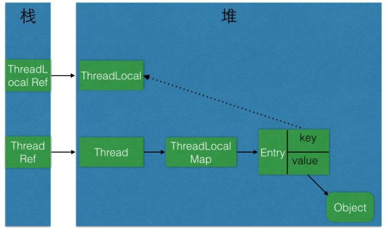

#### Theadlocal 内存泄露

1.key为空，value不为空的entry

2.复用线程（线程池）

引用：

https://www.zhihu.com/question/23089780/answer/62097840

http://www.jasongj.com/java/threadlocal/

http://ifeve.com/%E4%BD%BF%E7%94%A8threadlocal%E4%B8%8D%E5%BD%93%E5%8F%AF%E8%83%BD%E4%BC%9A%E5%AF%BC%E8%87%B4%E5%86%85%E5%AD%98%E6%B3%84%E9%9C%B2/

