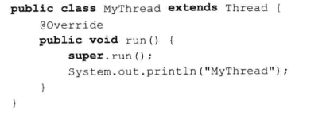

### 实现多线程的方式


#### 继承Thread类 重写run方法（单继承限制）



[super.run()](https://www.cnblogs.com/echo-cheng/p/6814909.html)  调用target runnable


#### 实现Runnable接口 实现run方法

```JAVA
public class MyRunnable implements Runnable{
	public void run() {
		System.out.println("运行中!");
	}
	
}
```

这是推荐的方式，而且Thread也实现了runnable接口，也就是可以把一个thread委托给另一个thread调用run。


#### 其他方式

实现Callable接口通过FutureTask包装器来创建Thread线程

使用ExecutorService、Callable、Future实现有返回结果的线程

http://www.cnblogs.com/felixzh/p/6036074.html


ps：start并不代表按顺序启动