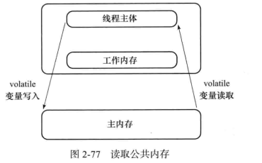

### volatile

> 只修饰变量

#### 可见但不原子

- 强制从公共堆栈(主存)取值

  
   这里的工作内存是个抽象概念
- 禁止特定的指令重排序

​      这在双重校验锁实现单例模式时候用到了。  

#### volatile 和 synchronized的比较

> 线程安全有可见性和原子性两个方面

1.volatile是线程同步的轻量级实现，修饰变量。syn修饰方法和代码块。

2.volatile被多线程访问并不会造成阻塞，它不是锁,syn是.

3.volatile保证可见性，但不是原子性。syn保证原子性，也间接保证可见性，它会将工作内存和私有内存做同步

