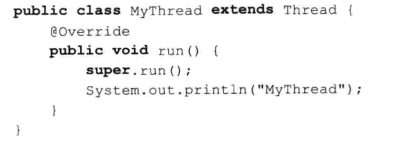

### 实现多线程的方式

#### 继承Thread类 重写run方法

#### 实现Runnable接口 实现run方法

#### 其他方式

实现Callable接口通过FutureTask包装器来创建Thread线程

使用ExecutorService、Callable、Future实现有返回结果的线程

http://www.cnblogs.com/felixzh/p/6036074.html