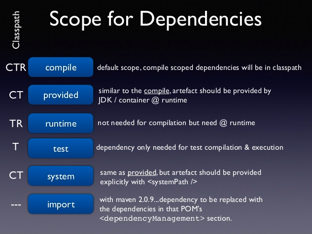

# maven dependency scope

>  Maven的一个哲学是惯例优于配置(Convention Over Configuration), Maven默认的依赖配置项中，scope的默认值是compile

## maven scpe 

- compile

  默认,参与编译,打包,运行,测试.

- provided
  和compile相似，但是表明了**dependency 由JDK或者容器提供**，例如Servlet AP和一些Java EE APIs。
  **这个scope 只能作用在编译和测试时，同时没有传递性，也不会打包**。

- runtime

  表示dependency不作用在编译时，但会作用在运行和测试时.

  比较常见的如JSR×××的实现，对应的API jar是compile的,具体实现是runtime的，compile只需要知道接口就足够了。
  oracle jdbc驱动架包也是一个很好的例子，一般scope为runntime。

  > runntime的依赖通常和optional搭配使用，optional为true。我可以用A实现，也可以用B实现。

- test

- import

  这个和`dependencyManagement`配合使用,指定依赖的版本

> system  很少使用
>
> 从参与度来说，也provided相同，不过被依赖项不会从maven仓库抓，而是从本地文件系统拿，一定需要配合systemPath属性使用。

**provided的包和test的包不会参与依赖传递**

## 总结

