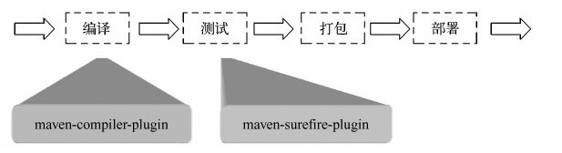

# maven 生命周期

## 什么是生命周期

在Maven出现之前，项目构建的生命周期就已经存在，软件开发人员每天都在对项目进行清理、编译、测试及部署。

**Maven的生命周期就是为了对所有的构建过程进行抽象和统一。**

Maven从大量项目和构建工具中学习和反思，然后总结了一套高度完善的、易扩展的生命周期。这个生命周期包含了项目的清理、初始化、编译、测试、打包、集成测试、验证、部署和站点生成等几乎所有构建步骤。

> Maven的生命周期是抽象的，这意味着生命周期本身不做任何实际的工作，在Maven的设计中，实际的任务（如编译源代码）都交由插件来完成。

> 每个构建步骤都可以绑定一个或者多个插件行为，而且Maven为大多数构建步骤编写并绑定了默认插件。例如，针对编译的插件有maven-compiler-plugin，针对测试的插件有maven-surefire-plugin等。虽然在大多数时间里，用户几乎都不会觉察到插件的存在，但实际上编译是由maven-compiler-plugin完成的，而测试是由maven-surefire-plugin完成的。当用户有特殊需要的时候，也可以配置插件定制构建行为，甚至自己编写插件。

## 3种生命周期

Maven拥有三套相互独立的生命周期，它们分别为`clean`、`default`和`site`

clean生命周期的目的是**清理项目**，default生命周期的目的是**构建项目**，而site生命周期的目的是**建立项目站点**。

**生命周期各个阶段的执行顺序：**
每个生命周期包含一些阶段(phase)，这些阶段是有顺序的，并且后面的阶段依赖于前面的阶段，用户和Maven最直接的交互方式就是调用这些生命周期阶段。

以clean生命周期为例，它包含的阶段有pre-clean、clean和post-clean。

当用户调用pre-clean的时候，只有pre-clean阶段得以执行；

当用户调用clean的时候，pre-clean和clean阶段会得以顺序执行；

当用户调用post-clean的时候，pre-clean、clean和post-clean会得以顺序执行。

**三套生命周期之间的关系：**
较之于生命周期阶段的前后依赖关系，三套生命周期本身是相互独立的，用户可以仅仅调用clean生命周期的某个阶段，或者仅仅调用default生命周期的某个阶段，而不会对其他生命周期产生任何影响。例如，当用户调用clean生命周期的clean阶段的时候，不会触发default生命周期的任何阶段，反之亦然

## clean生命周期

clean生命周期的目的是**清理项目**，它包含三个阶段：

- `pre-clean`执行一些清理前需要完成的工作。
- `clean`清理上一次构建生成的文件。
- `post-clean`执行一些清理后需要完成的工作。

##  site生命周期

site生命周期的目的是建立和发布项目站点，Maven能够基于POM所包含的信息，自动生成一个友好的站点，方便团队交流和发布项目信息。该生命周期包含如下阶段：

- `pre-site`执行一些在生成项目站点之前需要完成的工作。
- `site`生成项目站点文档。
- `post-site`执行一些在生成项目站点之后需要完成的工作。
- `site-deploy`将生成的项目站点发布到服务器上。

## 重中之重 default/build生命周期

default/build 生命周期定义了**真正构建时所需要执行的所有步骤**，它是所有生命周期中最核心的部分

这是 Maven 的主要生命周期，被用于构建应用，包括下面的 23 个阶段：

| 生命周期阶段          | 描述                                                         |
| --------------------- | ------------------------------------------------------------ |
| validate              | 检查工程配置是否正确，完成构建过程的所有必要信息是否能够获取到。 |
| initialize            | 初始化构建状态，例如设置属性。                               |
| generate-sources      | 生成编译阶段需要包含的任何源码文件。                         |
| process-sources       | 处理源代码，例如，过滤任何值filter any value。               |
| generate-resources    | 生成工程包中需要包含的资源文件。                             |
| process-resources     | 拷贝和处理资源文件到目的目录中，为打包阶段做准备。一般来说，是对src/main/resources目录的内容进行变量替换等工作后，复制到项目输出的主classpath目录中。 |
| **compile**           | 编译工程源码。                                               |
| process-classes       | 处理编译生成的文件，例如 Java Class 字节码的加强和优化。     |
| generate-test-sources | 生成编译阶段需要包含的任何测试源代码。                       |
| process-test-sources  | 处理测试源代码，例如，过滤任何值（filter any values)。       |
| test-compile          | 编译测试源代码到测试目的目录。                               |
| process-test-classes  | 处理测试代码文件编译后生成的文件。                           |
| **test**              | 使用适当的单元测试框架（例如JUnit）运行测试。                |
| prepare-package       | 在真正打包之前，为准备打包执行任何必要的操作。               |
| **package**           | 获取编译后的代码，并按照可发布的格式进行打包，例如 JAR、WAR 或者 EAR 文件。 |
| pre-integration-test  | 在集成测试执行之前，执行所需的操作。例如，设置所需的环境变量。 |
| integration-test      | 处理和部署必须的工程包到集成测试能够运行的环境中。           |
| post-integration-test | 在集成测试被执行后执行必要的操作。例如，清理环境。           |
| verify                | 运行检查操作来验证工程包是有效的，并满足质量要求。           |
| **install**           | 安装工程包到本地仓库中，该仓库可以作为本地其他工程的依赖。   |
| **deploy**            | 拷贝最终的工程包到远程仓库中，以共享给其他开发人员和工程。   |

