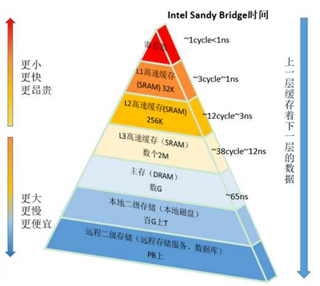

### CPU Cache

#### CPU为何要有高速缓存

CPU在摩尔定律的指导下以每18个月翻一番的速度在发展，然而内存和硬盘的发展速度远远不及CPU。这就造成了高性能能的内存和硬盘价格及其昂贵。然而CPU的高度运算需要高速的数据。为了解决这个问题，CPU厂商在CPU中内置了少量的高速缓存以解决I\O速度和CPU运算速度之间的不匹配问题。

在CPU访问存储设备时，无论是存取数据抑或存取指令，都趋于聚集在一片连续的区域中，这就被称为局部性原理。

> **时间局部性（Temporal Locality）**：如果一个信息项正在被访问，那么在近期它很可能还会被再次访问。

比如循环、递归、方法的反复调用等。

> **空间局部性（Spatial Locality）**：如果一个存储器的位置被引用，那么将来他附近的位置也会被引用。

比如顺序执行的代码、连续创建的两个对象、数组等。

#### 带有高速缓存的CPU执行计算的流程

1. 程序以及数据被加载到主内存
2. 指令和数据被加载到CPU的高速缓存
3. CPU执行指令，把结果写到高速缓存
4. 高速缓存中的数据写回主内存

https://blog.csdn.net/qq_27680317/article/details/78486220

https://blog.csdn.net/aigoogle/article/details/41517213

