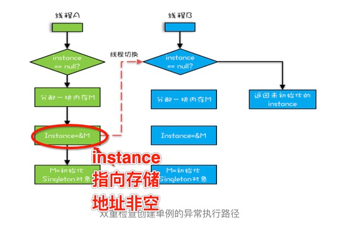

这恐怕是最常见的设计模式了,需要注意的是懒加载/并发下的处理
<!-- more -->
## 懒加载
### 真的需要懒加载吗
如果需要懒加载(需要时候才加载)那么就要有if xxx == null 的判断.这在多线程下可能是不安全的,
如果能接受程序启动就创建一个单例,放弃懒加载,那么有一种简便的方法,还能保证多线程状态下的安全.
```java
public class Singleton {

    private final static Singleton INSTANCE = new Singleton();

    private Singleton(){}

    public static Singleton getInstance(){
        return INSTANCE;
    }
}
```
利用静态关键字在类装载的时候就完成实例化，没有达到Lazy Loading的效果。如果从始至终从未使用过这个实例，则会造成内存的浪费。
### 实现懒加载的简单办法
即使你真的需要懒加载,那么使用synchronized同步锁也足够应对大多数情况了.如果性能不是关键,能接受,请到此为止,程序越简单越好.
```java
public class Singleton {

    private static Singleton singleton;

    private Singleton() {}

    public static synchronized Singleton getInstance() {
        if (singleton == null) {
            singleton = new Singleton();
        }
        return singleton;
    }
}
```

### 如果你真的很在乎性能
如果你真的很在乎性能,那么请你在任何地方都保持,在一整個项目里,不然其实效果不大.
双重检查锁  
```java
public class Singleton {
    // 注意这里的volatile
    private static volatile Singleton singleton;
    // 这里注意写成私有的构造方法
    private Singleton() {}

    public static Singleton getInstance() {
        if (singleton == null) {
            synchronized (Singleton.class) {
                if (singleton == null) {
                    singleton = new Singleton();
                }
            }
        }
        return singleton;
    }
}
```
Double-Check概念对于多线程开发者来说不会陌生，如代码中所示，我们进行了两次if (singleton == null)检查，这样就可以保证线程安全了。这样，实例化代码只用执行一次，后面再次访问时，判断if (singleton == null)，直接return实例化对象。
优点：线程安全；延迟加载；效率较高。
#### 这里volatile的作用
volatile可不只是可见性,还有禁止重排序,当然上面代码的可见性synchronized已经保证.

```java
public class Singleton {
    // 去掉这里的volatile
    private static  Singleton singleton;

    private Singleton() {}

    public static Singleton getInstance() {
        if (singleton == null) {
            synchronized (Singleton.class) {
                if (singleton == null) {
                    singleton = new Singleton();
                }
            }
        }
        return singleton;
    }
}
```
在上面这行代码中，没有使用volatile关键字，即使发生了指令重排序，在同步代码块结束时，instance会被正确的初始化。     
但是，如果发生了如下重排序:    
1.分配singleton内存空间。   
2.将内存空间的地址赋值给singleton的引用(singleton已经!= null)。    
3.初始化singleton对象    
假如你在其他线程中使用了这个static instance的静态变量，用instance==null的方法判断instance有没有被正确初始化的话，有可能会出现instance访问失败的情况。     
在这个时间点上，同步代码块尚未执行完毕，由于指令重排序，instance对象已经指向分配的内存空间，但是instance尚未初始化完毕。在这时调用instance，会引发jvm的exception。


### 另一种有趣的方式
静态内部类
```java
public class Singleton {

    private Singleton() {}

    private static class SingletonInstance {
        private static final Singleton INSTANCE = new Singleton();
    }

    public static Singleton getInstance() {
        return SingletonInstance.INSTANCE;
    }
}
```
这种方式跟饿汉式方式采用的机制类似，但又有不同。两者都是采用了类装载的机制来保证初始化实例时只有一个线程。不同的地方在饿汉式方式是只要Singleton类被装载就会实例化，没有Lazy-Loading的作用，而静态内部类方式在Singleton类被装载时并不会立即实例化，而是在需要实例化时，调用getInstance方法，才会装载SingletonInstance类，从而完成Singleton的实例化。  

类的静态属性只会在第一次加载类的时候初始化，所以在这里，JVM帮助我们保证了线程的安全性，在类进行初始化时，别的线程是无法进入的。  

优点：避免了线程不安全，延迟加载，效率高。  
