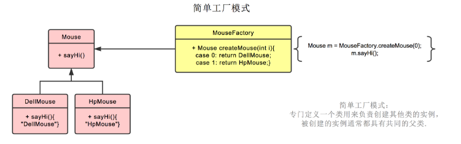
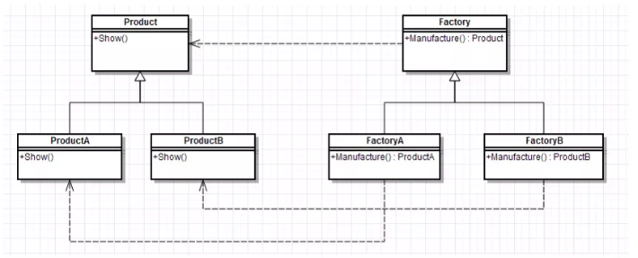
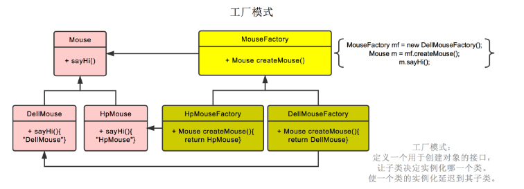
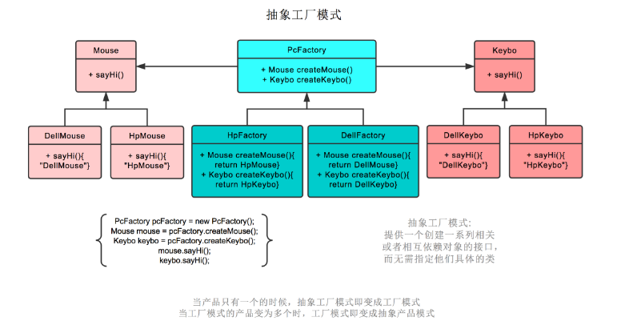
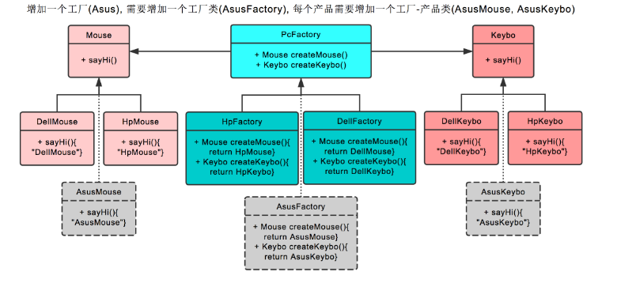
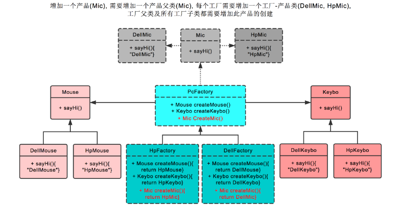

<!-- more -->


## 简单工厂模式
> 简单工厂模式其实并不算是一种设计模式，更多的时候是一种编程习惯。

### 写法
使用一个统一的工厂类,以鼠标为例子,有戴尔鼠标,有惠普鼠标


```java
public class MouseFactory {
          public static final String TAG = "MouseFactory";
          public static Mouse getMouse(String type) {
              Mouse mouse = null;
              if (type.equalsIgnoreCase("dell")) {
                  mouse = new DellMouse();
              } else if (type.equalsIgnoreCase("hp")) {
                  mouse = new HpMouse();
              } 
              return mouse;
          }
   }
```
### 优点
是对一些业务代码的简单优化(简单不一定就不好)
### 缺点
- 工厂类集中了所有实例（产品）的创建逻辑，一旦这个工厂不能正常工作，整个系统都会受到影响；
- 违背“开放 - 关闭原则”，一旦添加新产品就不得不修改工厂类的逻辑，这样就会造成工厂逻辑过于复杂。
- static 静态方法不能被继承和重写，会造成工厂角色无法形成基于继承的等级结构


## 工厂方法模式(最常用)
> 工厂方法模式把具体产品的创建推迟到工厂类的子类（具体工厂）中，此时工厂类不再负责所有产品的创建，而只是给出具体工厂必须实现的接口




### 写法
工厂模式也就是鼠标工厂是个父类，有生产鼠标这个接口。    
戴尔鼠标工厂，惠普鼠标工厂继承它，可以分别生产戴尔鼠标，惠普鼠标。    
生产哪种鼠标不再由参数决定，而是创建鼠标工厂时，由戴尔鼠标工厂创建。     


产品的公共接口
```java
public interface Mouse {
    void move();
}
```
具体实现类
```java
public class DellMouse implements Mouse {
    @Override
    public void move() {
        System.out.print("dell move");
    }
}
public class HpMouse implements Mouse {
    @Override
    public void move() {
        System.out.print("hp move");
    }
}
```

抽象的工厂接口MouseFactory
```java
public interface MouseFactory {
    Mouse getMouse();
}
```
具体工厂
```java
public class DellMouseFactory implements MouseFactory {
    @Override
    public Mouse getMouse() {
        return new DellMouse();
    }
}

public class HpMouseFactory implements MouseFactory {
    @Override
    public Mouse getMouse() {
        return new HpMouse();
    }
}
```

使用
```java
// 戴尔鼠标
MouseFactory factory=new DellMouseFactory();
Mouse  mouse=factory.getMouse();
mouse.move();
// 惠普鼠标
MouseFactory factory=new HpMouseFactory();
Mouse  mouse=factory.getMouse();
mouse.move();
```

### 优点
- 更符合开-闭原则
   新增一种产品时，只需要增加相应的具体产品类和相应的工厂子类即可
- 符合单一职责原则
   每个具体工厂类只负责创建对应的产品

### 缺点
- **一个具体工厂只能创建一种具体产品**
- 添加新产品时，除了增加新产品类外，还要提供与之对应的具体工厂类，系统类的个数将成对增加
	如果没有更复杂的需要,工厂方法模式就够了.	 

## 抽象工厂模式
> 一个工厂往往需要生产多类产品

值得注意的是,这时的工厂就不仅仅是鼠标工厂那种单一的概念了,它是更多的是一种"平台",比如linux/win,
或者品牌,华硕/戴尔/惠普工厂.
### 写法
抽象工厂模式也就是不仅生产鼠标，同时生产键盘。   
也就是 PC 厂商是个父类，有生产鼠标，生产键盘两个接口。   
戴尔工厂，惠普工厂继承它，可以分别生产戴尔鼠标+戴尔键盘，和惠普鼠标+惠普键盘。  
创建工厂时，由戴尔工厂创建。  
后续工厂.生产鼠标()则生产戴尔鼠标，工厂.生产键盘()则生产戴尔键盘。  



这里的代码不继续给了,只是在抽象的工厂接口中,定义多个产品.


### 在抽象工厂模式中，假设我们需要增加一个工厂
假设我们增加华硕工厂，则我们需要增加华硕工厂，和戴尔工厂一样，继承 PC 厂商。  
之后创建华硕鼠标，继承鼠标类。创建华硕键盘，继承键盘类即可。


### 在抽象工厂模式中，假设我们需要增加一个产品
假设我们增加耳麦这个产品，则首先我们需要增加耳麦这个父类，再加上戴尔耳麦，惠普耳麦这两个子类。   
之后在PC厂商这个父类中，增加生产耳麦的接口。最后在戴尔工厂，惠普工厂这两个类中，分别实现生产戴尔耳麦，惠普耳麦的功能。 以上。   

### 优点
其实是对于产品族(多种产品由于业务原因有内在聚合性,比如都是戴尔家的)情况下,工厂方法模式的拓展.

### 缺点
抽象工厂模式支持出现新的产品族,比如再来个华硕.    
抽象工厂模式很难支持新种类产品的变化.比如本来制造鼠标和键盘,现在多了耳麦。         
这是因为抽象工厂接口中已经确定了可以被创建的产品集合，如果需要添加新产品，此时就必须去修改抽象工厂的接口，这样就涉及到抽象工厂类的以及所有子类的改变，这样也就违背了“开放封闭”原则。     
**但是这並非无法解决,比如java8以后接口可以使用默认方法,这样一个具体的工厂不必实现抽象工厂所有的创建产品方法**   
> 对于新的产品族符合开-闭原则；对于新的产品种类不符合开-闭原则，这一特性称为开-闭原则的倾斜性。     

## 参考
http://www.runoob.com/design-pattern/abstract-factory-pattern.html
https://www.jianshu.com/p/7deb64f902db
https://juejin.im/entry/58f5e080b123db2fa2b3c4c6
https://java-design-patterns.com/patterns/factory-method/