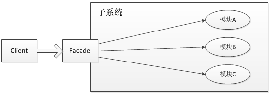
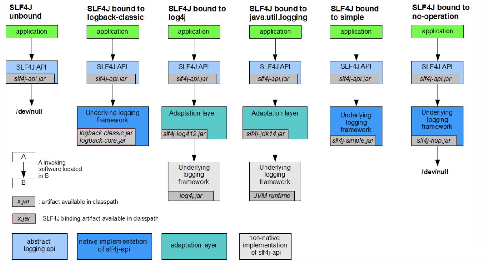

## 外观模式

外观模式（Facade Pattern）隐藏系统的复杂性，并向客户端提供了一个客户端可以访问系统的接口。这种类型的设计模式属于结构型模式，它向现有的系统添加一个接口，来隐藏系统的复杂性。

这种模式涉及到一个单一的类，该类提供了客户端请求的简化方法和对现有系统类方法的**委托**调用。

## 介绍

**意图：**为子系统中的一组接口提供一个一致的界面，外观模式定义了一个高层接口，这个接口使得这一子系统更加容易使用。

**主要解决：**降低访问复杂系统的内部子系统时的复杂度，简化客户端与之的接口。

**何时使用：** 1、客户端不需要知道系统内部的复杂联系，整个系统只需提供一个"接待员"即可。 2、定义系统的入口。

**如何解决：**客户端不与系统耦合，外观类与系统耦合。

**关键代码：**在客户端和复杂系统之间再加一层，这一层将调用顺序、依赖关系等处理好。

门面模式(外观模式)，其核心为**外部与一个子系统的通信必须通过一个统一的外观对象进行，使得子系统更易于使用**。用一张图来表示门面模式的结构为：

门面模式的核心为Facade即门面对象，门面对象核心为几个点：

- 知道所有子角色的功能和责任
- 将客户端发来的请求委派到子系统中，没有实际业务逻辑
- 不参与子系统内业务逻辑的实现

## 实例

SLF4J

具体slf4j如何实现的可以查看:

https://www.cnblogs.com/xrq730/p/8619156.html

