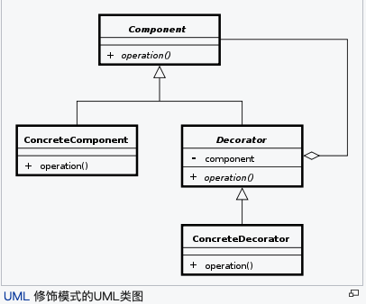
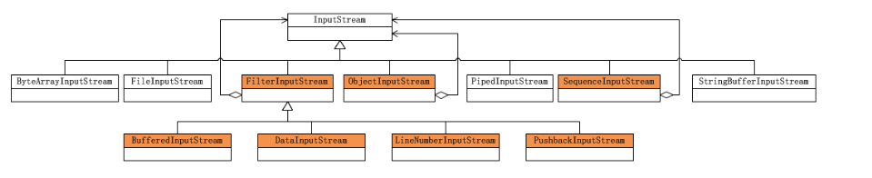

装饰模式又名包装(Wrapper)模式。装饰模式以对客户端透明的方式扩展对象的功能，是继承关系的一个替代方案。

<!-- more -->我是你但我又有你

## 涉及的原则
1. 开闭原则:对拓展开放,对修改关闭
2. 组合优于继承
    [link](https://juejin.im/post/5becce876fb9a049d2359d01)
## 装饰者模式
没什么好写的,已经写的很详尽了.看完下边的几个博客就行.    
    
[开头](https://www.cnblogs.com/god_bless_you/archive/2010/06/10/1755212.html)

[这篇还额外讲了实际中常见的半透明的装饰者模式](https://www.cnblogs.com/java-my-life/archive/2012/04/20/2455726.html )

[这个是git项目设计模式的网站,例子挺有趣的.  ](https://java-design-patterns.com/patterns/decorator/)

##  维基百科
通过使用装饰者模式，可以在运行时扩充一个类的功能。原理是：增加一个修饰类包裹原来的类，包裹的方式一般是通过在将原来的对象作为修饰类的构造函数的参数。装饰类实现新的功能，但是，在不需要用到新功能的地方，它可以直接调用原来的类中的方法。修饰类必须和原来的类有相同的接口(纯粹的装饰者模式)。

修饰模式是类继承的另外一种选择。类继承在编译时候增加行为，而装饰模式是在运行时增加行为。

当有几个相互独立的功能需要扩充时，这个区别就变得很重要。在有些面向对象的编程语言中，类不能在运行时被创建，通常在设计的时候也不能预测到有哪几种功能组合。这就意味着要为每一种组合创建一个新类。相反，修饰模式是面向运行时候的对象实例的,这样就可以在运行时根据需要进行组合。一个修饰模式的示例是JAVA里的Java I/O Streams的实现。

## 经典样例
Java I/O Streams   ,可以好好研究下

