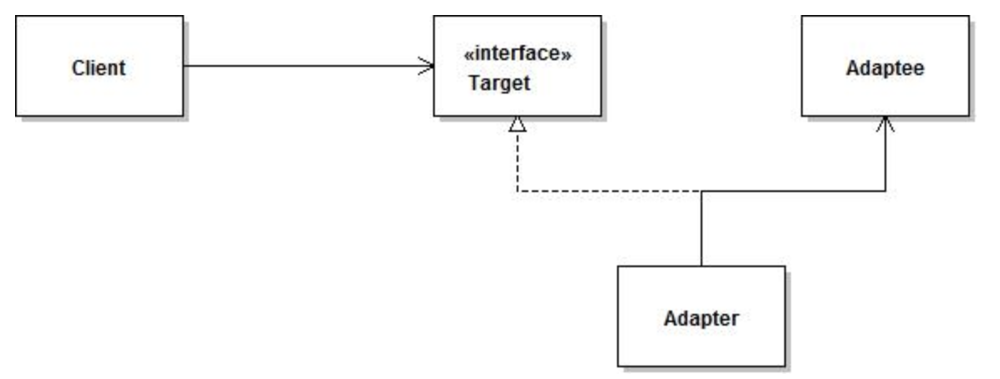
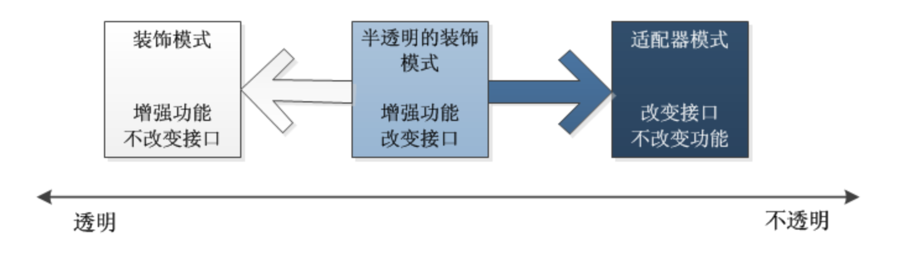

> 适配器模式把一个类的接口变换成客户端所期待的另一种接口，从而使原本因接口不匹配而无法在一起工作的两个类能够在一起工作。
> <!-- more -->
## 写法

定义一个包装类，用于包装不兼容接口的对象  
- target = 期望获得的能力(某个方法)
- 包装类 = 适配器Adapter
- 被包装对象 = Adaptee(拥有能力,但提供的接口不兼容)
和装饰者模式似乎有点像,这个后面会提到区别.

### 类的适配器模式(不建议使用)
组合优先于继承     
基于类的适配器模式通过继承Adaptee,得到Adaptee的能力.     
我们可以通过给适配器Adapter类增加一个实例对象Adaptee,来得到它的能力.这也就是组合的方式,更加灵活.    
**注意:如果你想修改Adaptee的接口实现,而不仅仅是转换它的输入输出,那其实已经超出了单纯适配的含义**

### 对象的适配器模式
这也就是基于组合的适配器模式.     
adapter的写法并不局限于上面的uml图,**只要实现了转化,达到了兼容的目的就可以**,来看一个spring的adapter模式
```java
class MethodBeforeAdviceAdapter implements AdvisorAdapter, Serializable {

    @Override
    public boolean supportsAdvice(Advice advice) {
        return (advice instanceof MethodBeforeAdvice);
    }

    @Override
    public MethodInterceptor getInterceptor(Advisor advisor) {
        MethodBeforeAdvice advice = (MethodBeforeAdvice) advisor.getAdvice();
        return new MethodBeforeAdviceInterceptor(advice);
    }

}
```
上面的adapter将Advisor转化成了对应的拦截器MethodBeforeAdviceInterceptor,使得调用者可以直接使用拦截器.


## 使用场景
可能没有一个架构师会在做系统设计的时候考虑使用适配器模式,往往是系统扩展了,不符合原有设计的时候才考虑通过适配器模式减少代码修改带来的风险。   
总的来说，适配器模式属于补偿模式，专用来在系统后期扩展、修改时使用。
## 优点
- 符合开闭原则
- 灵活性高、低耦合


## 缺点
一旦一个系统中出现过多的adapter,读起来会令人十分困惑,我最终到底调用了什么?
在这种情况下,可能你需要考虑重构了.

## 与装饰者模式的对比
**装饰模式和适配器模式都是“包装模式(Wrapper Pattern)”，它们都是通过封装其他对象达到设计的目的的**，但是它们的形态有很大区别。
我们可以看一个感性的例子:    

星巴克咖啡,用奶油,巧克力包装过后,口味得到了增强.但它依旧是一个星巴克咖啡.这里“是”的概念很重要.这是装饰者模式.         

笔记本电脑充电器是三口插头,家里只有两口插座,一个转换器可以把三口转成两口,这是适配器模式,它强调的是转换,从不兼容转化为兼容.    

理想的装饰模式在对被装饰对象进行功能增强的同时，要求具体构件角色、装饰角色的接口与抽象构件角色的接口完全一致。而适配器模式则不然，一般而言，适配器模式并不要求对源对象的功能进行增强，但是会改变源对象的接口，以便和目标接口相符合。  

装饰模式有透明和半透明两种，这两种的区别就在于装饰角色的接口与抽象构件角色的接口是否完全一致。透明的装饰模式也就是理想的装饰模式，要求具体构件角色、装饰角色的接口与抽象构件角色的接口完全一致。相反，如果装饰角色的接口与抽象构件角色接口不一致，也就是说装饰角色的接口比抽象构件角色的接口宽的话，装饰角色实际上已经成了一个适配器角色，这种装饰模式也是可以接受的，称为“半透明”的装饰模式，如下图所示。

在适配器模式里面，适配器类的接口通常会与目标类的接口重叠，但往往并不完全相同。换言之，适配器类的接口会比被装饰的目标类接口宽。

显然，半透明的装饰模式实际上就是处于适配器模式与装饰模式之间的灰色地带。如果将装饰模式与适配器模式合并成为一个“包装模式”的话，那么半透明的装饰模式倒可以成为这种合并后的“包装模式”的代表。