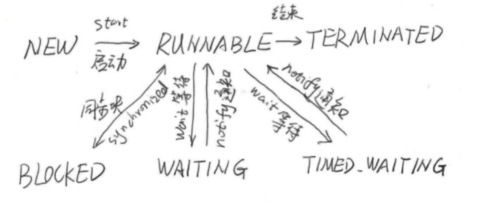

##  Java内存模型(JMM)

### 原子性(Atomicity)

不可中断

32位系统下,long(64位)的读取不是原子性的

### 可见性(Visibility)

一个线程修改了共享变量的值,其他线程能够立即知道


可见性常被编译器优化(指令重排)/缓存优化/硬件优化(有些读内存不会立即触发,而是进入硬件队列等待) 影响

### 有序性(Ordering)


#### Happen Before原则


## 线程

### 线程状态




### 新建线程

```java
public class ThreadA  extends  Thread{
    @Override
    public void run() {
        //super.run();
        System.out.println("new thread");
    }
}

Thread thread = new Thread(() -> System.out.println("new thread runable")
        );
```

### 终止线程stop() @Deprecated 

stop()

暴力停止,可能导致数据不一致.

```java
            while (true) {
                
//                if(stopme){
//                    System.out.println("exit by stop me");
//                    break;
//                }
                 do something
              
            }
```

### 线程中断

> 线程中断并不会使线程立即退出,而是给线程发送一个通知,告知希望其退出.如何处理是线程自己的事情

- public void Thread.interrupt()   // 中断线程
- public boolean Thread.isInterrupted() //判断线程是否被中断
- public static boolean Thread.interruped() //判断线程是否被中断,并清除中断状态

Thread.interrupt() 实例方法,设置中断位

Thread.isInterrupted() 实例方法,检验中断标志位,返回是否被中断

Thread.interruped() 静态方法 检验中断标志位,返回是否被中断,并且清除

**只是设置中断标记位,不做处理,那什么都不会发生** 

**sleep方法由于中断被抛出异常,此时,它会清除中断标记位置.**

### 等待wait()和通知notify

public final void wait() throws InterruptedException 

public final native void notify() 随机唤醒

对象的等待池(因为是随机选择,所以用池而不是队列来描述)和锁池.

public final native void notifyAll() 全部唤醒

> wait notify notifyAll 只能在synchronized中使用,否则会抛出java.lang.IllegalMonitorStateException
>
> notify并不是立即释放锁
>
> 多线程内使用while做判断条件{wait()}


### wait 和 sleep 区别

他们都会让线程等待一段时间,但是wait会释放对象的锁,但是sleep不会

### 挂起suspend()和继续执行resume()  @Deprecated 

不建议使用,已废弃,suspend后不会释放锁,还是runnable状态,容易误判.

同时如果resume意外先于suspend执行,则可能会导致其他线程无法拿到锁资源,从而死锁.

**可以使用wait和notify实现suspend和resume**


### 等待线程结束join() 和 谦让 yield()

#### Thread.join()

public final void join() throws InterruptedException 
public final **synchronized** void join(long millis)throws InterruptedException 

join会阻塞当前线程无限等待,第二个方法则给个一个最大等待时间

本质是调用线程wait方法,然后执行完会notifyAll

```java
 while (isAlive()) {
                wait(0);
 }
```

> 不要在应用程序中,在Thread实例对象上使用wait/notify/notify等方法,这可能会影响系统api的工作,或者被系统影响

#### **Thread.yield()**

public static native void yield()

让出cpu使用权后继续争夺

### 线程组

可以将线程绑定到线程组.

- activeCount() 获取活动线程数
- list() 打印此线程组所有线程信息


### 守护线程(Daemon)

比如垃圾回收线程,JIT线程

在start之前设置setDaemon(true)

### 线程优先级

注意这依赖底层操作系统,无法预测确切结果,只是倾向.


## 人手一只笔: ThreadLocal 


## synchronized同步

> 加锁,同时保证可见性.有序性(限制线程串行执行).可以替代volatile

#### 用法

- 指定加锁对象(类,实例)
- 作用于方法(静态方法,实例方法)


## volatile关键字

英文语意,易变的,不稳定的.

这等于告诉java虚拟机,这个变量可能被多个线程修改.

> volatile 对保证操作原子性有很大帮助,但它本身无法保证原子性

#### volatile 保证可见性

```java
public class NoVisibility {
    private static boolean ready;
    private static int number;

    private static class ReaderThread extends Thread {
        public void run() {
            while (!ready)
                Thread.yield();
            System.out.println(number);
        }
    }

    public static void main(String[] args) throws InterruptedException {
        new ReaderThread().start();
        Thread.sleep(1000);
        number = 42;
        ready = true;
        Thread.sleep(10000);
    }
}
```


#### volatile 保证有序性


## 一个隐蔽的问题


```java
public class BadLockOnInteger implements Runnable {

    public static Integer i = 0;
    static BadLockOnInteger instance = new BadLockOnInteger();
    
    @Override
    public void run() {
        for (int j = 0; j < 1000000; j++) {
            synchronized (i) {//这里同步的并不是同一个对象,因为i是以Integer关键字创建的
                //正确做法应该是 synchronized (instance)
                i++;
            }
        }
    }

    /**
     * 得到的结果并不是2000000,在多线程的操作中出现了错误
     *
     * @param args
     * @throws InterruptedException
     */
    public static void main(String args[]) throws InterruptedException {
        Thread thread1 = new Thread(instance);
        Thread thread2 = new Thread(instance);
        thread1.start();
        thread2.start();
        thread1.join();
        thread2.join();
        System.out.println(i);
    }
}
```


Integer是不可变对象,i++ 实际是Integer.valueOf(),锁住的不是一个对象


## JDK并发包

### ReentrantLock重入锁

> 重入锁可以完全代替synchronized,在java5之前,其性能远远优于synchronized,java6对synchronized做了大量优化,使得两者差距并不大,但ReentrantLock无疑更灵活.

#### 一个简单的demo

```java
public class ReenterLock implements Runnable {
    public static ReentrantLock lock = new ReentrantLock();
    public static int i = 0;

    @Override
    public void run() {
        for (int j = 0; j < 1000000; j++) {
            lock.lock();
            try {
                i++;
            } finally {
                lock.unlock();
            }

        }
    }

    public static void main(String args[]) throws InterruptedException {
        ReenterLock reenterLock = new ReenterLock();
        Thread thread1 = new Thread(reenterLock);
        Thread thread2 = new Thread(reenterLock);

        thread1.start();
        thread2.start();

        thread1.join();
        thread2.join();

        System.out.println(i);
    }
}

```


#### 重入

支持重入,可以多次lock,但是也必须释放相同的次数,释放少了锁依然持有,释放多了会有ILLegalMonitorStateException

#### 中断响应

等待锁的过程中,可以取消申请.这对解决死锁有帮助

lock.lockInterruptibly()

#### 锁申请等待延时

只等待一段时间,这对解决死锁有帮助

lock.tryLock(5, TimeUnit.SECONDS)

tryLock也可以不带参数运行,那样直接返回true/false


#### 公平锁

> 先申请先获得,不会产生饥饿现象

synchronized是非公平的,在创建reentrantlock的时候可以指定公平还是非公平

但是实现公平锁要求系统维护一个有序队列,因此公平锁的实现成本较高,性能相对低下.


### Condition 重入锁的好搭档

synchronized -- wait notify

Condition和ReentrantLock组合可以实现类似上面组合的效果

- 


### 信号量


## 锁

### 提高锁性能的几个建议

#### 尽可能减少持有锁的时间

锁的范围尽量小

#### 减小锁的粒度

ConcurrentHashMap的分段锁

#### 读写分离锁替换独占锁


#### 锁分离


#### 锁粗化


### java虚拟机对锁优化做的努力

#### 偏向锁

在几乎没有竞争的场景表现很好,在竞争激烈的场合不如不用


#### 轻量级锁


#### 自旋锁


### 无锁


### 死锁


