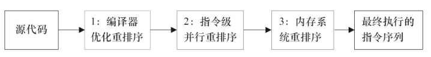

## 并发编程的挑战

### 多线程不一定快

有线程创建和切换的开销.

### 减少上下文的切换

- 无锁并发编程

  比如分段,不同线程处理不同段的数据

- CAS算法

  不需要加锁

- 使用最少线程

- 协程

  在单线程里实现多任务的调度,并在单线程里维持多个任务间的切换.

## 并发编程模型

在并发编程中,需要处理两个关键问题:

- 线程之间如何通信

  通信是指线程之间以何种机制来交换信息。在命令式编程中,线程之间的通信机制有两种:

  - 共享内存
  - 消息传递

  在共享内存的并发模型里,线程之间共享程序的公共状态,通过写-读内存中的公共状态进行**隐式通信**。

  在消息传递的并发模型里,线程之间没有公共状态,线程之间必须通过发送消息来**显式进行通信**。(Actor, CSP)

- 线程之间如何同步(这里的线程是指并发执行的活动实体)。

  同步是指程序中用于控制不同线程间操作发生相对顺序的机制。

​         在共享内存并发模型里,同步是显式进行的。程序员必须显式指定某个方法或某段代码需要在线程之间互斥执行。
​         **在消息传递的并发模型里,由于消息的发送必须在消息的接收之前,因此同步是隐式进行的。**

|      | 共享内存                                               | 消息传递 |
| ---- | ------------------------------------------------------ | -------- |
| 通信 | 隐式                                                   | 显式     |
| 同步 | 显式(显式指定某个方法或某段代码需要在线程之间互斥执行) | 隐式     |


##  Java内存模型(JMM)

### 介绍

Java线程之间的通信由Java内存模型(本文简称为JMM)控制,JMM决定一个线程对共享变量的写入何时对另一个线程可见。

从抽象的角度来看,JMM定义了线程和主内存之间的抽象关系:线程之间的共享变量存储在主内存(Main Memory)中,每个线程都有一个私有的本地内存(Local Memory),本地内存中存储了该线程以读/写共享变量的副本。本地内存是JMM的一个抽象概念,并不真实存在。它涵盖了缓存、写缓冲区、寄存器以及其他的硬件和编译器优化。


从整体来看,线程A在向线程B发送消息,这个通信过程必须要经过主内存。JMM通过控制主内存与每个线程的本地内存之间的交互,来为Java程序员提供内存可见性保证。

### 重排序

#### 分类



从Java源代码到最终实际执行的指令序列,会分别经历2种重排序.

- 编译器优化的重排序

  编译器在不改变单线程程序语义的前提下,可以重新安排语句
  的执行顺序。

- 处理器重排序

  - 处理器指令级并行的重排序。现代处理器采用了指令级并行技术(Instruction-Level
  Parallelism,ILP)来将多条指令重叠执行。**如果不存在数据依赖性,处理器可以改变语句对应**
  **机器指令的执行顺序**。

  - 内存系统的重排序。**由于处理器使用缓存和读/写缓冲区,这使得加载和存储操作看上去可能是在乱序执行**。


这些重排序可能会导致多线程程序出现内存可见性问题。

对于编译器,JMM的编译器重排序规则会禁止特定类型的编译器重排序(不是所有的编译器重排序都要禁止)。

对于处理器重排序,JMM的处理器重排序规则会要求Java编译器在生成指令序列时,插入特定类型的**内存屏障**(Memory Barriers,Intel称之为Memory Fence)指令,通过内存屏障指令来禁止特定类型的处理器重排序。


#### 处理器重排序 -- 内存操作的重排序(处理器缓冲区)

现代的处理器使用写缓冲区临时保存向内存写入的数据。

- 写缓冲区可以保证指令流水线持续运行,它可以避免由于处理器停顿下来等待向内存写入数据而产生的延迟。

- 同时,通过以批处理的方式刷新写缓冲区,以及合并写缓冲区中对同一内存地址的多次写,减少对内存总
  线的占用。

  虽然写缓冲区有这么多好处,但每个处理器上的写缓冲区,仅仅对它所在的处理器
  可见。这个特性会对内存操作的执行顺序产生重要的影响:

  **处理器对内存的读/写操作的执行顺序,不一定与内存实际发生的读/写操作顺序一致!**

Demo


假设处理器A和处理器B按程序的顺序并行执行内存访问,最终可能得到x=y=0的结果.


这里处理器A和处理器B可以同时把共享变量写入自己的写缓冲区(A1,B1),然后从内存中读取另一个共享变量(A2,B2),最后才把自己写缓存区中保存的脏数据刷新到内存中(A3,B3)。当以这种时序执行时,程序就可以得到x=y=0的结果。

从内存操作实际发生的顺序来看,直到处理器A执行A3来刷新自己的写缓存区,写操作A1才算真正执行了。**虽然处理器A执行内存操作的顺序为:A1→A2,但内存操作实际发生的顺序却是A2→A1。此时,处理器A的内存操作顺序被重排序了**(处理器B的情况和处理器A一样,这里就不赘述了)。

这里的关键是,由于写缓冲区仅对自己的处理器可见,它会导致处理器执行内存操作的顺序可能会与内存实际的操作执行顺序不一致。由于现代的处理器都会使用写缓冲区**,因此现代的处理器都会允许对写-读操作进行重排序**。


注意,单元格中的“N”表示处理器不允许两个操作重排序,“Y”表示允许重排序。
我们可以看出:

常见的处理器都允许Store-Load重排序;常见的处理器都不允许对存在数据依赖的操作做重排序。

sparc-TSO和X86拥有相对较强的处理器内存模型,它们仅允许对写-读操作做重排序(因为它们都使用了写缓冲区)。


**为了保证内存可见性,Java编译器在生成指令序列的适当位置会插入内存屏障指令来禁止特定类型的处理器内存操作重排序**。JMM把内存屏障指令分为4类.


**StoreLoad Barriers**是一个“全能型”的屏障,它同时具有其他3个屏障的效果。现代的多处理器大多支持该屏障(其他类型的屏障不一定被所有处理器支持)。执行该屏障开销会很昂贵,因为当前处理器通常要把写缓冲区中的数据全部刷新到内存中(Buffer Fully Flush)。

### 特性

#### 原子性(Atomicity)

不可中断

32位系统下,long(64位)的读取不是原子性的

#### 可见性(Visibility)

一个线程修改了共享变量的值,其他线程能够立即知道


可见性常被编译器优化(指令重排)/缓存优化/硬件优化(有些读内存不会立即触发,而是进入硬件队列等待) 影响

#### 有序性(Ordering)


### Happen Before原则

> 一种描述方式,JSR-133使用happens-before的概念来阐述操作之间的内存可见性。

从JDK 5开始,Java使用新的JSR-133内存模型(除非特别说明,本文针对的都是JSR-133内存模型)。JSR-133使用happens-before的概念来阐述操作之间的内存可见性。在JMM中,如果一个操作执行的结果需要对另一个操作可见,那么这两个操作之间必须要存在happens-before关系。这里提到的两个操作既可以是在一个线程之内,也可以是在不同线程之间。

与程序员密切相关的happens-before规则如下。

- 程序顺序规则:一个线程中的每个操作,happens-before于该线程中的任意后续操作。
- 监视器锁规则:对一个锁的解锁,happens-before于随后对这个锁的加锁。
- volatile变量规则:对一个volatile域的写,happens-before于任意后续对这个volatile域的
    读。
- 传递性:如果A happens-before B,且B happens-before C,那么A happens-before C。

> 两个操作之间具有happens-before关系,并不意味着前一个操作必须要在后一个操作之前执行!
>
> happens-before仅仅要求前一个操作(执行的结果)对后一个操作可见

#### Happen Before原则和JMM的关系


如图3-5所示,**一个happens-before规则对应于一个或多个编译器和处理器重排序规则**。对于Java程序员来说,happens-before规则简单易懂,它避免Java程序员为了理解JMM提供的内存可见性保证而去学习复杂的重排序规则以及这些规则的具体实现方法。

### 数据依赖性和as-if-serial原则

#### 数据依赖性

>  如果两个操作访问同一个变量,且这两个操作中有一个为写操作,此时这两个操作之间就存在数据依赖性。


上面3种情况,只要重排序两个操作的执行顺序,程序的执行结果就会被改变。前面提到过,编译器和处理器可能会对操作做重排序。编译器和处理器在重排序时,会遵守数据依赖性,编译器和处理器不会改变存在数据依赖关系的两个操作的执行顺序。
这里所说的数据依赖性仅针对单个处理器中执行的指令序列和单个线程中执行的操作,**不同处理器之间和不同线程之间的数据依赖性不被编译器和处理器考虑。**

#### as-if-serial(单线程)

as-if-serial语义的意思是:不管怎么重排序(编译器和处理器为了提高并行度),(单线程)程序的执行结果不能被改变。编译器、runtime和处理器都必须遵守as-if-serial语义。

为了遵守as-if-serial语义,编译器和处理器不会对存在数据依赖关系的操作做重排序,因为这种重排序会改变执行结果。但是,如果操作之间不存在数据依赖关系,这些操作就可能被编译器和处理器重排序。


### JMM与顺序一致性模型

**顺序一致性模型介绍**

顺序一致性内存模型是一个理论参考模型,在设计的时候,处理器的内存模型和编程语言的内存模型都会以顺序一致性内存模型作为参照。

1)一个线程中的所有操作必须按照程序的顺序来执行。
2)(不管程序是否同步)所有线程都只能看到一个单一的操作执行顺序。在顺序一致性内存模型中,每个操作都必须原子执行且立刻对所有线程可见。


在概念上,顺序一致性模型有一个单一的全局内存,这个内存通过一个左右摆动的开关可以连接到任意一个线程,同时每一个线程必须按照程序的顺序来执行内存读/写操作。从上面的示意图可以看出,在任意时间点最多只能有一个线程可以连接到内存。当多个线程并发执行时,图中的开关装置能把所有线程的所有内存读/写操作串行化(即在顺序一致性模型中,所有操作之间具有全序关系)。


设有两个线程A和B并发执行。其中A线程有3个操作,它们在程序中的顺序是:A1→A2→A3。B线程也有3个操作,它们在程序中的顺序是:B1→B2→B3。


假设这两个线程使用监视器锁来正确同步:A线程的3个操作执行后释放监视器锁,随后B线程获取同一个监视器锁。那么程序在顺序一致性模型中的执行效果将如图:


现在我们再假设这两个线程没有做同步,下面是这个未同步程序在顺序一致性模型中的执行示意图,如图


未同步程序在顺序一致性模型中虽然整体执行顺序是无序的,但所有线程都只能看到一个一致的整体执行顺序。以上图为例,线程A和B看到的执行顺序都是:B1→A1→A2→B2→A3→B3。之所以能得到这个保证是因为顺序一致性内存模型中的每个操作必须立即对任意线程可见。


**但是,在JMM中就没有这个保证**。未同步程序在JMM中不但整体的执行顺序是无序的,而且所有线程看到的操作执行顺序也可能不一致。比如,在当前线程把写过的数据缓存在本地内存中,在没有刷新到主内存之前,这个写操作仅对当前线程可见;从其他线程的角度来观察,会认为这个写操作根本没有被当前线程执行。


**JMM对正确同步的多线程程序**的内存一致性做了如下保证。如果程序是正确同步的,程序的执行将具有顺序一致性(Sequentially Consistent)——即程序的执行结果与该程序在顺序一致性内存模型中的执行结果相同。

这对于程序员来说是一个极强的保证。这里的同步是指广义上的同步,包括对常用同步原语(synchronized、volatile和final)的正确使用。

当然,单线程一定是符合顺序一致性模型的.


### 总结

由于常见的处理器内存模型比JMM要弱,Java编译器在生成字节码时,会在执行指令序列的适当位置插入内存屏障来限制处理器的重排序。同时,由于各种处理器内存模型的强弱不同,为了在不同的处理器平台向程序员展示一个一致的内存模型,JMM在不同的处理器中需要插入的内存屏障的数量和种类也不相同。

JMM屏蔽了不同处理器内存模型的差异,它在不同的处理器平台之上为Java程序员呈现了一个一致的内存模型。


### 补充

#### JSR-133对旧内存模型的修补

JSR-133对JDK 5之前的旧内存模型的修补主要有两个。
·增强volatile的内存语义。旧内存模型允许volatile变量与普通变量重排序。JSR-133严格
限制volatile变量与普通变量的重排序,使volatile的写-读和锁的释放-获取具有相同的内存语
义。
·增强final的内存语义。在旧内存模型中,多次读取同一个final变量的值可能会不相同。为
此,JSR-133为final增加了两个重排序规则。在保证final引用不会从构造函数内逸出的情况下,
final具有了初始化安全性。


## 线程

### 线程状态


### 新建线程

```java
public class ThreadA  extends  Thread{
    @Override
    public void run() {
        //super.run();
        System.out.println("new thread");
    }
}

Thread thread = new Thread(() -> System.out.println("new thread runable")
        );
```

### 终止线程stop() @Deprecated 

stop()

暴力停止,可能导致数据不一致.

```java
            while (true) {
                
//                if(stopme){
//                    System.out.println("exit by stop me");
//                    break;
//                }
                 do something
              
            }
```

### 线程中断

> 线程中断并不会使线程立即退出,而是给线程发送一个通知,告知希望其退出.如何处理是线程自己的事情

- public void Thread.interrupt()   // 中断线程
- public boolean Thread.isInterrupted() //判断线程是否被中断
- public static boolean Thread.interruped() //判断线程是否被中断,并清除中断状态

Thread.interrupt() 实例方法,设置中断位

Thread.isInterrupted() 实例方法,检验中断标志位,返回是否被中断

Thread.interruped() 静态方法 检验中断标志位,返回是否被中断,并且清除

**只是设置中断标记位,不做处理,那什么都不会发生** 

**sleep方法由于中断被抛出异常,此时,它会清除中断标记位置.**

### 等待wait()和通知notify

public final void wait() throws InterruptedException 

public final native void notify() 随机唤醒

对象的等待池(因为是随机选择,所以用池而不是队列来描述)和锁池.

public final native void notifyAll() 全部唤醒

> wait notify notifyAll 只能在synchronized中使用,否则会抛出java.lang.IllegalMonitorStateException
>
> notify并不是立即释放锁
>
> 多线程内使用while做判断条件{wait()}


### wait 和 sleep 区别

他们都会让线程等待一段时间,但是wait会释放对象的锁,但是sleep不会

### 挂起suspend()和继续执行resume()  @Deprecated 

不建议使用,已废弃,suspend后不会释放锁,还是runnable状态,容易误判.

同时如果resume意外先于suspend执行,则可能会导致其他线程无法拿到锁资源,从而死锁.

**可以使用wait和notify实现suspend和resume**


### 等待线程结束join() 和 谦让 yield()

#### Thread.join()

public final void join() throws InterruptedException 
public final **synchronized** void join(long millis)throws InterruptedException 

join会阻塞当前线程无限等待,第二个方法则给个一个最大等待时间

本质是调用线程wait方法,然后执行完会notifyAll

```java
 while (isAlive()) {
                wait(0);
 }
```

> 不要在应用程序中,在Thread实例对象上使用wait/notify/notify等方法,这可能会影响系统api的工作,或者被系统影响

#### **Thread.yield()**

public static native void yield()在单线程里实现多任务的调度,并在单线程里维持多个任务间的切换

让出cpu使用权后继续争夺

### 线程组

可以将线程绑定到线程组.

- activeCount() 获取活动线程数
- list() 打印此线程组所有线程信息


### 守护线程(Daemon)

比如垃圾回收线程,JIT线程

在start之前设置setDaemon(true)

### 线程优先级

注意这依赖底层操作系统,无法预测确切结果,只是倾向.


## 人手一只笔: ThreadLocal 

在单线程里实现多任务的调度,并在单线程里维持多个任务间的切换


## 锁

### 提高锁性能的几个建议

#### 尽可能减少持有锁的时间

锁的范围尽量小

#### 减小锁的粒度

ConcurrentHashMap的分段锁

#### 读写分离锁替换独占锁


#### 锁分离


#### 锁粗化


### java虚拟机对锁优化做的努力

#### 偏向锁

在几乎没有竞争的场景表现很好,在竞争激烈的场合不如不用

#### 轻量级锁

#### 自旋锁

#### 重量级锁


### 无锁


### 死锁

- 性能数据存储经验；理解数据库事务，有流程引擎设计实施经验者优先。

  具有良好的商业敏感度和优秀的数据分析技能。能够开发创新而实际的分析方法以解决复杂的商业问题。

  擅长与商业伙伴的交流沟通，具有性能数据存储经验；理解数据库事务，有流程引擎设计实施经验者优先。

  具有良好的商业敏感度和优秀的数据分析技能。能够开发创新而实际的分析方法以解决复杂的商业问题。

  擅长与商业伙伴的交流沟通，具有不可剥夺

- 资源独占

- 请求和保持

- 循环等待

## synchronized同步

> 加锁,同时保证可见性.有序性(限制线程串行执行).可以替代volatile

#### 用法

- 指定加锁对象(类,实例)
- 作用于方法(静态方法,实例方法)

### synchronized 锁的种类

 synchronized锁的状态总共有四种，无锁状态、偏向锁、轻量级锁和重量级锁。随着锁的竞争，锁可以从偏向锁升级到轻量级锁，再升级的重量级锁，但是锁的升级是单向的，也就是说只能从低到高升级，不会出现锁的降级.


  synchronized的偏向锁、轻量级锁以及重量级锁是通过Java对象头实现的。


Java对象的内存布局分为：

- 对象头
- 实例数据
- 对齐填充.

对象头又可以分为”Mark Word”和类型指针klass。”Mark Word”是关键，默认情况下，其存储对象的HashCode、分代年龄和锁标记位。


#### 偏向锁

jdk6后引入

**优化思路**

​       经过研究发现，在大多数情况下，锁不仅不存在多线程竞争，而且**总是由同一线程多次获得**，因此为了减少同一线程获取锁(会涉及到一些CAS操作,耗时)的代价而引入偏向锁。

**核心思想**

​      如果一个线程获得了锁，那么锁就进入偏向模式，此时Mark Word 的结构也变为偏向锁结构，当这个线程再次请求锁时，无需再做任何同步操作，即获取锁的过程，这样就省去了大量有关锁申请的操作，从而也就提供程序的性能.

**具体操作**

​       当锁对象第一次被线程获取的时候，线程使用CAS操作把这个锁的线程ID记录再对象Mark Word之中，同时置偏向标志位1。以后该线程在进入和退出同步块时不需要进行CAS操作来加锁和解锁，只需要简单地测试一下对象头的Mark Word里是否存储着指向当前线程的偏向锁。如果测试成功，表示线程已经获得了锁。

​       如果线程使用CAS操作时失败则表示该锁对象上存在竞争并且这个时候另外一个线程获得偏向锁的所有权。当到达全局安全点（safepoint，这个时间点上没有正在执行的字节码）时获得偏向锁的线程被挂起，膨胀为轻量级锁（涉及Monitor Record，Lock Record相关操作，这里不展开），同时被撤销偏向锁的线程继续往下执行同步代码。

​        **当有另外一个线程去尝试获取这个锁时，偏向模式就宣告结束。**

​        所以，对于没有锁竞争的场合，偏向锁有很好的优化效果，毕竟极有可能连续多次是同一个线程申请相同的锁。但是对于锁竞争比较激烈的场合，偏向锁就失效了，因为这样场合极有可能每次申请锁的线程都是不相同的，因此这种场合下不应该使用偏向锁，否则会得不偿失，需要注意的是，偏向锁失败后，并不会立即膨胀为重量级锁，而是先升级为轻量级锁。下面我们接着了解轻量级锁。

#### 轻量级锁

**优化思路**

即使锁不是总是由一个线程获得,存在竞争.但是这种竞争可能是交替的.

对于绝大部分的锁，在整个同步周期内都是不存在竞争的（区别于偏向锁）。这是一个经验数据。如果没有竞争，轻量级锁使用CAS操作避免了使用互斥量的开销，但如果存在锁竞争，除了互斥量的开销外，还额外发生了CAS操作，因此在有竞争的情况下，轻量级锁比传统的重量级锁更慢。


**轻量级锁加锁**

性能数据存储经验；理解数据库事务，有流程引擎设计实施经验者优先。

具有良好的商业敏感度和优秀的数据分析技能。能够开发创新而实际的分析方法以解决复杂的商业问题。

擅长与商业伙伴的交流沟通，具有


**轻量级锁解锁**


#### 自旋转锁


#### 重量级锁


## volatile关键字

### 介绍

英文语意,易变的,不稳定的.

这等于告诉java虚拟机,这个变量可能被多个线程修改.

如果一个字段被声明成volatile,Java线程内存模型确保所有线程看到这个变量的值是一致的。

> volatile 对保证操作原子性有很大帮助,但它本身无法保证原子性,而且只修饰变量
>
> 理解volatile特性的一个好方法是把对volatile变量的单个读/写,看成是使用同一个锁对这些**单个**读/写操作做了同步.注意是单个.


### volatile 保证可见性

强制从公共堆栈(主存)取值


 这里的工作内存是个抽象概念

```java
public class NoVisibility {
    private static boolean ready;
    private static int number;

    private static class ReaderThread extends Thread {
        public void run() {
            while (!ready)
                Thread.yield();
            System.out.println(number);
        }
    }

    public static void main(String[] args) throws InterruptedException {
            new ReaderThread().start();
            Thread.sleep(5000);
            number = 42;
            ready = true;
    }
}
```


### volatile不保证原子性

对任意单个volatile变量的读/写具有原子性,但类似于volatile++这种复合操作不具有原子性。

```java
volatile i;
i++; //并不是安全的,先读入最新的i,在本地+1,再写回主存.  这个过程中可能i已经被更新.
```


### volatile 保证有序性,禁止特定的指令重排序


```java
public class Singleton {
    // 注意这里的volatile
    private static volatile Singleton singleton;
    // 私有构造方法很重要
    private Singleton() {}

    public static Singleton getInstance() {
        if (singleton == null) {
            synchronized (Singleton.class) {
                if (singleton == null) {
                    singleton = new Singleton();
                }
            }
        }在单线程里实现多任务的调度,并在单线程里维持多个任务间的切换在单线程里实现多任务的调度,并在单线程里维持多个任务间的切换
        return singleton;
    }
}
```

如果没使用volatile,可能会先指向一个地方,然后初始化.使用会报错.

一个对象的初始化分为三步.

```
memory = allocate(); // 1:分配对象的内存空间
ctorInstance(memory); // 2:初始化对象
instance = memory;// 3:设置instance指向刚分配的内存地址
```

上面3行伪代码中的2和3之间,可能会被重排序(在一些JIT编译器上).

根据《The Java Language Specification,Java SE 7 Edition》(后文简称为Java语言规范),所有线程在执行Java程序时必须要遵守intra-thread semantics。intra-thread semantics保证重排序不会改变单线程内的程序执行结果。换句话说,intra-thread semantics允许那些在单线程内,不会改变单线程程序执行结果的重排序。上面3行伪代码的2和3之间虽然被重排序了,但这个重排序并不会违反intra-thread semantics。这个重排序在没有改变单线程程序执行结果的前提下,可以提高程序的执行性能。


### volatile 和 synchronized的比较

> 线程安全有可见性和原子性两个方面

1.volatile是线程同步的轻量级实现，修饰变量。syn修饰方法和代码块。

2.volatile被多线程访问并不会造成阻塞，它不是锁,syn是.

3.volatile保证可见性，但不是原子性。syn保证原子性，也间接保证可见性，它会将工作内存和主内存做同步

### 原理探究

**volatile写**

```java
instance = new Singleton()// instance是volatile变量
//  0x01a3de1d: movb $0×0,0×1104800(%esi);0x01a3de24: lock addl $0×0,(%esp);
```

Lock前缀的指令在多核处理器下会引发了两件事情

1)将当前处理器缓存行的数据写回到系统内存。 (否则不一定写到系统内存,可能先写到缓存行)
2)这个写回内存的操作会使在其他CPU里缓存了该内存地址的数据无效。


#### **volatile 内存语义**

从内存语义的角度来说,volatile的写-读与锁的释放-获取有相同的内存效果:

volatile写和锁的释放有相同的内存语义;

volatile读与锁的获取有相同的内存语义。

#### volatile 内存语义的实现

重排序分为编译器重排序和处理器重排序。为了实现volatile内存语义,JMM会分别限制这两种类型的重排序类型

**volatile编译器重排序规则**


当第二个操作是volatile写时,不管第一个操作是什么,都不能重排序。这个规则确保
volatile写之前的操作不会被编译器重排序到volatile写之后。
·当第一个操作是volatile读时,不管第二个操作是什么,都不能重排序。这个规则确保
volatile读之后的操作不会被编译器重排序到volatile读之前。
·当第一个操作是volatile写,第二个操作是volatile读时,不能重排序


**volatile实现禁止处理器重排序**

为了实现volatile的内存语义,编译器在生成字节码时,会在指令序列中插入内存屏障来禁止特定类型的处理器重排序。对于编译器来说,发现一个最优布置来最小化插入屏障的总数几乎不可能。为此,JMM采取保守策略:

 在每个volatile写操作的前面插入一个StoreStore屏障。
·在每个volatile写操作的后面插入一个StoreLoad屏障。
·在每个volatile读操作的后面插入一个LoadLoad屏障。
·在每个volatile读操作的后面插入一个LoadStore屏障。


更详细的可以参考.java并发编程艺术的章节.

#### JSR-133增强volatile的内存语义

**为什么增强?**

在JSR-133之前的旧Java内存模型中,虽然不允许volatile变量之间重排序,但旧的Java内
存模型允许volatile变量与普通变量重排序。


在旧的内存模型中,当1和2之间没有数据依赖关系时,1和2之间就可能被重排序(3和4类似)。其结果就是:读线程B执行4时,不一定能看到写线程A在执行1时对共享变量的修改。


因此,在旧的内存模型中,volatile的写-读没有锁的释放-获所具有的内存语义。为了提供一种比锁更轻量级的线程之间通信的机制,JSR-133专家组决定增强volatile的内存语义:严格限制编译器和处理器对volatile变量与普通变量的重排序,确保volatile的写-读和锁的释放-获取具有相同的内存语义。


## 一个隐蔽的问题


```java
public class BadLockOnInteger implements Runnable {

    public static Integer i = 0;
    static BadLockOnInteger instance = new BadLockOnInteger();
    
    @Override
    public void run() {
        for (int j = 0; j < 1000000; j++) {
            synchronized (i) {//这里同步的并不是同一个对象,因为i是以Integer关键字创建的
                //正确做法应该是 synchronized (instance)
                i++;
            }
        }
    }

    /**
     * 得到的结果并不是2000000,在多线程的操作中出现了错误
     *
     * @param args
     * @throws InterruptedException
     */
    public static void main(String args[]) throws InterruptedException {
        Thread thread1 = new Thread(instance);
        Thread thread2 = new Thread(instance);
        thread1.start();
        thread2.start();
        thread1.join();
        thread2.join();
        System.out.println(i);
    }
}
```


Integer是不可变对象,i++ 实际是Integer.valueOf(),锁住的不是一个对象


## JDK并发包

### 倒计数器CountDownLatch

> 火箭发射前,做好所有检查工作后,再发射火箭


```java
// 新建
CountDownLatch end = new CountDownLatch(10);

// 递减
{
 end.countDown();
}


// 等待直到条件全部达成
{
 end.await();
 System.out.println("Fire!");
}
```


### 循环栅栏CyclicBarrier

和CountDownLatch 很类似,但功能更加强大

CountDownLatch的计数器只能使用一次,而CyclicBarrier的计数器可以使用reset()方法重
置。所以CyclicBarrier能处理更为复杂的业务场景。例如,如果计算发生错误,可以重置计数
器,并让线程重新执行一次。


 Cyclic是循环,代表可以反复使用,barrierAction可以指定一次计数完成后应该采取的动作

```java
//parties 计数总数,也就是参与的线程数量.当await线程的数量到达parties的时候
//barrierAction  一次计数完成后应该采取的动作
public CyclicBarrier(int parties, Runnable barrierAction) {
  
}
```


```java


{
  cyclicBarrier.await();
}
// 新建cyclicBarrier
CyclicBarrier cyclicBarrier = new CyclicBarrier(N, new BarrierRun());
```


可能抛出InterruptedException, BrokenBarrierException 

其中BrokenBarrierException计数器已经破损.再也无法达成.此时应该让线程退出.

比如,一共10个线程要在cyclicBarrier上等待后执行,如果一个线程调用了interrupt.那么很可能在被中断线程上得到一个InterruptedException ,在其他 9个等待的线程上得到BrokenBarrierException.

BrokenBarrierException可以避免其他线程无谓的等待.


### 信号量Semphore

Semaphore可以控制某个资源可被同时访问的个数，通过 acquire() 获取一个许可，如果没有就等待，而 release() 释放一个许可。

可以通过构造方法设置是否公平.

```java
public Semaphore(int permits) {}

public Semaphore(int permits, boolean fair){}
```

一个典型的例子是.

```java
public class SemapDemo implements Runnable {
    // 最大的并发是5.
    final Semaphore semp = new Semaphore(5);

    @Override
    public void run() {
        try {
            
            semp.acquire();
            //----------------临界区--------------
            Thread.sleep(2000);
            System.out.println(Thread.currentThread().getId() + ":done!");
            //----------------临界区--------------
            semp.release();
        } catch (InterruptedException e) {
            e.printStackTrace();
        }
    }

    /**
     * 总共20个线程,系统会以5个线程一组为单位,依次执行并输出
     *
     * @param args
     */
    public static void main(String args[]) throws  InterruptedException{
        ExecutorService executorService = Executors.newFixedThreadPool(20);
        final SemapDemo demo = new SemapDemo();
        for (int i = 0; i < 20; i++) {
            executorService.submit(demo);
        }
        // 不然线程池没退出
        Thread.sleep(10000);
        executorService.shutdown();
    }
}
```

#### 主要方法

##### 获取许可证

```java
//获取一个许可证(响应中断)，在没有可用的许可证时当前线程被阻塞。
public void acquire() throws InterruptedException {
   sync.acquireSharedInterruptibly(1);
}

//获取一个许可证(不响应中断)
public void acquireUninterruptibly() {
   sync.acquireShared(1);
}

//尝试获取许可证(非公平获取)，立即返回结果（非阻塞）。
public boolean tryAcquire() {
   return sync.nonfairTryAcquireShared(1) >= 0;
}

//尝试获取许可证(定时获取)
public boolean tryAcquire(long timeout, TimeUnit unit) throws InterruptedException {
   return sync.tryAcquireSharedNanos(1, unit.toNanos(timeout));
}

```

##### 释放许可证

```java
public void release() {
    sync.releaseShared(1);
}
// 释放几个许可
public void release(int permits) {
    if (permits < 0) throw new IllegalArgumentException();
    sync.releaseShared(permits);
}

```


### 重入锁ReentrantLock

> 重入锁可以完全代替synchronized,在java5之前,其性能远远优于synchronized,java6对synchronized做了大量优化,使得两者差距并不大,但ReentrantLock无疑更灵活.

#### 一个简单的demo

```java
public class ReenterLock implements Runnable {
    public static ReentrantLock lock = new ReentrantLock();
    public static int i = 0;

    @Override
    public void run() {
        for (int j = 0; j < 1000000; j++) {
            lock.lock();
            try {
                i++;
            } finally {
                lock.unlock();
            }

        }
    }

    public static void main(String args[]) throws InterruptedException {
        ReenterLock reenterLock = new ReenterLock();
        Thread thread1 = new Thread(reenterLock);
        Thread thread2 = new Thread(reenterLock);

        thread1.start();
        thread2.start();

        thread1.join();
        thread2.join();

        System.out.println(i);
    }
}

```


#### 重入

支持重入,可以多次lock,但是也必须释放相同的次数,释放少了锁依然持有,释放多了会有ILLegalMonitorStateException

#### 中断响应

等待锁的过程中,可以取消申请.这对解决死锁有帮助

lock.lockInterruptibly()

#### 锁申请等待延时

只等待一段时间,这对解决死锁有帮助

lock.tryLock(5, TimeUnit.SECONDS)

tryLock也可以不带参数运行,那样直接返回true/false


#### 公平锁

> 先申请先获得,不会产生饥饿现象

synchronized是非公平的,在创建reentrantlock的时候可以指定公平还是非公平

但是实现公平锁要求系统维护一个有序队列,因此公平锁的实现成本较高,性能相对低下.


### 重入锁的好搭档 Condition 

synchronized -- wait notify

Condition和ReentrantLock组合可以实现类似上面组合的效果


### 读写锁ReadWriteLock

读写锁是JDK1.5提供的读写分离锁,可以有效减少所竞争.

|      | 读     | 写   |
| ---- | ------ | ---- |
| 读   | 非阻塞 | 阻塞 |
| 写   | 阻塞   | 阻塞 |

这时多个线程同时读,可以真正并行.当系统读的需求很大的时候,对性能提升很大.

```java
    private static Lock readLock = reentrantReadWriteLock.readLock();
    private static Lock writeLock = reentrantReadWriteLock.writeLock();
```


### 线程阻塞工具类LockSupport

LockSupport是一个非常方便的线程阻塞工具,可以在任意位置让线程阻塞,

`park`和`unpark`方法提供了阻塞和解除阻塞线程的有效方法，并且不会遇到过时方法Thread.suspend和Thread.resume 导致线程变得不可用的问题.

LockSupport对park和unpark的调用顺序并没有要求，先调用unpark，再调用park，依旧可以获得许可，让线程继续运行。这一点与Thread.suspend和Thread.resume以及Object.wait() Object.notify 要求固定的顺序不同。


和Object.wait()相比,无需先获得锁,也不会抛出InterruptedException异常.

LockSupport的park能够能响应interrupt事件，且不会抛出InterruptedException异常,只是继续执行而已。

#### 方法

##### 暂停执行

```java
// park方法阻塞的是当前的线程，也就是说在哪个线程中调用，那么哪个线程就被阻塞（在没有获得许可的情况下）。
public static void park() {
        UNSAFE.park(false, 0L);
    } 
public static void park(Object blocker) {
        Thread t = Thread.currentThread();
        setBlocker(t, blocker);
        UNSAFE.park(false, 0L);
        setBlocker(t, null);
    }
```

支持一个`blocker`对象参数。此对象在线程受阻塞时被记录，以允许监视工具和诊断工具确定线程受阻塞的原因。（这样的工具可以使用方法 `getBlocker(java.lang.Thread)`访问blocker。）建议最好使用这些形式，而不是不带此参数的原始形式。在锁实现中提供的作为`blocker`的普通参数是`this`。

##### 恢复执行

```java
// 传入一个线程对象.
public static void unpark(Thread thread) {
        if (thread != null)
            UNSAFE.unpark(thread);
    }
```

<https://juejin.im/post/5b018f70f265da0b7d0ba86a>


## Future模式

Future模式有点类似在网上买东西。如果我们在网上下单买了一部手机，当我们支付完成后，手机并没有办法立即送到家里，但是在电脑上会立即产生一个订单。这个订单就是将来发货或者领取手机的重要凭证，这个凭证也就是Future模式中会给出的一个契约。在支付活动结束后，大家不会傻傻地等着手机到来，而是各忙各的。而这张订单就成了商家的动力.

future模式无法立即给你数据,但允许你拿到一个契约,你可以将来通过契约拿到你想要的数据.

### JDK的Future

#### 接口Future<V>

提供了如下功能:

　　1）判断任务是否完成；

　　2）能够中断任务；

　　3）能够获取任务执行结果。

```java
// 一个立即返回的契约
public interface Future<V> {

    // 取消任务 mayInterruptIfRunning决定已经开始的任务时中断还是可以继续完成
    // 如果任务已经完成,则无论mayInterruptIfRunning为true还是false，此方法肯定返回false
    // 如果任务还没开始,返回true
    boolean cancel(boolean mayInterruptIfRunning);

    boolean isCancelled();

    // 正常地结束,异常结束,或者被取消,返回true
    boolean isDone();

    // 阻塞住,还可能抛出运行时异常CancellationException
    V get() throws InterruptedException, ExecutionException;

  
    V get(long timeout, TimeUnit unit)
        throws InterruptedException, ExecutionException, TimeoutException;
}
```

#### 接口Callable<V>

这是一个类似**Runnable**的接口.但有返回值,可以抛出异常.

Callable里面的call方法是可以抛出异常的，我们可以捕获异常进行处理；但是Runnable里面的run方法是不可以抛出异常的，异常要在run方法内部必须得到处理，不能向外界抛出；

```java
Runnable r = new Runnable() {
            @Override
            public void run() throws  Exception{
                // 会报错,只能抛出运行时异常.
                throw new Exception();
                //throw new RuntimeException();
               
            }
        };
```

```java
@FunctionalInterface
public interface Callable<V> {
    /**
     * Computes a result, or throws an exception if unable to do so.
     *
     * @return computed result
     * @throws Exception if unable to compute a result
     */
    V call() throws Exception;
}
```


#### 具体实现FutureTask<V>

```java
public class FutureTask<V> implements RunnableFuture<V>
```

FutureTask类实现了RunnableFuture接口，我们看一下RunnableFuture接口的实现：

```java
public interface RunnableFuture<V> extends Runnable, Future<V> {
    void run();
}
```

可以看出RunnableFuture继承了Runnable接口和Future接口，而FutureTask实现了RunnableFuture接口。**所以它既可以作为Runnable被线程执行，又可以作为Future得到Callable的返回值**。

FutureTask提供了2个构造器：

```java
`public` `FutureTask(Callable<V> callable) {``}``public` `FutureTask(Runnable runnable, V result) {``}`
```

事实上，FutureTask是Future接口的一个唯一实现类。

#### 参考

<https://www.cnblogs.com/dolphin0520/p/3949310.html>

https://www.cnblogs.com/cz123/p/7693064.html

### Guava对Future的支持

在JDK自带的简单 Future 模式中，虽然我们可以使用 Future.get()方法得到 Future 的处理结果，但是这个方法是阻塞的，因此并不利于我们开发高并发应用。但在 Guava 中，增强了 Future 模式，增加了对 Future 模式完成时的回调接口，使得 Future 完成时可以自动通知应用程序进行后续处理。

```java
ListeningExecutorService listeningExecutorService = MoreExecutors.listeningDecorator(Executors.newFixedThreadPool(10));

        ListenableFuture<String> future = listeningExecutorService.submit(() -> "hello");

        Futures.addCallback(future, new FutureCallback<String>() {
            @Override
            public void onSuccess(@Nullable String s) {
                System.out.println("处理成功");
            }

            @Override
            public void onFailure(Throwable throwable) {
                System.out.println("处理失败" + throwable);
            }
        }, MoreExecutors.newDirectExecutorService());
```


## 线程池

线程复用,不必总是频繁的创建和销毁.


### 前置

#### Executor接口

```java
public interface Executor {

    /**
     * @param command the runnable task
     * @throws RejectedExecutionException if this task cannot be
     * accepted for execution
     * @throws NullPointerException if command is null
     */
    void execute(Runnable command);
}
```

#### ExecutorService 接口

```java
public interface ExecutorService extends Executor {
 
    void shutdown();
    boolean isShutdown();
    boolean isTerminated();
    boolean awaitTermination(long timeout, TimeUnit unit)
        throws InterruptedException;
    // 如果为了可取消性而使用 Future 但又不提供可用的结果，则可以声明 Future<?> 形式类型、并返回 null 作为底层任务的结果。
    Future<?> submit(Runnable task);
    <T> Future<T> submit(Callable<T> task);
    ......
}
```


Executor是一个顶层接口，在它里面只声明了一个方法execute(Runnable)，返回值为void，参数为Runnable类型，从字面意思可以理解，就是用来执行传进去的任务的；

然后ExecutorService接口继承了Executor接口，并声明了一些方法：submit、invokeAll、invokeAny以及shutDown等；

抽象类AbstractExecutorService实现了ExecutorService接口，基本实现了ExecutorService中声明的所有方法；

```java
    protected <T> RunnableFuture<T> newTaskFor(Callable<T> callable) { };
    public Future<?> submit(Runnable task) {};
```

然后ThreadPoolExecutor继承了类AbstractExecutorService。


### ThreadPoolExcutor


```java
public class ThreadPoolExecutor extends AbstractExecutorService {
 public ThreadPoolExecutor(int corePoolSize,
                           int maximumPoolSize,
                           long keepAliveTime,
                           TimeUnit unit,
                           BlockingQueue<Runnable> workQueue,
                           ThreadFactory threadFactory,
                           RejectedExecutionHandler handler);
}
```

#### 核心参数

**corePoolSize：** 线程池核心线程数最大值

**maximumPoolSize：** 线程池最大线程数大小

**keepAliveTime：** 线程池中非核心线程空闲的存活时间大小

**unit：** 线程空闲存活时间单位

**workQueue：** 存放任务的阻塞队列

**threadFactory：** 用于设置创建线程的工厂，可以给创建的线程设置有意义的名字，可方便排查问题。

**handler：**  线城池的饱和策略事件，主要有四种类型。

#### 线程使用策略


#### 拒绝策略

- AbortPolicy(抛出一个异常，默认的)

- DiscardPolicy(直接丢弃任务)

- DiscardOldestPolicy（丢弃队列里最老的任务，将当前这个任务继续提交给线程池）

- CallerRunsPolicy（交给线程池调用所在的线程进行处理)


#### 工作队列

- ArrayBlockingQueue
- LinkedBlockingQueue
- DelayQueue
- PriorityBlockingQueue
- SynchronousQueue

##### ArrayBlockingQueue

ArrayBlockingQueue（有界队列）是一个用数组实现的有界阻塞队列，按FIFO排序量。

##### LinkedBlockingQueue

LinkedBlockingQueue（可设置容量队列）基于链表结构的阻塞队列，按FIFO排序任务，容量可以选择进行设置，不设置的话，将是一个无边界的阻塞队列，最大长度为Integer.MAX_VALUE，吞吐量通常要高于ArrayBlockingQuene；newFixedThreadPool线程池使用了这个队列

##### DelayQueue

DelayQueue（延迟队列）是一个任务定时周期的延迟执行的队列。根据指定的执行时间从小到大排序，否则根据插入到队列的先后排序。newScheduledThreadPool线程池使用了这个队列。


##### PriorityBlockingQueue

PriorityBlockingQueue（优先级队列）是具有优先级的无界阻塞队列；


##### SynchronousQueue

SynchronousQueue（同步队列）一个不存储元素的阻塞队列，每个插入操作必须等到另一个线程调用移除操作，否则插入操作一直处于阻塞状态，吞吐量通常要高于LinkedBlockingQuene，newCachedThreadPool线程池使用了这个队列。


#### 常用的线程池

newFixedThreadPool (固定数目线程的线程池)

newSingleThreadExecutor(单线程的线程池)

newCachedThreadPool(可缓存线程的线程池)

newScheduledThreadPool(定时及周期执行的线程池)


##### newFixedThreadPool

```java
  public static ExecutorService newFixedThreadPool(int nThreads, ThreadFactory threadFactory) {
        return new ThreadPoolExecutor(nThreads, nThreads,
                                      0L, TimeUnit.MILLISECONDS,
                                      new LinkedBlockingQueue<Runnable>(),
                                      threadFactory);
    }
```

线程池特点：

- 核心线程数和最大线程数大小一样
- 没有所谓的非空闲时间，即keepAliveTime为0
- 阻塞队列为无界队列LinkedBlockingQueue


工作机制:


**使用无界队列的线程池会导致内存飙升吗？**

答案 **：会的，newFixedThreadPool使用了无界的阻塞队列LinkedBlockingQueue，如果线程获取一个任务后，任务的执行时间比较长(比如，上面demo设置了10秒)，会导致队列的任务越积越多，导致机器内存使用不停飙升，** 最终导致OOM。

使用场景

FixedThreadPool 适用于处理CPU密集型的任务，确保CPU在长期被工作线程使用的情况下，尽可能的少的分配线程，即适用执行长期的任务。


##### newSingleThreadExecutor

```java
public static ExecutorService newSingleThreadExecutor(ThreadFactory threadFactory) {
        return new FinalizableDelegatedExecutorService
            (new ThreadPoolExecutor(1, 1,
                                    0L, TimeUnit.MILLISECONDS,
                                    new LinkedBlockingQueue<Runnable>(),
                                    threadFactory));
    }

```

**线程池特点**

- 核心线程数为1
- 最大线程数也为1
- 阻塞队列是LinkedBlockingQueue
- keepAliveTime为0


**工作机制**


- 提交任务
- 线程池是否有一条线程在，如果没有，新建线程执行任务
- 如果有，讲任务加到阻塞队列
- 当前的唯一线程，从队列取任务，执行完一个，再继续取，一个人（一条线程）夜以继日地干活。

使用场景

适用于串行执行任务的场景，一个任务一个任务地执行。


##### newCachedThreadPool

```java
public static ExecutorService newCachedThreadPool(ThreadFactory threadFactory) {
        return new ThreadPoolExecutor(0, Integer.MAX_VALUE,
                                      60L, TimeUnit.SECONDS,
                                      new SynchronousQueue<Runnable>(),
                                      threadFactory);
    }
```

**线程池特点**：

- 核心线程数为0
- 最大线程数为Integer.MAX_VALUE
- 阻塞队列是SynchronousQueue
- 非核心线程空闲存活时间为60秒

当提交任务的速度大于处理任务的速度时，每次提交一个任务，就必然会创建一个线程。极端情况下会创建过多的线程，耗尽 CPU 和内存资源。由于空闲 60 秒的线程会被终止，长时间保持空闲的 CachedThreadPool 不会占用任何资源。

**工作机制**


提交任务

因为没有核心线程，所以任务直接加到SynchronousQueue队列。

判断是否有空闲线程，如果有，就去取出任务执行。

如果没有空闲线程，就新建一个线程执行。

执行完任务的线程，还可以存活60秒，如果在这期间，接到任务，可以继续活下去；否则，被销毁。

**使用场景**

用于并发执行大量短期的小任务。


##### newScheduledThreadPool


```java
 public ScheduledThreadPoolExecutor(int corePoolSize) {
        super(corePoolSize, Integer.MAX_VALUE, 0, NANOSECONDS,
              new DelayedWorkQueue());
    }

```


**线程池特点**

- 最大线程数为Integer.MAX_VALUE
- 阻塞队列是DelayedWorkQueue
- keepAliveTime为0
- scheduleAtFixedRate() ：按某种速率周期执行
- scheduleWithFixedDelay()：在某个延迟后执行


**工作机制**

- 添加一个任务
- 线程池中的线程从 DelayQueue 中取任务
- 线程从 DelayQueue 中获取 time 大于等于当前时间的task
- 执行完后修改这个 task 的 time 为下次被执行的时间
- 这个 task 放回DelayQueue队列中

```java
/**
    创建一个给定初始延迟的间隔性的任务，之后的下次执行时间是上一次任务从执行到结束所需要的时间+给定的间隔时间
    */
    ScheduledExecutorService scheduledExecutorService = Executors.newScheduledThreadPool(1);
        scheduledExecutorService.scheduleWithFixedDelay(()->{
            System.out.println("current Time" + System.currentTimeMillis());
            System.out.println(Thread.currentThread().getName()+"正在执行");
        }, 1, 3, TimeUnit.SECONDS);

  /**
    创建一个给定初始延迟的间隔性的任务，之后的每次任务执行时间为 初始延迟 + N * delay(间隔) 
    */
    ScheduledExecutorService scheduledExecutorService = Executors.newScheduledThreadPool(1);
            scheduledExecutorService.scheduleAtFixedRate(()->{
            System.out.println("current Time" + System.currentTimeMillis());
            System.out.println(Thread.currentThread().getName()+"正在执行");
        }, 1, 3, TimeUnit.SECONDS);;

```


注意一旦其中一次任务出现异常,后边所有子任务的调度,都会停止,所以做好异常处理很重要.

**使用场景**

周期性执行任务的场景，需要限制线程数量的场景,

回到面试题：**说说几种常见的线程池及使用场景？**

回答这四种经典线程池 **：newFixedThreadPool，newSingleThreadExecutor，newCachedThreadPool，newScheduledThreadPool，分线程池特点，工作机制，使用场景分开描述，再分析可能存在的问题，比如newFixedThreadPool内存飙升问题** 即可


#### execute方法和submit方法

execute()方法实际上是Executor接口中声明的方法，在ThreadPoolExecutor进行了具体的实现，这个方法是ThreadPoolExecutor的核心方法，通过这个方法可以向线程池提交一个任务，交由线程池去执行。

submit()方法是在ExecutorService中声明的方法，在AbstractExecutorService就已经有了具体的实现，在ThreadPoolExecutor中并没有对其进行重写，这个方法也是用来向线程池提交任务的，但是它和execute()方法不同，它能够返回任务执行的结果，去看submit()方法的实现，会发现它实际上还是调用的execute()方法，只不过它利用了Future来获取任务执行结果（Future相关内容将在下一篇讲述）。


#### 拓展线程池


#### 异常处理

默认是无法感知异常的.

```java
ExecutorService threadPool = Executors.newFixedThreadPool(5);
        for (int i = 0; i < 5; i++) {
            threadPool.submit(() -> {
                System.out.println("current thread name" + Thread.currentThread().getName());
                Object object = null;
                System.out.print("result## " + object.toString());
            });
        }
```

##### 1.使用try catch

```java
ExecutorService threadPool = Executors.newFixedThreadPool(5);
for (int i = 0; i < 5; i++) {
            threadPool.submit(() -> {
                System.out.println("current thread name" + Thread.currentThread().getName());
                try{
                    Object object = null;
                    System.out.print("result## " + object.toString());
                }catch (Exception e){
                    // 可以感知.
                    System.out.println(Thread.currentThread().getName()+"异常");
                    // 线程可以继续复用.
                    throw  new RuntimeException(Thread.currentThread().getName()+"异常");
                }
            });
        }
```

##### 2. 使用Future.get方法.

```java
 ExecutorService threadPool = Executors.newFixedThreadPool(5);
 for (int i = 0; i < 5; i++) {
            Future future = threadPool.submit(() -> {
                System.out.println("current thread name" + Thread.currentThread().getName());
                Object object = null;
                System.out.print("result## " + object.toString());
            });
            try {
                future.get();
            } catch (Exception e) {
                System.out.println(Thread.currentThread().getName() + "异常");
                //终止主线程
                throw new RuntimeException(Thread.currentThread().getName() + "异常");
            }
        }
```

##### 3.为工作者线程设置UncaughtExceptionHandler，在uncaughtException方法中处理异常

自定义ThreadFactory.

```java
 ExecutorService threadPool = Executors.newFixedThreadPool(1, r -> {
            Thread t = new Thread(r);
            t.setUncaughtExceptionHandler(
                    (t1, e) -> {
                        System.out.println(t1.getName() + "线程抛出的异常"+e);
                        //throw new RuntimeException();
                    });
            return t;
        });
        threadPool.execute(()->{
            Object object = null;
            System.out.print("result## " + object.toString());
        });
```

##### 4.重写ThreadPoolExecutor的afterExecute方法，处理传递的异常引用

```java
class ExtendedExecutor extends ThreadPoolExecutor {

        public ExtendedExecutor(int corePoolSize, int maximumPoolSize, long keepAliveTime, TimeUnit unit, BlockingQueue<Runnable> workQueue) {
            super(corePoolSize, maximumPoolSize, keepAliveTime, unit, workQueue);
        }

        // jdk文档里面给的例子。。
        protected void afterExecute(Runnable r, Throwable t) {
            super.afterExecute(r, t);
            if (t == null && r instanceof Future<?>) {
                try {
                    Object result = ((Future<?>) r).get();
                } catch (CancellationException ce) {
                    t = ce;
                } catch (ExecutionException ee) {
                    t = ee.getCause();
                } catch (InterruptedException ie) {
                    Thread.currentThread().interrupt(); // ignore/reset
                }
            }
            if (t != null)
                System.out.println(t);
        }
    }
```


#### 关闭线程池


UncaughtExceptionHandler只对execute提交有作用.

#### 参考

<https://juejin.im/post/5d1882b1f265da1ba84aa676>  比喻很好

<https://www.cnblogs.com/dolphin0520/p/3932921.html>

<https://segmentfault.com/a/1190000015808897>


### Excuters

不建议使用,会屏蔽细节.


## CAS（Compare and Swap）

##### 悲观与乐观

悲观者与乐观者的做事方式完全不一样，悲观者的人生观是一件事情我必须要百分之百完全控制才会去做，否则就认为这件事情一定会出问题；而乐观者的人生观则相反，凡事不管最终结果如何，他都会先尝试去做，大不了最后不成功。

悲观锁会把整个对象加锁占为自有后才去做操作，乐观锁不获取锁直接做操作，然后通过一定检测手段决定是否更新数据。


##### 内存值、预期值、新值

当且仅当预期值和内存值相等时才将内存值修改为新值

```java
public class AtomicInt {
    private volatile int value; 
    public final int get() {
        return value;
    }
	
	public final int getAndIncrement() {
        for (;;) {
            int current = get();
            int next = current + 1;
            if (compareAndSet(current, next))
                return current;
        }
    }
    
    public final boolean compareAndSet(int expect, int update) {
		Unsafe类提供的硬件级别的compareAndSwapInt方法;
    }
}
class Unsafe{
     public final native boolean compareAndSwapObject(Object field, long field, Object var4, Object var5);
    
     public final native boolean compareAndSwapInt(Object field, long field, int var4, int var5);
 
     public final native boolean compareAndSwapLong(Object field, long var2, long var4, long var6);
}
```

##### 优点

避免悲观锁独占对象，提高了并发性能

**缺点** 

1.乐观锁只能保证一个共享变量的原子操作，悲观的互斥锁不管对象数量多少及对象颗粒度大小。

2.长时间自旋可能导致开销大。假如CAS长时间不成功而一直自旋，会给CPU带来很大的开销。

3.ABA问题。CAS的核心思想是通过比对内存值与预期值是否一样而判断内存值是否被改过，但这个判断逻辑不严谨，假如内存值原来是A，后来被一条线程改为B，最后又被改成了A，则CAS认为此内存值并没有发生改变，但实际上是有被其他线程改过的，这种情况对依赖过程值的情景的运算结果影响很大。解决的思路是引入版本号，每次变量更新都把版本号加一。

**进阶**

CAS是锁了cpu总线还是缓存行.

https://www.zhihu.com/question/65372648

https://blog.csdn.net/chenssy/article/details/69640293

## JDK并发容器

jdk提供了一些已经实现的并发容器,当然Collections工具可以帮我们把任意集合包装成线程安全的集合.比如

Collections.synchromzedMap() 和 Collections.synchromzedList()

### 线程安全的HashMap

Collections.synchromzedMap()方法会生成一个名为SynchronizedMap的Map。它使用委托，
将自己所有相关的功能交给传入的实现，而自己则主要负责保证线程安全。

synchronizedMap的线程安全主要通过一个基于synchronized的mutex锁.这样做可以保证并发安全,但性能并不高,

在高并发场景下我们需要考虑其他的方案.比如ConcurrentHashMap

```java
 public static <K,V> Map<K,V> synchronizedMap(Map<K,V> m) {
        return new SynchronizedMap<>(m);
 }

  final Object mutex; 
  public int size() {
        synchronized (mutex) {return m.size();}
  }
```


#### ConcurrentHashMap

高效并发的HashMap.


### 高效写入读取ConcurrentLinkedQueue

高效的链表并发队列,可以看成是线程安全的LinkedList


### 高效读取CopyOnWriteArrayList

读多写少,性能要好的多.


只有写写加锁.

CopyOnWrite,在写入时候进行自我复制.

```java
/** The array, accessed only via getArray/setArray. */
private transient volatile Object[] array; // 使用volatile保持可见性.
public boolean add(E e) {
    final ReentrantLock lock = this.lock;
    lock.lock();
    try {
        Object[] elements = getArray();
        int len = elements.length;
        Object[] newElements = Arrays.copyOf(elements, len + 1);
        newElements[len] = e;
        setArray(newElements);
        return true;
    } finally {
        lock.unlock();
    }
}
private E get(Object[] a, int index) {
        return (E) a[index];
}
```

<https://juejin.im/post/5cd1724cf265da03a7440aae>


### BlockingQuene

一个接口,阻塞队列,JDK用数组/链表等实现它.

压入元素 

- offer() 如果当前队列己经满了，它就会立即返回false

- put() 如果队列满了，它会一直等待，直到队列中有空闲的位置

  

弹出元素

- poll() 如果队列为空，那么poll()方法会直接返回null
- take() 会等待，直到队列内有可用元素。

**ArrayBlockingQueue**

```java
final Object[] items;
// fair 公平锁和非公平锁. 在BlockingQueue里也就是是否FIFO.
public ArrayBlockingQueue(int capacity, boolean fair) {
        if (capacity <= 0)
            throw new IllegalArgumentException();
        this.items = new Object[capacity];
        lock = new ReentrantLock(fair);
        notEmpty = lock.newCondition();
        notFull =  lock.newCondition();
}


public E take() throws InterruptedException {
        final ReentrantLock lock = this.lock;
        lock.lockInterruptibly();
        try {
            while (count == 0)
                notEmpty.await();
            return dequeue();
        } finally {
            lock.unlock();
        }
}

private void enqueue(E x) {
        // assert lock.getHoldCount() == 1;
        // assert items[putIndex] == null;
        final Object[] items = this.items;
        items[putIndex] = x;
        if (++putIndex == items.length)
            putIndex = 0;
        count++;
        notEmpty.signal();
}

public void put(E e) throws InterruptedException {
        checkNotNull(e);
        final ReentrantLock lock = this.lock;
        lock.lockInterruptibly();
        try {
            while (count == items.length)
                notFull.await();
            enqueue(e);
        } finally {
            lock.unlock();
        }
}
private E dequeue() {
        // assert lock.getHoldCount() == 1;
        // assert items[takeIndex] != null;
        final Object[] items = this.items;
        @SuppressWarnings("unchecked")
        E x = (E) items[takeIndex];
        items[takeIndex] = null;
        if (++takeIndex == items.length)
            takeIndex = 0;
        count--;
        if (itrs != null)
            itrs.elementDequeued();
        notFull.signal();
        return x;
}
```


**LinkedBlockingQueue**

链表实现


### ConcurrentSkipListMap

跳表


跳表的查找(空间换时间 logn)

跳表内的所有链表的元素都是排序的。查找时，可以从顶级链表开始找。一旦发现被查找的元素大于当前链表中的取值，就会转入下一层链表继续找。这也就是说在查找过程中，搜索是跳跃式的，在跳表中查找元素7，如图所示。


内部使用CAS.


