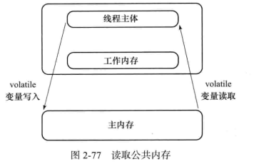

### volatile

> 只修饰变量

#### 可见但不原子

- 强制从公共堆栈(主存)取值

  
   这里的工作内存是个抽象概念
- 禁止特定的指令重排序

​      这在双重校验锁实现单例模式时候用到了。  

      ```java
public class SafeDoubleCheckedLocking {
    private volatile static Instance instance;  //禁止重排序，防止访问到的对象还没初始化完

    public static Instance getInstance() {
        if (instance == null) {
            synchronized (SafeDoubleCheckedLocking.class) {  //加锁避免重复创建对象
                if (instance == null) {
                    instance = new Instance();   // instance为volatile,现在没问题了
                }
            }
        }

        return instance;
    }
}
注意 这个解决方案需要JDK 5或更高版本(因为从JDK 5开始使用新的JSR-13 3内存模
型规范,这个规范增强了volatile的语义)。
      ```


#### volatile 和 synchronized的比较

> 线程安全有可见性和原子性两个方面

1.volatile是线程同步的轻量级实现，修饰变量。syn修饰方法和代码块。

2.volatile被多线程访问并不会造成阻塞，它不是锁,syn是.

3.volatile保证可见性，但不是原子性。syn保证原子性，也间接保证可见性，它会将工作内存和私有内存做同步

