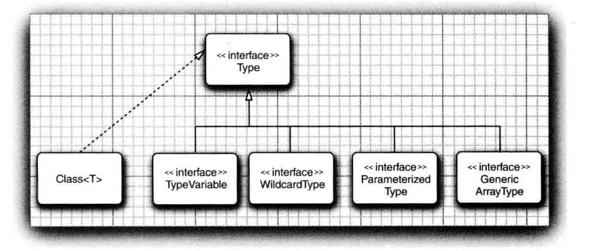

# Java泛型


## 泛型的要点

- 虚拟机中没有泛型，只有普通的类和方法。
- 所有的类型参数都用它们的限定类型替换,没有限定类型用Object替换。
- 为保持类型安全性，必要时插人强制类型转换。
- 桥方法被合成来保持多态。


## 为什么是泛型

Java泛型比杂乱无章的Object和强制类型转换更具有安全性和可读性
泛型对于集合类尤其有用， 例如,ArrayList 就是一个无处不在的集合类。

java泛型和c++中的模版可以做类比


## 泛型类

```java
public class Pair<T> {

    private T first;
    private T second;

    public Pair() {
        first = null;
        second = null;
    }

    public Pair(T first, T second) {
        this.first = first;
        this.second = second;
    }
}

```

## 泛型方法

让泛型的使用更灵活,你不是必须要将整个类泛化,可以只泛化一部分,

```java
 static class ArrayAlg {
        /**
         * 静态泛型方法,当然非静态也可以
         *
         * @param a
         * @param <T>
         * @return
         */
        public static <T> T getMiddle(T... a) {
            return a[a.length / 2];
        }
    
    static void test(){
        // 在这种情况(实际也是大多数情况)下， 方法调用中可以省略 <String> 类型参数。编译 器有足够的信息能够推断出所调用的方法
        String middle = ArrayAlg.<String>getMiddle("ohnM", "middle","Public");
        middle = ArrayAlg.getMiddle("]ohn", "middle", "Public");

        Double d = ArrayAlg.getMiddle(1.0,2.0,3.0);
        System.out.println(d);
    }
 }
```


## 类型限定

```java
/**
* 获得数组中最大值和最小值.
*/
public static <T extends Comparable> Pair<T> minmax(T[] a) {
            if (a == null || a.length == 0) {
                return null;
            }
            T min = a[0];
            T max = a[0];
            for (int i = 1; i < a.length; i++) {
                if(min.compareTo(a[i])>0){
                    min =a[i];
                }
                if(max.compareTo(a[i])<0){
                    max =a[i];
                }
            }
            return new Pair<>(min,max);
        }
```

T extends Comparable类型变量的限定,extend表示应该是绑定类型的子类型.


## 泛型的原理-类型擦除

### 没有限定类型

无论何时定义一个泛型类型， 都自动提供了一个相应的原始类型(raw type)。原始类型
的名字就是删去类型参数后的泛型类型名。

擦除 ( erased ) 类型变量 , 并替换为限定类型 (无限定的变量用 Object )。

原始类型用第一个限定的类型变量来替换， 如果没有给定限定就用 Object 替换。

```java
 //Pair<T> 
public class Pair {
            private Object first;
            private Object second;

            public Pair(Object first, Object second) {
                this, first = first;
                this.second = second;
                public Object getFirstO {
                    return first;
                }
                public Object getSecondO {
                    return second;
                }
                if (inin.compareTo(a[i]) > 0) min = a[i];
                if (max.coinpareTo(a[i]) < 0) max = a[i];
                public void setFirst (Object newValue){
                    first = newValue;
                }
                public void setSecond (Object newValue){
                    second = newValue;
                }
            }
  }
```

### 多个限定类型

```java
public class Interval<T extends Comparable & Serializable> implements Serializable{
            private T lower;
            private T upper;
            public Interval(T first, T second)
            {
                if (first.compareTo(second) <= 0) {
                    lower = first;
                    upper = second;
                } else {
                    lower = second;
                    upper = first;
                }
            }
 }
 public class Interval implements Serializable {
            private Comparable lower;
            private Coiparable upper;

            public Interval(Coiparable first, Coiparable second) { . . .}
 }
```

class Interval<T extends Serializable & Comparable>会发生什么。
如果这样做，原始类型用Serializable替换T, 而编译器在必要时要向Comparable 插入强制类型转换。 为了提高效率， 应该将标签(tagging) 接口 (即没有方法的接口)放在边界列表的末尾。


### 泛型表达式的翻译

编译器进行类型擦除,自动插入强制类型转换

下面的getFirst方法在类型擦除后返回Object类型.

编译器实际做了两件事:

- 方法调用
- 强制类型转换

```
Pair<Employee> buddies = ...;
Employee buddy = buddies.getFirst();
```


### 泛型方法的翻译

类型擦除也会出现在泛型方法中.

```java
public static  <T extends Comparable> T min (T[] a) //擦除前
  
public static Comparable min (Comparable[] a) //擦除后
  
```


这也带来了一些问题

#### 类型擦除与多态的冲突

桥方法的原理.

```java
public class Pair<T> {

    private T first;
    ......省略
    public void setFirst(T newValue) {
        first = newValue;
    }  
 
    public T getFirst() {
        return first;
    }
}

class PairStr extends Pair<String>{  
    public void setFirst(String fir){....}  
}  
```

假如我们这样调用.

```java
PairStr p = new PairStr(...);
Pair<String> p1 = p;
p1.setFirst("123"); // 这里希望具有多态性.调用到合适的方法
```

注意,变量p1是Pair<String>类型,虚拟机在p1的引用上只能看到方法声明为setFirst(Object)的方法,

它将调用这个方法,这个对象是PairStr类型的,最后实际会调用PairStr.setFirst(Object)方法(这个方法是它从Pair类继承过来的).

所幸编译器会将这个方法变成一个桥方法.

```java
 public void setFirst(object obj){
   setFirst ( ( String ) obj ) ;
 } 
```


这样就保证了多态性,PairStr覆盖了Pair的方法.


> 你不能覆盖getFirst()方法,否则在PairStr中会出现两个参数类型相同仅有返回类型不同的的getFirst()方法
>
> 虚拟机可以使用参数类型和返回类型区别一个方法,但是这在实际编写代码时候是不允许的.


#### 桥方法的其他应用

桥方法不仅应用于泛型类型,在继承时,方法覆盖可以使用更严格的返回类型.

```java
public class Employee implements Cloneable{

public Employee clone throws ClonenotSupportedexception  {...}
                                                           
}
```

Object clone 和 Employee clone 方法被说成具有协变的返回类型（covariant return types）实际上，Employee 类有两个克隆方法 

Employee clone  //defined above

Object clone// synthesized bridge method, overrides Object. clone

合成的桥方法调用了新定义的方法。


## 泛型不能干什么

这在大多数情况由类型擦除引起

### 不能创建参数化类型的数组

```java
Pair<String> table = new Pair <String>[10]; //Error
```

table 的类型是 Pair [] ,可以把它转换为Object [].

数组会记住它的元素类型 ，如果试图存储其他类型的元素 ，就会抛出一个ArrayStoreException

异常.

不过对于泛型类型 ，擦除会使这种机制无效.所以禁止.

PECS

可以声明通配类型的数组，然后进行类型转换

```java
Pair <String> [] table = ( Pair<String> []) new Pair <?> [10] ; //不安全
```

如果需要收集参数化类型对象 ，只有一种安全而有效的方法使用 ：

ArrayList : ArrayList <Pair <String>>


### 把类型变量应用在泛型类的静态上下文中

```java
public class Singleton<T>{

private static T singleinstance; //Error 

public static T getsinglelnstance(){ 

   if(singleinstance = null) //construct new instance of T
    return singleinstance
}
```

如果这个程序能够运行，就可以声明一个 Singleton <Random>共享随机数生成器，声明一个 Singleton.<Jfilechooser>共享文件选择器对话框。但是，这个程序无法工作。类型擦除之后，只剩下 Singleton 类，它只包含一个 singlelnstance 域。因此，禁止使用带有类型变量的静态域和方法。


### 不能抛出或捕获泛型类的实例

```java
Public class Problem<T> extends Exception  {/* */}  //error--can't extend Throwable

catch(T e) //error
```


## 泛型类型的继承规则

Pair<Manager>和Pair<Employee>没有继承关系.

虽然Manager是Employee的子类


## 通配符限定

通配符类型中 ，允许类型参数变化

`Pair <? extends Employee>` 表示任何泛型 Pair 类型，它的类型参数是 Employee 的子类，如 Pair <Manager>，但不是Pair <String> .


### Producer Extends，Consumer Super(PECS)

PECS原则


### 集合的例子

AirayList 类有一个方法 addAll 用来添加另一个集合的全部元素。 程序员可能想要将
ArrayList<Manager> 中的所有元素添加到 ArrayList<Employee> 中去。然而， 反过来就不行

```java
public boolean addAll(Collection<? extends E> c) {
        Object[] a = c.toArray();
        int numNew = a.length;
        ensureCapacityInternal(size + numNew);  // Increments modCount
        System.arraycopy(a, 0, elementData, size, numNew);
        size += numNew;
        return numNew != 0;
    }
```


### 无限定通配符

Class<?> 的作用是告诉编译器我知道我使用的是泛型类,但我并不关心它具体的类型. **?并不是匹配所有类型**

```java
public static boolean hasNulls (Pair<?> p){
  return p.getFirst() == null || p.getSecond() == null;
}
//可以避免使用通配符类型
//public static <T> boolean hasNulls( Pair<T> p )
```


Pair<?>这看起来和Pair没什么不同.

```java
? getFirst()

void setFirst(?)
```

getFirst 的返回值只能赋给一个 Object

setFirst 方法不能被调用 甚至不能用 Object 调 用 

Pair<?> 和 Pair 本质的不同在于是否可以用任意 Object 对象调用原始 Pair 类的 setObject 方法.


### 通配符捕获

在某些情况下，编译器推断通配符的类型。例如，一个列表可以被定义为 `List<?>`， 但是当评估一个表达式时，编译器从代码中推断出一个特定的类型。这种情况被称为 **通配符捕获**。


```java
import java.util.List;

public class WildcardError {

    void foo(List<?> i) {
        i.set(0, i.get(0)); //产生捕获错误
    }
}
```


这个代码看起来应该可以工作，因为取出值的类型符合放回值的类型，然而，编译器生成（令人困惑的）关于 “capture#xxx of ?” 与 `Object` 不兼容的错误消息。

在此示例中，编译器将 i 输入参数处理为 Object 类型。当 foo 方法调用 `List.set(int,E)` 时， 编译器无法确认被插入到列表中的对象的类型，并产生错误。当发生这种类型的错误时，通常意味着编译器认为您将错误的类型分配给变量。 因为这个原因，泛型被添加到 Java 语言中 - 在编译时强制执行类型安全检查。


可以通过编写一个捕获通配符的私有帮助方法来修复它。 在这种情况下，可以通过创建专用辅助方法 fooHelper 来解决该问题.

```java
public class WildcardFixed {

    void foo(List<?> i) {
        fooHelper(i);
    }
    //创建Helper方法，以帮助编译器捕获通配符
    //通过类型推断
    private <T> void fooHelper(List<T> l) {ß
        l.set(0, l.get(0));
    }

}
```

参考:

https://zq99299.github.io/java-tutorial/java/generics/capture.html

https://docs.oracle.com/javase/tutorial/java/generics/capture.html


## 反射和泛型

### 介绍

Class类是泛型的。例如，String.Class 实际上是一个 Class <String>类的对象（事实上，是唯一的对象）。

类型参数十分有用，这是因为它允许 Class <T>方法的返回类型更加具有针对性。下面 Class<T>中的方法就使用了类型参数：

```java
T newInstance()

T cast (Object obj)

T[] getEnumConstants()

Class <? super T> getSuperclass()

Constructor<T> getConstructor (Class... parametertypes)

Constructor<T> getDeclaredConstructor (Class... parametertypes)
```


### 使用 Class <T>参数进行类型匹配

```java
public static <T> Pair <T> makePair (Class<T> c) throws InstantiationException, IllegalAccessException {
        return new Pair <> (c.newInstance(), c.newInstance());
}
```

`makePair(Employee.class )`


### 虚拟机中的泛型类型信息


Java 泛型的卓越特性之一是在虚拟机中泛型类型的擦除 。

令人感到奇怪的是擦除的类 ，仍然保留一些泛型祖先的微弱记忆

具体可以查看core java相关章节.


为了表达泛型类型声明，使用 java.lang.reflect 包中提供的接口 Type。

