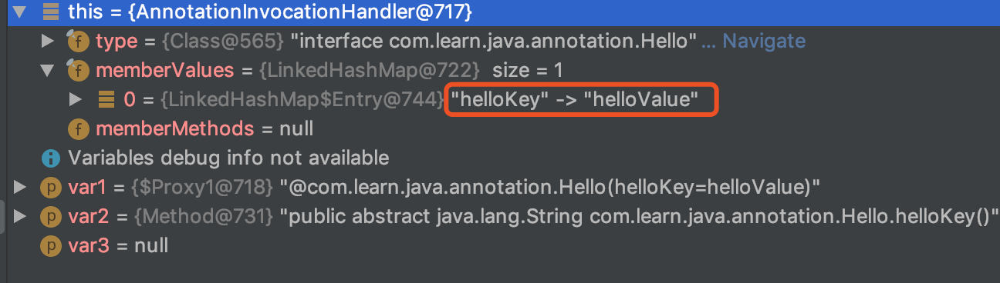
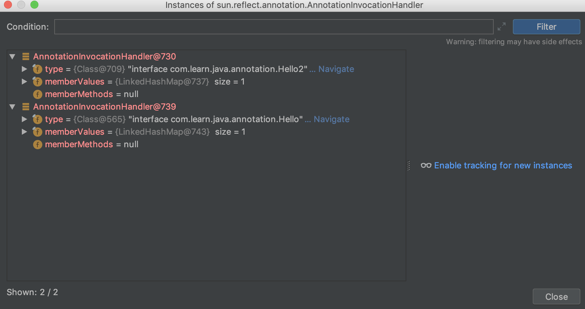
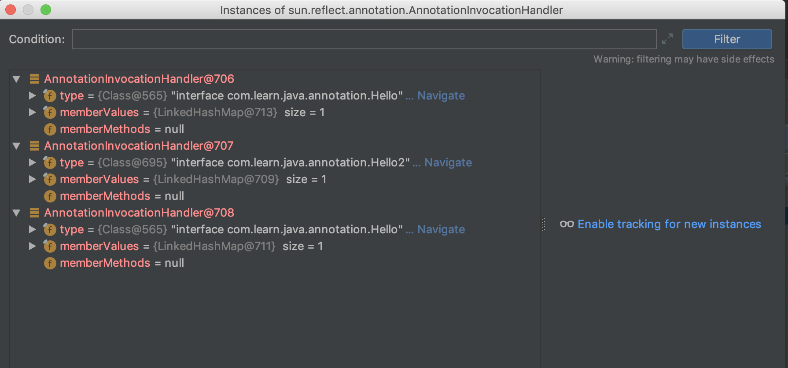

# Java注解


> 注解是一种附加信息/标识信息,如果没有对应的处理器,那没有任何作用.
<!-- more -->
## 注解概述
### 元注解

TRID

#### @Target
注解作用的范围:     
* ElementType.TYPE：允许被修饰的注解作用在类、接口和枚举上
* ElementType.FIELD：允许作用在属性字段上
* ElementType.METHOD：允许作用在方法上
* ElementType.PARAMETER：允许作用在方法参数上
* ElementType.CONSTRUCTOR：允许作用在构造器上
* ElementType.LOCAL_VARIABLE：允许作用在本地局部变量上
* ElementType.ANNOTATION_TYPE：允许作用在注解上
* ElementType.PACKAGE：允许作用在包上

  
#### @Retention
注解留存的时间节点:      
* RetentionPolicy.SOURCE：当前注解编译期可见,不会写入 class 文件,常见的注解为@Override,   @SuppressWarnings   
* RetentionPolicy.CLASS：会写入 class 文件,在类加载后丢弃,可以定义对字节码的操作    
* RetentionPolicy.RUNTIME：永久保存，可以反射获取    


#### @Inherited
是否允许子类继承该注解,注意,**这不是说注解允许继承,而是如果你用注解标注了一个父类,是否允许这个父类的子类也自动拥有这个注解.**
#### @Documented
注解是否应当被包含在 JavaDoc 文档中

### 编译器注解(java内置)
-  @Deprecated
表示弃用,编译这样的类/方法等编译器会给警告.它直接可以标注的东西很多,可以点进去看下@Target.
注意配合javadoc注释,告诉别人新的在哪里.
```java
/**
  @deprecated This class is full of bugs. Use MyNewComponent instead.
*/
```
-  @Override
表示父类进行重写的方法
-  @SuppressWarnings
用来抑制编译器生成警告信息。


## 注解底层原理
### 奇怪的变量定义方式
先看一个接口`public interface Annotation`,在它的doc描述中有一句`The common interface extended by all annotation types`,也就是所有注解都会继承这个接口.那么注解其实也是接口,它在运行时会有代理类,这也就解释了,为什么定义注解使用的变量看起来会有点奇怪,居然要定义个方法.
```java
@Target({ElementType.METHOD,ElementType.FIELD})
@Retention(RetentionPolicy.RUNTIME)
public @interface Hello {
    String helloKey() default "helloValue";
}
```
因为注解实际会有代理类,所以定义的属性确实是方法,只不过方法名字和属性名相同,属性值由方法return.
这里可能有人会问,为什么不直接定义变量,因为java用接口实现注解,接口无法定义实例变量,而每一个注解都是单独的实例,你在类A的两个实例的使用同一种注解,实际在堆内存中有两个注解实例,这个在后边会看到验证.
### 代理
其实后面就是代理的事情了,默认是JDK的动态代理.    
可以使用`System.getProperties().put("sun.misc.ProxyGenerator.saveGeneratedFiles","true");`来在当前工程中保存JDK生成的动态代理类.    
看一下代理类   
```java
public final class $Proxy1 extends Proxy implements Hello {
    // equals
    private static Method m1;
    // toString
    private static Method m2;
    // annotationType
    private static Method m4;
    // hashCode
    private static Method m0;
    // 注解定义的属性对应的方法
    private static Method m3;
		
    static {
        try {
          m1 = Class.forName("java.lang.Object").getMethod("equals", Class.forName("java.lang.Object"));
            m2 = Class.forName("java.lang.Object").getMethod("toString");
            m4 = Class.forName("com.learn.java.annotation.Hello").getMethod("annotationType");
            m3 = Class.forName("com.learn.java.annotation.Hello").getMethod("helloKey");
            m0 = Class.forName("java.lang.Object").getMethod("hashCode");
        } catch (NoSuchMethodException var2) {
            throw new NoSuchMethodError(var2.getMessage());
        } catch (ClassNotFoundException var3) {
            throw new NoClassDefFoundError(var3.getMessage());
        }
    }

    public $Proxy1(InvocationHandler var1) throws  {
        super(var1);
    }

    public final boolean equals(Object var1) throws  {
        try {
            return (Boolean)super.h.invoke(this, m1, new Object[]{var1});
        } catch (RuntimeException | Error var3) {
            throw var3;
        } catch (Throwable var4) {
            throw new UndeclaredThrowableException(var4);
        }
    }

    public final String toString() throws  {
        try {
            return (String)super.h.invoke(this, m2, (Object[])null);
        } catch (RuntimeException | Error var2) {
            throw var2;
        } catch (Throwable var3) {
            throw new UndeclaredThrowableException(var3);
        }
    }

    public final Class annotationType() throws  {
        try {
            return (Class)super.h.invoke(this, m4, (Object[])null);
        } catch (RuntimeException | Error var2) {
            throw var2;
        } catch (Throwable var3) {
            throw new UndeclaredThrowableException(var3);
        }
    }

    public final int hashCode() throws  {
        try {
            return (Integer)super.h.invoke(this, m0, (Object[])null);
        } catch (RuntimeException | Error var2) {
            throw var2;
        } catch (Throwable var3) {
            throw new UndeclaredThrowableException(var3);
        }
    }

    public final String helloKey() throws  {
        try {
            return (String)super.h.invoke(this, m3, (Object[])null);
        } catch (RuntimeException | Error var2) {
            throw var2;
        } catch (Throwable var3) {
            throw new UndeclaredThrowableException(var3);
        }
    }
}
```
可以看出,Proxy类的实际逻辑都是交给InvocationHandler h的invoke方法处理的,     
invoke(this,方法Method对象,方法参数列表),这是JDK代理的通用逻辑,代理后的实际逻辑在对应的handler.
对于注解,它的处理handler是`AnnotationInvocationHandler`.         
同时,我们可以看到代理类Proxy对四个方法是有特殊处理的,这四个方法的实际逻辑也在对应的handler.如果没有这样操作的话,其实代理类会使用Object的实现或者找不到.
-  private static Method m1;// equals	
-  private static Method m2;// toString		
-  private static Method m4;// annotationType	
-  private static Method m0;// hashCode

AnnotationInvocationHandler的invoke方法.
```java
class AnnotationInvocationHandler implements InvocationHandler, Serializable {
    private static final long serialVersionUID = 6182022883658399397L;
    private final Class<? extends Annotation> type;
    private final Map<String, Object> memberValues;
    private transient volatile Method[] memberMethods = null;
    // var1是Proxy$1代理类的this,var2是传进来的方法对象,var3是方法参数
    // 我们只关注var2就好,别的没用到
    public Object invoke(Object var1, Method var2, Object[] var3) {
        // 方法名
        String var4 = var2.getName();
        // 方法参数
        Class[] var5 = var2.getParameterTypes();
        // equals特殊处理
        if (var4.equals("equals") && var5.length == 1 && var5[0] == Object.class) {
            return this.equalsImpl(var3[0]);
        } else if (var5.length != 0) {
            //这里说明注解的方法不允许有参数
            throw new AssertionError("Too many parameters for an annotation method");
        } else {
            byte var7 = -1;
            // 这里判断方法名的hashcode
            switch (var4.hashCode()) {
                case -1776922004:
                    if (var4.equals("toString")) {
                        var7 = 0;
                    }
                    break;
                case 147696667:
                    if (var4.equals("hashCode")) {
                        var7 = 1;
                    }
                    break;
                case 1444986633:
                    if (var4.equals("annotationType")) {
                        var7 = 2;
                    }
            }

            switch (var7) {
                case 0:
                    return this.toStringImpl();
                case 1:
                    return this.hashCodeImpl();
                case 2:
                    return this.type;
                default:
                    Object var6 = this.memberValues.get(var4);
                    if (var6 == null) {
                        throw new IncompleteAnnotationException(this.type, var4);
                    } else if (var6 instanceof ExceptionProxy) {
                        throw ((ExceptionProxy) var6).generateException();
                    } else {
                        if (var6.getClass().isArray() && Array.getLength(var6) != 0) {
                            var6 = this.cloneArray(var6);
                        }

                        return var6;
                    }
            }
        }
    }
}		

```
可以看到,如果是4种特殊方法,那么var7会被设成对应的值,直接调用invoker中复写的方法.  如果是equals在上边就直接判断了.          
如果不是,说明方法是注解自定义的方法,其实也就是注解的参数.     
会从memberValues中取得,它是一个Map<String, Object>,会存储当前注解的属性名(方法名)为Key,以及对应的值. 

举个例子
```java
@Target({ElementType.METHOD,ElementType.FIELD})
@Retention(RetentionPolicy.RUNTIME)
public @interface Hello {
    String helloKey() default "helloValue";
}
```
那么memberValues存放的值是

当然,这是由于虚拟机读取到注解的Retention是Runtime.如果不是运行时的注解,那么不会有自己的AnnotationInvocationvandler.      
注意,虚拟机会给每一个运行时注解生成一个AnnotationInvocationvandler类的实例,type属性是注解的类型.

一个注解,多个地方使用也就是有多个实例,也会有多个AnnotationInvocationvandler类的实例



## 注解与XML

注解 - 分布式,高耦合

xml -  集中式,松耦合

这两种配置方式的争论一直在,看具体场景吧