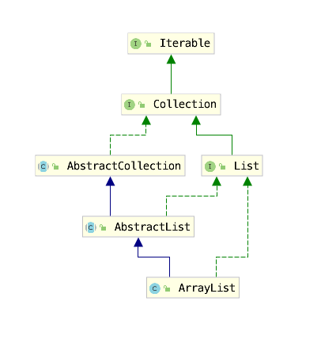

## 概述



``` java
public class ArrayList<E> extends AbstractList<E>
        implements List<E>, RandomAccess, Cloneable, java.io.Serializable
```
> 标记接口RandomAccess,代表可以被随机访问。

## 源码分析

### 成员变量
```java
    //默认初始容量
    private static final int DEFAULT_CAPACITY = 10;

    //底层数组
    transient Object[] elementData; // non-private to simplify nested class access

    //实际拥有的元素数量
    private int size;
    // 最大容量  可突破
    private static final int MAX_ARRAY_SIZE = Integer.MAX_VALUE - 8;
```

### 构造函数

```java
    //节约空间,缓存,节约空间;
    private static final Object[] EMPTY_ELEMENTDATA = {};
    private static final Object[] DEFAULTCAPACITY_EMPTY_ELEMENTDATA = {};
    public ArrayList(int initialCapacity) {
        if (initialCapacity > 0) {
            this.elementData = new Object[initialCapacity];
        } else if (initialCapacity == 0) {
            // 使用同一个静态空数组
            this.elementData = EMPTY_ELEMENTDATA;
        } else {
            throw new IllegalArgumentException("Illegal Capacity: "+
                                               initialCapacity);
        }
    }
    
    
    public ArrayList(Collection<? extends E> c) {
        elementData = c.toArray(); // 这里不一定返回object[] 可能是底层的数据类型
        if ((size = elementData.length) != 0) {
            // c.toArray might (incorrectly) not return Object[] (see 6260652)
            if (elementData.getClass() != Object[].class)
                elementData = Arrays.copyOf(elementData, size, Object[].class);
        } else {
            // replace with empty array.
            this.elementData = EMPTY_ELEMENTDATA;
        }
    }    
    
    public ArrayList() {
        this.elementData = DEFAULTCAPACITY_EMPTY_ELEMENTDATA;
    }
```

>  c.toArray might (incorrectly) not return Object[] (see 6260652) 
>
> 说的是public Object[] toArray() 返回的类型不一定就是 Object[]，其类型取决于其返回的实际类型. 子类可以重写方法并返回协变的子类型.
>
> 我们有1个Object[]数组，并不代表着我们可以将Object对象存进去，这取决于数组中元素实际的类型。
>
> 所以我们不能使用elementData[0] = xxx;
>
> https://blog.csdn.net/jdsjlzx/article/details/54344233


### 主要方法

add() 

```java
 public boolean add(E e) {
        ensureCapacityInternal(size + 1);  // Increments modCount!!
        elementData[size++] = e;
        return true;
    }

public void add(int index, E element) {
        // 保证不越界
        rangeCheckForAdd(index);

        ensureCapacityInternal(size + 1);  // Increments modCount!!
        System.arraycopy(elementData, index, elementData, index + 1,
                         size - index);
        elementData[index] = element;
        size++;
    }


private void rangeCheckForAdd(int index) {
        if (index > size || index < 0)
            throw new IndexOutOfBoundsException(outOfBoundsMsg(index));
    }
```

> ```
> System.arraycopy
> src:源数组；	srcPos:源数组要复制的起始位置；
> dest:目的数组；	destPos:目的数组放置的起始位置；	length:复制的长度。
> ```


get()

```java
public E get(int index) {
        rangeCheck(index);

        return elementData(index);
    }
E elementData(int index) {
        return (E) elementData[index];
    }
```

remove()

`remove()`方法也有两个版本，一个是`remove(int index)`删除指定位置的元素，另一个是`remove(Object o)`删除第一个满足`o.equals(elementData[index])`的元素。删除操作是`add()`操作的逆过程，需要将删除点之后的元素向前移动一个位置。需要注意的是为了让GC起作用，必须显式的为最后一个位置赋`null`值。

```java
public E remove(int index) {
    rangeCheck(index);
    modCount++;
    E oldValue = elementData(index);
    int numMoved = size - index - 1;
    if (numMoved > 0)
        System.arraycopy(elementData, index+1, elementData, index, numMoved);
    elementData[--size] = null; //清除该位置的引用，让GC起作用
    return oldValue;
}
```


**grow() 扩容**

```java
private void ensureExplicitCapacity(int minCapacity) {
        modCount++;
        // overflow-conscious code
        if (minCapacity - elementData.length > 0)
            grow(minCapacity);
    }
```

```java
private void grow(int minCapacity) {
        // overflow-conscious code
        int oldCapacity = elementData.length;
        // 扩容原来数组的一半
        int newCapacity = oldCapacity + (oldCapacity >> 1);
        if (newCapacity - minCapacity < 0)
            newCapacity = minCapacity;
        if (newCapacity - MAX_ARRAY_SIZE > 0)
            newCapacity = hugeCapacity(minCapacity);
        // minCapacity is usually close to size, so this is a win:
        elementData = Arrays.copyOf(elementData, newCapacity);
    }
```


modcount

增删改查中， 增导致**扩容**，则**会修改modCount**，**删一定会修改**。 **改和查一定不会修改modCount**。


## SubList

类似切片.实际底层还是ArrayList本身.


## 解惑

### 为什么ArrayList的elementData是用transient修饰的？
transient修饰的属性意味着不会被序列化，也就是说在序列化ArrayList的时候，不序列化elementData。
为什么要这么做呢？

elementData不总是满的，每次都序列化，会浪费时间和空间
重写了writeObject  保证序列化的时候虽然不序列化全部 但是拥有的元素都序列化

所以说不是不序列化 而是不全部序列化。
``` java

private void writeObject(java.io.ObjectOutputStream s)
        throws java.io.IOException{
     // Write out element count, and any hidden stuff
     int expectedModCount = modCount;
     s.defaultWriteObject();
     // Write out array length
     s.writeInt(elementData.length);
     // Write out all elements in the proper order.
     for (int i=0; i<size; i++)
           s.writeObject(elementData[i]);
    if (modCount != expectedModCount) {
           throw new ConcurrentModificationException();
    }
}
```

### ArrayList和Vector的区别

- Vector是一个线程安全的容器,ArrayList线程不安全     **但是Vector效率低,使用的synchronize关键字** 
- 扩容时候ArrayList扩容增加0.5倍，Vector扩容增加1倍


### 线程安全的办法

Collections工具类有一个synchronizedList方法

可以把list变为线程安全的集合，但是意义不大，可以使用Vector.

**两种都是使用的synchronize关键字.性能差别不大**

### 并发下的ArrayList

```java

public class ArrayListMultiThread {
    static ArrayList<Integer> arrayList = new ArrayList<Integer>(10);

    public static class AddThread implements Runnable {
        @Override
        public void run() {
            for (int i = 0; i < 1000000; i++) {
                arrayList.add(i);
            }
        }
    }

    /**
     *
     * @param args
     * @throws InterruptedException
     */
    public static void main(String args[]) throws InterruptedException {
        Thread thread1 = new Thread(new AddThread());
        Thread thread2 = new Thread(new AddThread());

        thread1.start();
        thread2.start();

        thread1.join();
        thread2.join();

        System.out.println(arrayList.size());
    }

}
```

你可能会得到三种结果

- ArrayList大小确实200万,运气非常好

   * ArrayList是一个线程不安全的容器,多线程操作时会出现冲突,报错信息如下:
     * Exception in thread "Thread-1" java.lang.ArrayIndexOutOfBoundsException: 22
     * at java.util.ArrayList.add(ArrayList.java:441)
     * at chapter2.ArrayListMultiThread$AddThread.run(ArrayListMultiThread.java:27)
     * at java.lang.Thread.run(Thread.java:745)

     在扩容过程中,没有锁,导致了不一致的内部状态

- 大小<200万,但没报错,写入覆盖了,但没报错,如果在生产环境这非常难以排查

## 面试问题

**ArrayList插入删除一定慢么？**
取决于你删除的元素离数组末端有多远，ArrayList可以作为堆栈使用，push和pop操作完全不涉及数据移动操作(操作结尾)。

**ArrayList的遍历和LinkedList遍历性能比较如何？**

论遍历ArrayList要比LinkedList快得多，ArrayList遍历最大的优势在于内存的连续性，CPU的内部缓存结构会缓存连续的内存片段，可以大幅降低读取内存的性能开销。

**ArrayList是如何扩容的？**

ArrayList扩容后的大小等于扩容前大小的1.5倍，当ArrayList很大的时候，这样扩容还是挺浪费空间的，甚至会导致内存不足抛出OutOfMemoryError。扩容的时候还需要对数组进行拷贝，这个也挺费时的。所以我们使用的时候要竭力避免扩容，提供一个初始估计容量参数，以免扩容对性能带来较大影响。

**ArrayList的默认数组大小为什么是10？**

经验型数据

**数组用来做队列合适么？**

数组可以,ArrayList不适合.

## 参考

https://juejin.im/post/5a58aa62f265da3e4d72a51b

https://blog.csdn.net/fighterandknight/article/details/61240861
https://blog.csdn.net/zxt0601/article/details/77281231


