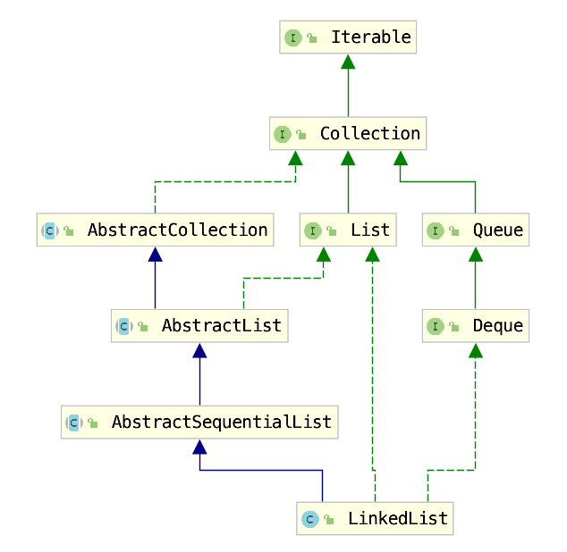
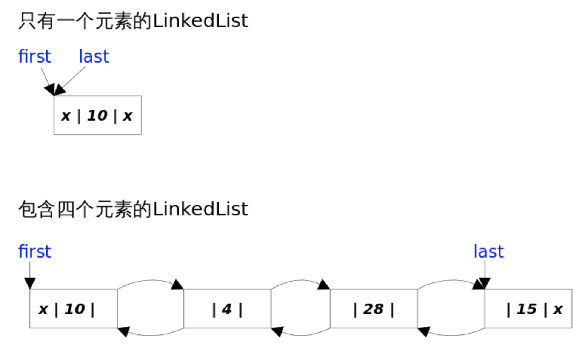
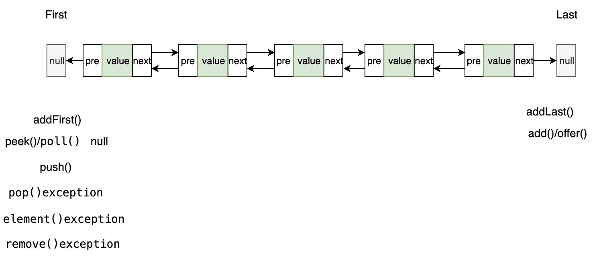

## LinkedList

## 概述



```java
public class LinkedList<E>
    extends AbstractSequentialList<E>  //顺序
    implements List<E>, Deque<E>, Cloneable, java.io.Serializable
```

> Deque是双向队列接口

*LinkedList*同时实现了*List*接口和*Deque*接口，也就是说它既可以看作一个顺序容器，又可以看作一个队列（*Queue*），同时又可以看作一个栈（*Stack*）。这样看来，*LinkedList*简直就是个全能冠军。当你需要使用栈或者队列时，可以考虑使用*LinkedList*，一方面是因为Java官方已经声明不建议使用*Stack*类，更遗憾的是，Java里根本没有一个叫做*Queue*的类（它是个接口名字）。关于栈或队列，现在的首选是*ArrayDeque*，它有着比*LinkedList*（当作栈或队列使用时）有着更好的性能。

LinkedList 是一个继承于AbstractSequentialList的双向链表。它也可以被当作堆栈、队列或双端队列进行操作。
LinkedList 实现 List 接口，能对它进行队列操作。
LinkedList 实现 Deque 接口，即能将LinkedList当作双端队列使用。
LinkedList 实现了Cloneable接口，即覆盖了函数clone()，能克隆。
LinkedList 实现java.io.Serializable接口，这意味着LinkedList支持序列化，能通过序列化去传输。
LinkedList 是非同步的。


## 源码分析



### 成员变量

```java
    // 当前元素数量
    transient int size = 0;

    /**
     * Pointer to first node.
     * Invariant: (first == null && last == null) ||
     *            (first.prev == null && first.item != null)
     */
    transient Node<E> first;

    /**
     * Pointer to last node.
     * Invariant: (first == null && last == null) ||
     *            (last.next == null && last.item != null)
     */
    transient Node<E> last;
```

LinkedList是双向链表,但不是循环的.没有所谓的哑元，当链表为空的时候`first`和`last`都指向`null`。


### Node节点

```java
private static class Node<E> {
        E item;
        Node<E> next;
        Node<E> prev;

        Node(Node<E> prev, E element, Node<E> next) {
            this.item = element;
            this.next = next;
            this.prev = prev;
        }
    }

```

### 构造函数

``` java
  
    public LinkedList() {
    }
    public LinkedList(Collection<? extends E> c) {
        this();
        addAll(c);
    }

```

### 主要方法

#### add方法 = addLast

``` java
   // 在尾部插入,自己变成尾部节点
   public boolean add(E e) {
           linkLast(e);
           return true;
       }
   /**
    * Links e as last element.
    */
   void linkLast(E e) {
           final Node<E> l = last;
           final Node<E> newNode = new Node<>(l, e, null);
           last = newNode;
           if (l == null)
               first = newNode;
           else
               l.next = newNode;
               
           size++;
           modCount++;
   }  
  public void addLast(E e) {
        linkLast(e);
    }  
```

#### addFirst
``` java
    // 在头部插入,自己变成头部节点
    public void addFirst(E e) {
        linkFirst(e);
    }
    private void linkFirst(E e) {
        final Node<E> f = first;
        final Node<E> newNode = new Node<>(null, e, f);
        first = newNode;
        if (f == null)
            last = newNode;
        else
            f.prev = newNode;
        size++;
        modCount++;
    }
    
```

#### get

```java
public E get(int index) {
        checkElementIndex(index);
        return node(index).item;
    }
Node<E> node(int index) {
        // assert isElementIndex(index);
        // 从更近的一边开始查找.
        if (index < (size >> 1)) {
            Node<E> x = first;
            for (int i = 0; i < index; i++)
                x = x.next;
            return x;
        } else {
            Node<E> x = last;
            for (int i = size - 1; i > index; i--)
                x = x.prev;
            return x;
        }
    }
```


#### remove() = removeFirst.  NoSuchElementException

```java
public E remove() { return removeFirst();}
public E removeFirst() {
        final Node<E> f = first;
        if (f == null)
            throw new NoSuchElementException();
        return unlinkFirst(f);
  }
```

#### removeLast   NoSuchElementException

```java
public E removeLast() {
        final Node<E> l = last;
        if (l == null)
            throw new NoSuchElementException();
        return unlinkLast(l);
    }
```

#### addAll

``` java
     public boolean addAll(int index, Collection<? extends E> c) {
        // 检验index是否合法
        checkPositionIndex(index);

        Object[] a = c.toArray();
        // 新增加的长度
        int numNew = a.length;
        if (numNew == 0)
            return false;

        Node<E> pred, succ;
        if (index == size) {
            是尾节点
            succ = null;
            pred = last;
        } else {
            //不是尾节点
            succ = node(index);
            pred = succ.prev;
        }

        for (Object o : a) {
            @SuppressWarnings("unchecked") E e = (E) o;
            Node<E> newNode = new Node<>(pred, e, null);
            if (pred == null)
                first = newNode;
            else
                pred.next = newNode;
            pred = newNode;
        }

        if (succ == null) {
            last = pred;
        } else {
            pred.next = succ;
            succ.prev = pred;
        }

        size += numNew;
        modCount++;
        return true;
    }
```


## 操作总结



## 参考

https://juejin.im/post/5abfde3f6fb9a028e46ec51c


