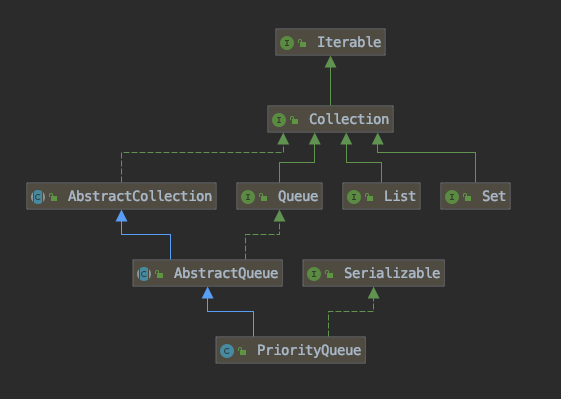

> 二叉小顶堆实现，可以用一棵完全二叉树表示


## 层次图



## 介绍

**优先队列的作用是能保证每次取出的元素都是队列中权值最小的**（Java的优先队列每次取最小元素，C++的优先队列每次取最大元素）。这里牵涉到了大小关系，**元素大小的评判可以通过元素本身的自然顺序（natural ordering），也可以通过构造时传入的比较器**（*Comparator*，类似于C++的仿函数）。


Java中**PriorityQueue**实现了**Queue**接口，不允许放入`null`元素；

Queue接口

```java
public interface Queue<E> extends Collection<E> {
    boolean add(E var1);

    boolean offer(E var1); //false

    E remove();

    E poll(); // null

    E element();

    E peek(); // null
}
```

其通过堆实现，具体说是通过完全二叉树（*complete binary tree*）实现的**小顶堆**（任意一个非叶子节点的权值，都不大于其左右子节点的权值），也就意味着可以通过数组来作为*PriorityQueue*的底层实现。


上图中我们给每个元素按照层序遍历的方式进行了编号，如果你足够细心，会发现父节点和子节点的编号是有联系的，更确切的说父子节点的编号之间有如下关系：

```java
leftNo = parentNo*2+1
rightNo = parentNo*2+2
parentNo = (nodeNo-1)/2
```

通过上述三个公式，可以轻易计算出某个节点的父节点以及子节点的下标。这也就是为什么可以直接用数组来存储堆的原因。

**PriorityQueue**的`peek()`和`element`操作是常数时间，`add()`, `offer()`, 无参数的`remove()`以及`poll()`方法的时间复杂度都是`log(N)`。


## 方法分析

### add()和offer()

`add(E e)`和`offer(E e)`的语义相同，都是向优先队列中插入元素，只是`Queue`接口规定二者对插入失败时的处理不同，前者在插入失败时抛出异常，后则则会返回`false`。对于PriorityQueue这两个方法其实没什么差别。


新加入的元素`x`可能会破坏小顶堆的性质，因此需要进行调整。调整的过程为：**从`k`指定的位置开始，将`x`逐层与当前点的`parent`进行比较并交换，直到满足`x >= queue[parent]`为止**。注意这里的比较可以是元素的自然顺序，也可以是依靠比较器的顺序。

### element()和peek()

`element()`和`peek()`的语义完全相同，都是获取但不删除队首元素，也就是队列中权值最小的那个元素，二者唯一的区别是当方法失败时前者抛出异常，后者返回`null`。根据小顶堆的性质，堆顶那个元素就是全局最小的那个；由于堆用数组表示，根据下标关系，`0`下标处的那个元素既是堆顶元素。所以**直接返回数组`0`下标处的那个元素即可**。

```java
//peek()
public E peek() {
    if (size == 0)
        return null;
    return (E) queue[0];//0下标处的那个元素就是最小的那个
}
```

### remove()和poll()

`remove()`和`poll()`方法的语义也完全相同，都是获取并删除队首元素，区别是当方法失败时前者抛出异常，后者返回`null`。由于删除操作会改变队列的结构，为维护小顶堆的性质，需要进行必要的调整。


首先记录`0`下标处的元素，并用最后一个元素替换`0`下标位置的元素，之后调用`siftDown()`方法对堆进行调整，最后返回原来`0`下标处的那个元素（也就是最小的那个元素）。重点是`siftDown(int k, E x)`方法，该方法的作用是**从`k`指定的位置开始，将`x`逐层向下与当前点的左右孩子中较小的那个交换，直到`x`小于或等于左右孩子中的任何一个为止**。


## 性能

- 初始化O(N)
- 插入/删除 log(N)


## 参考

https://github.com/CarpenterLee/JCFInternals/blob/master/markdown/8-PriorityQueue.md