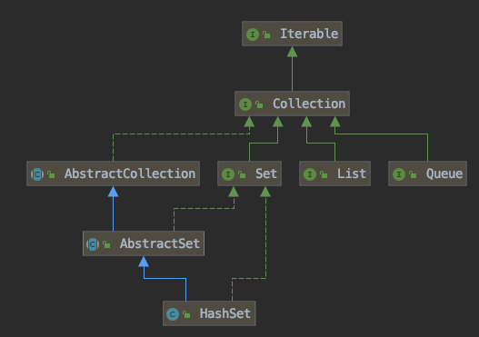

## 层次图




前面已经说过HashSet是对HashMap的简单包装，对HashSet的函数调用都会转换成合适的HashMap方法，因此HashSet的实现非常简单，只有不到300行代码。这里不再赘述。

```java
//HashSet是对HashMap的简单包装
public class HashSet<E>
{
	......
	private transient HashMap<E,Object> map;//HashSet里面有一个HashMap
    // Dummy value to associate with an Object in the backing Map
    private static final Object PRESENT = new Object();
    public HashSet() {
        map = new HashMap<>();
    }
    ......
    public boolean add(E e) {//简单的方法转换
        return map.put(e, PRESENT)==null;
    }
    ......
}
```


