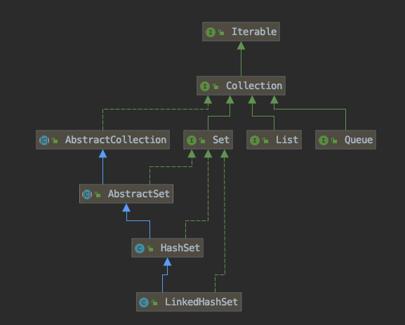

## 层次图




## LinkedHashSet

前面已经说过LinkedHashSet是对LinkedHashMap的简单包装，对LinkedHashSet的函数调用都会转换成合适的LinkedHashMap方法，因此LinkedHashSet的实现非常简单，这里不再赘述。

```java
public class LinkedHashSet<E>
    extends HashSet<E>
    implements Set<E>, Cloneable, java.io.Serializable {
    ......
    // LinkedHashSet里面有一个LinkedHashMap
    public LinkedHashSet(int initialCapacity, float loadFactor) {
        map = new LinkedHashMap<>(initialCapacity, loadFactor);
    }
	......
    public boolean add(E e) {//简单的方法转换
        return map.put(e, PRESENT)==null;
    }
    ......
}
```


