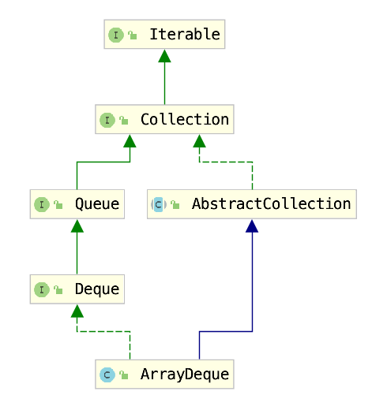
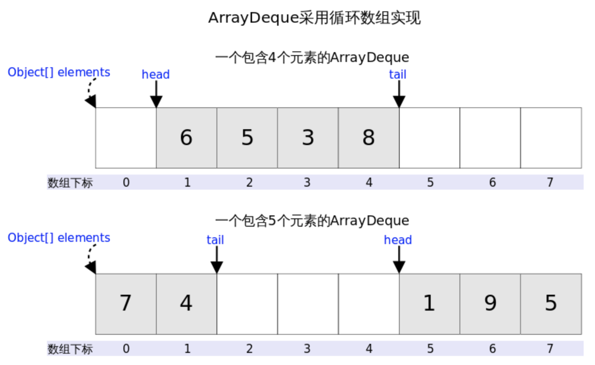
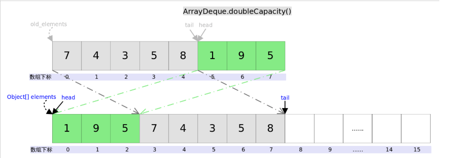

## Java中的Stack和Queue

Java里有一个叫做*Stack*的类，却没有叫做*Queue*的类（它是个接口名字）。当需要使用栈时，Java已不推荐使用*Stack*，而是推荐使用更高效的*ArrayDeque*；既然*Queue*只是一个接口，当需要使用队列时也就首选*ArrayDeque*了（次选是*LinkedList*）。

## Deque

*Deque*的含义是“double ended queue”，即双端队列，它既可以当作栈使用，也可以当作队列使用。

### *Deque*与*Queue*相对应的接口

| Queue Method | Equivalent Deque Method | 说明                                   |
| ------------ | ----------------------- | -------------------------------------- |
| `add(e)`     | `addLast(e)`            | 向队尾插入元素，失败则抛出异常         |
| `offer(e)`   | `offerLast(e)`          | 向队尾插入元素，失败则返回`false`      |
| `remove()`   | `removeFirst()`         | 获取并删除队首元素，失败则抛出异常     |
| `poll()`     | `pollFirst()`           | 获取并删除队首元素，失败则返回`null`   |
| `element()`  | `getFirst()`            | 获取但不删除队首元素，失败则抛出异常   |
| `peek()`     | `peekFirst()`           | 获取但不删除队首元素，失败则返回`null` |


### *Deque*与Stack相对应的接口


| Stack Method | Equivalent Deque Method | 说明                                   |
| ------------ | ----------------------- | -------------------------------------- |
| `push(e)`    | `addFirst(e)`           | 向栈顶插入元素，失败则抛出异常         |
| 无           | `offerFirst(e)`         | 向栈顶插入元素，失败则返回`false`      |
| `pop()`      | `removeFirst()`         | 获取并删除栈顶元素，失败则抛出异常     |
| 无           | `pollFirst()`           | 获取并删除栈顶元素，失败则返回`null`   |
| `peek()`     | `peekFirst()`           | 获取但不删除栈顶元素，失败则抛出异常   |
| 无           | `peekFirst()`           | 获取但不删除栈顶元素，失败则返回`null` |


## Deque的实现

可以使用ArrayDeque或者LinkedList


## ArrayDeque分析



### 概述

*ArrayDeque*底层通过数组实现，为了满足可以同时在数组两端插入或删除元素的需求，该数组还必须是循环的，即**循环数组（circular array）**，也就是说数组的任何一点都可能被看作起点或者终点。*ArrayDeque*是非线程安全的（not thread-safe），当多个线程同时使用的时候，需要程序员手动同步；另外，该容器不允许放入`null`元素。




### 源码分析

#### 成员变量

```java
// 底层数组
transient Object[] elements;
// 头
transient int head;
// 指向尾端第一个可以插入元素的空位
transient int tail;
// 最小容量 2的倍数
private static final int MIN_INITIAL_CAPACITY = 8;
```

#### 构造函数

```java
// 默认容量16
public ArrayDeque() {
        elements = new Object[16];
    }
public ArrayDeque(int numElements) {
        allocateElements(numElements);
    }

//取最小的N>numElements (N=2^k)
private static int calculateSize(int numElements) {
        int initialCapacity = MIN_INITIAL_CAPACITY;
        // Find the best power of two to hold elements.
        // Tests "<=" because arrays aren't kept full.
        if (numElements >= initialCapacity) {
            initialCapacity = numElements;
            initialCapacity |= (initialCapacity >>>  1);
            initialCapacity |= (initialCapacity >>>  2);
            initialCapacity |= (initialCapacity >>>  4);
            initialCapacity |= (initialCapacity >>>  8);
            initialCapacity |= (initialCapacity >>> 16);
            initialCapacity++;

            if (initialCapacity < 0)   // Too many elements, must back off
                initialCapacity >>>= 1;// Good luck allocating 2 ^ 30 elements
        }
        return initialCapacity;
    }
```

```java
ArrayDeque<Integer> deque = new ArrayDeque<>(16);//底层object是32
ArrayDeque<Integer> deque = new ArrayDeque<>(2);  //最小是8
```

#### 主要方法

add = addLast

```java
 public boolean add(E e) {
        addLast(e);
        return true;
    }
 //不允许null
 public void addLast(E e) {
        if (e == null)
            throw new NullPointerException();
        elements[tail] = e;
        if ( (tail = (tail + 1) & (elements.length - 1)) == head)
            doubleCapacity();
    }
```

addFirst

```java
//-1 补码 1111 1111 如果object[] len =32 则head放在31
public void addFirst(E e) {
        if (e == null)
            throw new NullPointerException();
        elements[head = (head - 1) & (elements.length - 1)] = e;
        if (head == tail)
            doubleCapacity();
    }

```

doubleCapacity 扩容



```java
// 第一次复制head右边的元素，第二次复制head左边的元素。
private void doubleCapacity() {
        assert head == tail;
        int p = head;
        int n = elements.length;
        int r = n - p; // number of elements to the right of p
        int newCapacity = n << 1;
        if (newCapacity < 0)
            throw new IllegalStateException("Sorry, deque too big");
        Object[] a = new Object[newCapacity];
        System.arraycopy(elements, p, a, 0, r);
        System.arraycopy(elements, 0, a, r, p);
        elements = a;
        head = 0;
        tail = n;
    }
```


## 参考

[https://github.com/CarpenterLee/JCFInternals/blob/master/markdown/4-Stack%20and%20Queue.md](https://github.com/CarpenterLee/JCFInternals/blob/master/markdown/4-Stack and Queue.md)

