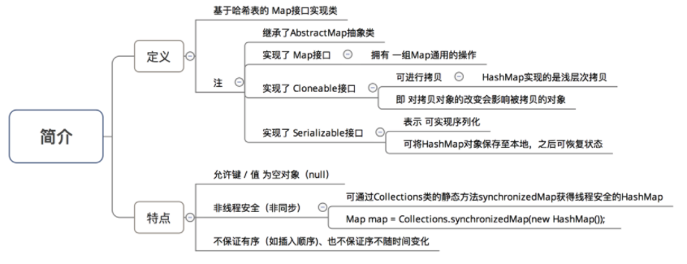
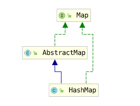
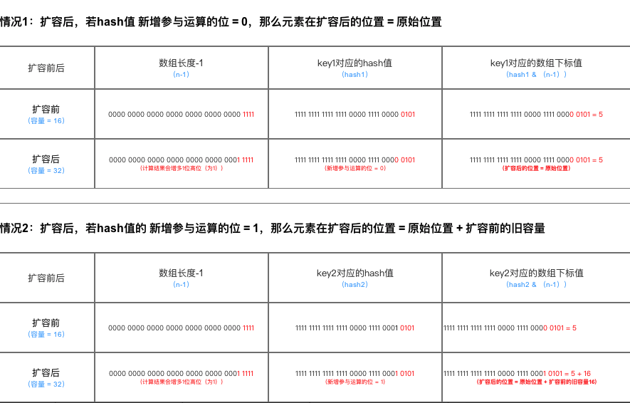
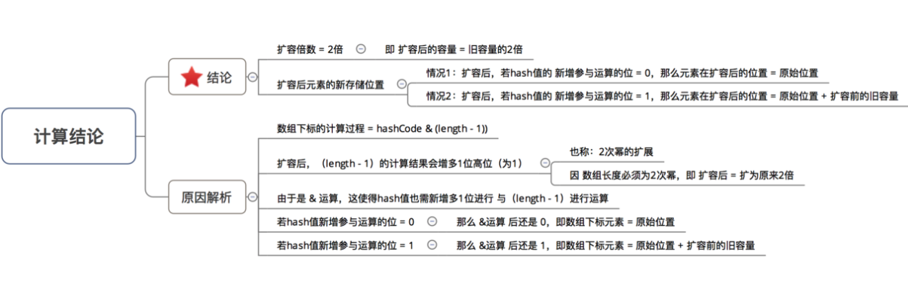
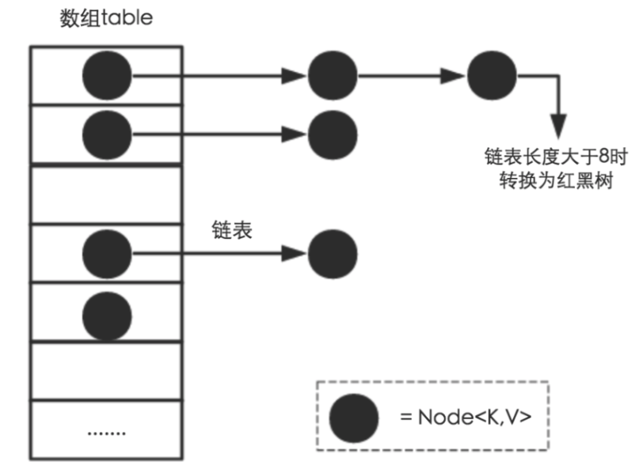

## HashMap




## 源码分析

### tips

X % 2^n = X & (2^n - 1)

推理:

```
a % b = a - (a/b)*b 

           = a - (a/2^n) * 2^n
           
           = a - (a >> n) << n
           
           = 在右移中被抛弃的低位(左移补的是0，补不回来)
```

在右移中被抛弃的低位 = a & (2^n - 1)            

### 概览




```java
public class HashMap<K,V> extends AbstractMap<K,V>
    implements Map<K,V>, Cloneable, Serializable {
```

- 数组+链表 
- 冲突使用拉链法。

### 成员变量

```java
    // 初始容量
    static final int DEFAULT_INITIAL_CAPACITY = 1 << 4; // aka 16
    // 最大容量 =  2的30次方（若传入的容量过大，将被最大值替换）
    static final int MAXIMUM_CAPACITY = 1 << 30;
    // 默认负载因子
    static final float DEFAULT_LOAD_FACTOR = 0.75f;
   
    static final int TREEIFY_THRESHOLD = 8;         // 链表转换红黑树的阈值
    static final int UNTREEIFY_THRESHOLD = 6;       // 红黑树转换为链表的阈值
    static final int MIN_TREEIFY_CAPACITY = 64;     // 最小树型化容量阀值
    transient HashMap.Node<K, V>[] table;
    transient Set<Entry<K, V>> entrySet;
    //当前元素个数
    transient int size;
    //修改次数
    transient int modCount;
    int threshold;// HashMap的阈值，用于判断是否需要调整HashMap的容量（threshold = 容量*加载因子） 
    
  // 3. 扩容阈值（threshold）：当哈希表的大小 ≥ 扩容阈值时，就会扩容哈希表（即扩充HashMap的容量） 
  // a. 扩容 = 对哈希表进行resize操作（即重建内部数据结构），从而哈希表将具有大约两倍的桶数
  // b. 扩容阈值 = 容量 x 加载因子
    final float loadFactor;
   
```


### 链表节点Node<K,V>

```java
    static class Node<K,V> implements Map.Entry<K,V> {
        final int hash;
        final K key;
        V value;
        Node<K,V> next;

        Node(int hash, K key, V value, Node<K,V> next) {
            this.hash = hash;
            this.key = key;
            this.value = value;
            this.next = next;
        }

        public final K getKey()        { return key; }
        public final V getValue()      { return value; }
        public final String toString() { return key + "=" + value; }

        public final int hashCode() {
            return Objects.hashCode(key) ^ Objects.hashCode(value);
        }

        public final V setValue(V newValue) {
            V oldValue = value;
            value = newValue;
            return oldValue;
        }

        public final boolean equals(Object o) {
            if (o == this)
                return true;
            if (o instanceof Map.Entry) {
                Map.Entry<?,?> e = (Map.Entry<?,?>)o;
                if (Objects.equals(key, e.getKey()) &&
                    Objects.equals(value, e.getValue()))
                    return true;
            }
            return false;
        }
    }
```

### 构造函数

```java
    /**
     * 构造函数1：默认构造函数（无参）
     * 加载因子 & 容量 = 默认 = 0.75、16
     */
    public HashMap() {
        this.loadFactor = DEFAULT_LOAD_FACTOR;
    }
    /**
     * 构造函数2：指定“容量大小”的构造函数
     * 加载因子 = 默认 = 0.75 、容量 = 指定大小
     */
    public HashMap(int initialCapacity) {
        // 实际上是调用指定“容量大小”和“加载因子”的构造函数
        // 只是在传入的加载因子参数 = 默认加载因子
        this(initialCapacity, DEFAULT_LOAD_FACTOR);
        
    }
    /**
     * 构造函数3：指定“容量大小”和“加载因子”的构造函数
     * 加载因子 & 容量 = 自己指定
     */
    public HashMap(int initialCapacity, float loadFactor) {

    	// 指定初始容量必须非负，否则报错  
   		 if (initialCapacity < 0)  
           throw new IllegalArgumentException("Illegal initial capacity: " +  
                                           initialCapacity); 

        // HashMap的最大容量只能是MAXIMUM_CAPACITY，哪怕传入的 > 最大容量
        if (initialCapacity > MAXIMUM_CAPACITY)
            initialCapacity = MAXIMUM_CAPACITY;

        // 填充比必须为正  
    	if (loadFactor <= 0 || Float.isNaN(loadFactor))  
        	throw new IllegalArgumentException("Illegal load factor: " +  
                                           loadFactor);  
        // 设置 加载因子
        this.loadFactor = loadFactor;

        // 设置 扩容阈值
        // 注：此处不是真正的阈值，仅仅只是将传入的容量大小转化为：>传入容量大小的最小的2的幂，该阈值后面会重新计算
        // 下面会详细讲解 ->> tableSizeFor分析
        this.threshold = tableSizeFor(initialCapacity); 

    }

```


#### 容量转化  tableSizeFor

> 将传入的容量大小转化为：>传入容量大小的最小的2的幂

先来分析有关n位操作部分：先来假设n的二进制为01xxx...xxx。接着

对n右移1位：001xx...xxx，再位或：0011xx...xxx

对n右移2位：00011...xxx，再位或：001111...xxx

对n右移4位：00011...xxx，再位或：0011111111...xxx

对n右移8位：00011...xxx，再位或：001111111111111111...xxx

对n右移16位：00011...xxx，再位或：001111111111111111…111

综上可得，该算法让最高位的1后面的位全变为1。

最后再让结果n+1，即得到了2的整数次幂的值了。

现在回来看看第一条语句：

int n = cap - 1;
让cap-1再赋值给n的目的是另找到的目标值大于或等于原值。例如二进制1000，十进制数值为8。如果不对它减1而直接操作，将得到答案10000，即16。显然不是结果。减1后二进制为111，再进行操作则会得到原来的数值1000，即8。

```java
    /**
     * Returns a power of two size for the given target capacity.
     */
    static final int tableSizeFor(int cap) {
        int n = cap - 1;
        n |= n >>> 1;
        n |= n >>> 2;
        n |= n >>> 4;
        n |= n >>> 8;
        n |= n >>> 16;
        return (n < 0) ? 1 : (n >= MAXIMUM_CAPACITY) ? MAXIMUM_CAPACITY : n + 1;
    }


```


### 主要方法

#### 计算key的hash 

key的hash异或上高16位的hash

``` java
    static final int hash(Object key) {
        int h;
        // 让高16位也参与运算
        return (key == null) ? 0 : (h = key.hashCode()) ^ (h >>> 16);
    }
    public V put(K key, V value) {
        return putVal(hash(key), key, value, false, true);
    }
```

##### 为什么不直接采用经过hashCode（）处理的哈希码 作为存储数组table的下标位置？

 哈希码 与 数组大小范围不匹配

##### 为什么在计算数组下标前，需对哈希码进行二次处理：扰动处理？

加大哈希码低位的随机性，使得分布更均匀，从而提高对应数组存储下标位置的随机性 & 均匀性，最终减少Hash冲突

#### put 方法

``` java
public V put(K key, V value) {
        return putVal(hash(key), key, value, false, true);
}

final V putVal(int hash, K key, V value, boolean onlyIfAbsent,
                   boolean evict) {
        Node<K,V>[] tab; Node<K,V> p; int n, i;
         // tab为空则调用resize()初始化创建
        if ((tab = table) == null || (n = tab.length) == 0)         
            n = (tab = resize()).length;
        // 计算index,并对null做处理  
        if ((p = tab[i = (n - 1) & hash]) == null)// 无哈希冲突,创建新的Node
            tab[i] = newNode(hash, key, value, null);
        else {
            Node<K,V> e; K k;
            // 节点key存在,直接覆盖value，保证key的唯一性
            if (p.hash == hash &&
                ((k = p.key) == key || (key != null && key.equals(k))))
                e = p;
            // 判断是否为为红黑树    
            else if (p instanceof TreeNode)
                e = ((TreeNode<K,V>)p).putTreeVal(this, tab, hash, key, value);//是红黑树，赋值 
            else {  
                
                 // 若是链表,则在链表中插入 or 更新键值对
                 // i.  遍历table[i]，判断Key是否已存在：采用equals（） 对比当前遍历节点的key 与 需插入数        据的key：若已存在，则直接用新value 覆盖 旧value
                 // ii. 遍历完毕后仍无发现上述情况，则直接在链表尾部插入数据
                 // 注：新增节点后，需判断链表长度是否>8（8 = 桶的树化阈值）：若是，则把链表转换为红黑树
                for (int binCount = 0; ; ++binCount) {
                    if ((e = p.next) == null) {
                        p.next = newNode(hash, key, value, null); //如果e后的Node为空，将value赋予下一个Node
                        if (binCount >= TREEIFY_THRESHOLD - 1) // -1 for 1st
                            treeifyBin(tab, hash);//链表长度达到8，改变链表结构为红黑树
                        break;
                    }
                    // key相同则跳出循环
                    if (e.hash == hash &&
                        ((k = e.key) == key || (key != null && key.equals(k))))
                        break;
                    //就是移动指针方便继续取 p.next
                    p = e;
                }
            }
            if (e != null) { 
                V oldValue = e.value;
                //根据规则选择是否覆盖value
                if (!onlyIfAbsent || oldValue == null)
                    e.value = value;
                afterNodeAccess(e);// 替换旧值时会调用的方法（默认实现为空）
                return oldValue;
            }
        }
        ++modCount;
        // 扩容检测
        if (++size > threshold)
            // size大于加载因子,扩容
            resize();
        afterNodeInsertion(evict);// // 插入成功时会调用的方法（默认实现为空
        return null;
    }

```

初始化哈希表的时机 = 第1次调用put函数时，即调用resize() 初始化创建

#### get方法

```java
 
public V get(Object key) {
        Node<K,V> e;
        return (e = getNode(hash(key), key)) == null ? null : e.value;
    }    

final Node<K,V> getNode(int hash, Object key) {
        Node<K,V>[] tab; Node<K,V> first, e; int n; K k;
        if ((tab = table) != null && (n = tab.length) > 0 &&
            (first = tab[(n - 1) & hash]) != null) {
            if (first.hash == hash && // always check first node
                ((k = first.key) == key || (key != null && key.equals(k))))
                return first;
            if ((e = first.next) != null) {
                if (first instanceof TreeNode)
                    return ((TreeNode<K,V>)first).getTreeNode(hash, key);
                do {
                    if (e.hash == hash &&
                        ((k = e.key) == key || (key != null && key.equals(k))))
                        return e;
                } while ((e = e.next) != null);
            }
        }
        return null;
    }
```

如果出现链表,通过key.equals(k) || (k = e.key) == key方法来判断是否是要找的那个entry

#### resize()

```java
   /**
     * 分析4：resize（）
     * 该函数有2种使用情况：1.初始化哈希表 2.当前数组容量过小，需扩容
     */
   final Node<K,V>[] resize() {
    Node<K,V>[] oldTab = table; // 扩容前的数组（当前数组）
    int oldCap = (oldTab == null) ? 0 : oldTab.length; // 扩容前的数组的容量 = 长度
    int oldThr = threshold;// 扩容前的数组的阈值
    int newCap, newThr = 0;

    // 针对情况2：若扩容前的数组容量超过最大值，则不再扩充
    if (oldCap > 0) {
        if (oldCap >= MAXIMUM_CAPACITY) {
            threshold = Integer.MAX_VALUE;
            return oldTab;
        }

        // 针对情况2：若无超过最大值，就扩充为原来的2倍
        else if ((newCap = oldCap << 1) < MAXIMUM_CAPACITY &&
                 oldCap >= DEFAULT_INITIAL_CAPACITY)
            newThr = oldThr << 1; // 通过右移扩充2倍
    }

    // 针对情况1：初始化哈希表（采用指定 or 默认值）
    else if (oldThr > 0) // initial capacity was placed in threshold
        newCap = oldThr;

    else {               // zero initial threshold signifies using defaults
        newCap = DEFAULT_INITIAL_CAPACITY;
        newThr = (int)(DEFAULT_LOAD_FACTOR * DEFAULT_INITIAL_CAPACITY);
    }

    // 计算新的resize上限
    if (newThr == 0) {
        float ft = (float)newCap * loadFactor;
        newThr = (newCap < MAXIMUM_CAPACITY && ft < (float)MAXIMUM_CAPACITY ?
                  (int)ft : Integer.MAX_VALUE);
    }

    threshold = newThr;
    @SuppressWarnings({"rawtypes","unchecked"})
        Node<K,V>[] newTab = (Node<K,V>[])new Node[newCap];
    table = newTab;

    if (oldTab != null) {
        // 把每个bucket都移动到新的buckets中
        for (int j = 0; j < oldCap; ++j) {
            Node<K,V> e;
            if ((e = oldTab[j]) != null) {
                oldTab[j] = null;

                if (e.next == null)
                    newTab[e.hash & (newCap - 1)] = e;
                else if (e instanceof TreeNode)
                    ((TreeNode<K,V>)e).split(this, newTab, j, oldCap);

                else { // 链表优化重hash的代码块
                    Node<K,V> loHead = null, loTail = null;
                    Node<K,V> hiHead = null, hiTail = null;
                    Node<K,V> next;
                    do {
                        next = e.next;
                        // 原索引
                        if ((e.hash & oldCap) == 0) {
                            if (loTail == null)
                                loHead = e;
                            else
                                loTail.next = e;
                            loTail = e;
                        }
                        // 原索引 + oldCap
                        else {
                            if (hiTail == null)
                                hiHead = e;
                            else
                                hiTail.next = e;
                            hiTail = e;
                        }
                    } while ((e = next) != null);
                    // 原索引放到bucket里
                    if (loTail != null) {
                        loTail.next = null;
                        newTab[j] = loHead;
                    }
                    // 原索引+oldCap放到bucket里
                    if (hiTail != null) {
                        hiTail.next = null;
                        newTab[j + oldCap] = hiHead;
                    }
                }
            }
        }
    }
    return newTab;
}

```

##### `JDK 1.8`扩容时，数据存储位置重新计算的方式

提高了扩容效率



##### 总结




#### remove方法
``` java
     /**
     * Implements Map.remove and related methods
     *
     * @param hash hash for key
     * @param key the key
     * @param value the value to match if matchValue, else ignored
     * @param matchValue if true only remove if value is equal
     * @param movable if false do not move other nodes while removing
     * @return the node, or null if none
     */
    final Node<K,V> removeNode(int hash, Object key, Object value,
                               boolean matchValue, boolean movable) {
        Node<K,V>[] tab; Node<K,V> p; int n, index;
        // 链表不为null 且 length > 0 且 table[index]上有值
        if ((tab = table) != null && (n = tab.length) > 0 &&
            (p = tab[index = (n - 1) & hash]) != null) {
            
            Node<K,V> node = null, e; K k; V v;
            if (p.hash == hash &&
                ((k = p.key) == key || (key != null && key.equals(k))))
                // 直接找到了这个节点
                node = p;
            else if ((e = p.next) != null) {
                if (p instanceof TreeNode)
                    // 红黑树节点
                    node = ((TreeNode<K,V>)p).getTreeNode(hash, key);
                else {
                    // 链表节点
                    do {
                        if (e.hash == hash &&
                            ((k = e.key) == key ||
                             (key != null && key.equals(k)))) {
                            node = e;
                            break;
                        }
                        p = e;
                    } while ((e = e.next) != null);
                }
            }
            // 获取到node后，分情形删除节点
            if (node != null && (!matchValue || (v = node.value) == value ||
                                 (value != null && value.equals(v)))) {
                if (node instanceof TreeNode)
                    // 这里我们只需要知道我们只是删除对应的红黑树节点即可
                    ((TreeNode<K,V>)node).removeTreeNode(this, tab, movable);
                else if (node == p)
                    // table[index]的entry变成下一个
                    tab[index] = node.next;
                else
                    // 链表删除
                    p.next = node.next;
                ++modCount;
                --size;
                afterNodeRemoval(node);
                return node;
            }
        }
        return null;
    }


```


## HashMap的死锁问题

https://coolshell.cn/articles/9606.html


## 1.8新特性

### 数组+链表+红黑树



### Hash方法变化

hash方法计算加入了扰动,每次都会向右移动16位,将高位信息带入

### resize变化

resize()方法 计算扩容后位置hash无需再次扰动计算,扩容后位置 = 原位置 or 原位置 + oldCap。且使用尾插入法(1.7是头插入法)，不会出现逆序，环形链表死循环问题


## Hashtable区别

Hashtable是线程安全的,不允许null.   否则在计算hash时候会NPE.

## 红黑树

https://blog.csdn.net/yang_yulei/article/details/26066409

## 参考

https://juejin.im/post/5aa5d8d26fb9a028d2079264

https://zhuanlan.zhihu.com/p/24828513?refer=dreawer