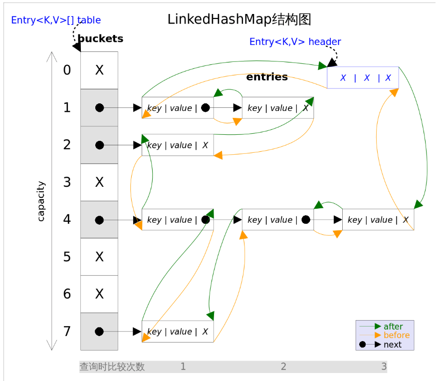

## LinkedHashMap

> LinkedHashMap，其中HashMap用于存储数据，"LinkedList"用于存储数据顺序

*LinkedHashMap*实现了*Map*接口，即允许放入`key`为`null`的元素，也允许插入`value`为`null`的元素。从名字上可以看出该容器是*linked list*和*HashMap*的混合体，也就是说它同时满足*HashMap*和*linked list*的某些特性。**可将LinkedHashMap看作采用LinkedList增强的HashMap。**




事实上*LinkedHashMap*是*HashMap*的直接子类，**二者唯一的区别是LinkedHashMap在HashMap的基础上，采用双向链表（doubly-linked list）的形式将所有entry连接起来，这样是为保证元素的迭代顺序跟插入顺序相同**。上图给出了*LinkedHashMap*的结构图，主体部分跟*HashMap*完全一样，多了`header`指向双向链表的头部（是一个哑元），**该双向链表的迭代顺序就是entry的插入顺序**。

除了可以保迭代历顺序，这种结构还有一个好处：**迭代LinkedHashMap时不需要像HashMap那样遍历整个table，而只需要直接遍历header指向的双向链表即可**，也就是说*LinkedHashMap*的迭代时间就只跟`entry`的个数相关，而跟`table`的大小无关。

有两个参数可以影响*LinkedHashMap*的性能：初始容量（inital capacity）和负载系数（load factor）。初始容量指定了初始`table`的大小，负载系数用来指定自动扩容的临界值。当`entry`的数量超过`capacity*load_factor`时，容器将自动扩容并重新哈希。对于插入元素较多的场景，将初始容量设大可以减少重新哈希的次数。

将对象放入到*LinkedHashMap*或*LinkedHashSet*中时，有两个方法需要特别关心：`hashCode()`和`equals()`。**hashCode()方法决定了对象会被放到哪个bucket里，当多个对象的哈希值冲突时，equals()方法决定了这些对象是否是“同一个对象”**。所以，如果要将自定义的对象放入到`LinkedHashMap`或`LinkedHashSet`中，需要*@Override*`hashCode()`和`equals()`方法。


## 顺序

插入顺序使用

```java
 static void insertOrder() {
        LinkedHashMap<String, String> map = new LinkedHashMap<String, String>(16, 0.75f);
        map.put("0", "1");
        map.put("1", "2");
        map.put("2", "3");
        map.put("3", "4");

        map.get("1");
        map.get("2");

        Iterator iter = map.entrySet().iterator();

        while (iter.hasNext()) {
            Map.Entry entry = (Map.Entry) iter.next();
            System.out.println(entry.getKey() + "=" + entry.getValue());
        }
    }
```


访问顺序使用

最近被访问的会被移动到last

```java
  static void accessOrder() {
        LinkedHashMap<String, String> map = new LinkedHashMap<String, String>(16, 0.75f,true
        );
        map.put("1", "1");
        map.put("2", "2");
        map.put("3", "3");
        map.put("4", "4");

        map.get("1");
        map.get("2");

        Iterator iter = map.entrySet().iterator();

        while (iter.hasNext()) {
            Map.Entry entry = (Map.Entry) iter.next();
            System.out.println(entry.getKey() + "=" + entry.getValue());
        }

    }
```


## LinkedHashMap经典用法

*LinkedHashMap*除了可以保证迭代顺序外，还有一个非常有用的用法：可以轻松实现一个采用了FIFO替换策略的缓存。具体说来，LinkedHashMap有一个子类方法`protected boolean removeEldestEntry(Map.Entry<K,V> eldest)`，该方法的作用是告诉Map是否要删除“最老”的Entry，所谓最老就是当前Map中最早插入的Entry，如果该方法返回`true`，最老的那个元素就会被删除。在每次插入新元素的之后LinkedHashMap会自动询问removeEldestEntry()是否要删除最老的元素。这样只需要在子类中重载该方法，当元素个数超过一定数量时让removeEldestEntry()返回true，就能够实现一个固定大小的FIFO策略的缓存。示例代码如下：

```java
/** 一个固定大小的FIFO替换策略的缓存 */
class FIFOCache<K, V> extends LinkedHashMap<K, V>{
    private final int cacheSize;
    public FIFOCache(int cacheSize){
        this.cacheSize = cacheSize;
    }

    // 当Entry个数超过cacheSize时，删除最老的Entry
    @Override
    protected boolean removeEldestEntry(Map.Entry<K,V> eldest) {
       return size() > cacheSize;
    }
}
```

### LRU

```java
public class LRUCache {
    private LinkedHashMap<Integer, Integer> map;
    private final int CAPACITY;
    public LRUCache(int capacity) {
        CAPACITY = capacity;
        map = new LinkedHashMap<Integer, Integer>(capacity, 0.75f, true){
            protected boolean removeEldestEntry(Map.Entry eldest) {
                return size() > CAPACITY;
            }
        };
    }
    public int get(int key) {
        return map.getOrDefault(key, -1);
    }
    public void put(int key, int value) {
        map.put(key, value);
    }
}
```


## 参考

[https://github.com/CarpenterLee/JCFInternals/blob/master/markdown/7-LinkedHashSet%20and%20LinkedHashMap.md](https://github.com/CarpenterLee/JCFInternals/blob/master/markdown/7-LinkedHashSet and LinkedHashMap.md)


https://juejin.im/post/5ace2bde6fb9a028e25deca8

https://juejin.im/post/5a4b433b6fb9a0451705916f