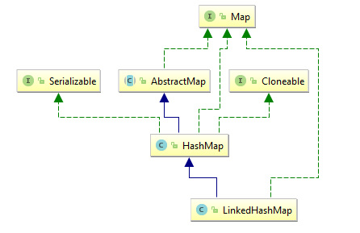

## LinkedHashMap.md

> LinkedHashMap，其中HashMap用于存储数据，"LinkedList"用于存储数据顺序

插入顺序使用

```java
 public static void main(String[] args) {
        Map<String, String> map = new LinkedHashMap<String, String>();
        map.put("1", "1");
        map.put("2", "2");
        map.put("3", "3");
        map.put("4", "4");

        Iterator iter = map.entrySet().iterator();

        while(iter.hasNext()){
            Map.Entry entry = (Map.Entry) iter.next();
            System.out.println(entry.getKey() + "=" + entry.getValue());
        }
    }
```


访问顺序使用

```java
  public static void main(String[] args) {
        Map<String, String> map = new LinkedHashMap<String, String>(16,0.75f,true);
        map.put("1", "1");
        map.put("2", "2");
        map.put("3", "3");
        map.put("4", "4");

        map.get("1");
        map.get("2");

        Iterator iter = map.entrySet().iterator();

        while(iter.hasNext()){
            Map.Entry entry = (Map.Entry) iter.next();
            System.out.println(entry.getKey() + "=" + entry.getValue());
        }
    }
Console
3=3
4=4
1=1
2=2
```


类图：




https://juejin.im/post/5ace2bde6fb9a028e25deca8

https://juejin.im/post/5a4b433b6fb9a0451705916f