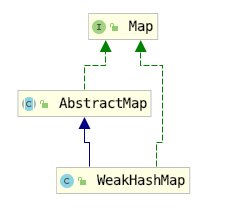

## 概括

它的特殊之处在于 *WeakHashMap* 里的`entry`可能会被GC自动删除，即使程序员没有调用`remove()`或者`clear()`方法。

更直观的说，当使用 *WeakHashMap* 时，即使没有显示的添加或删除任何元素，也可能发生如下情况：

> - 调用两次`size()`方法返回不同的值；
> - 两次调用`isEmpty()`方法，第一次返回`false`，第二次返回`true`；
> - 两次调用`containsKey()`方法，第一次返回`true`，第二次返回`false`，尽管两次使用的是同一个`key`；
> - 两次调用`get()`方法，第一次返回一个`value`，第二次返回`null`，尽管两次使用的是同一个对象。

## 场景

缓存

**WeekHashMap 的这个特点特别适用于需要缓存的场景**。在缓存场景下，由于内存是有限的，不能缓存所有对象；对象缓存命中可以提高系统效率，但缓存MISS也不会造成错误，因为可以通过计算重新得到。

当WeekHashMap中key指向的对象,只被key指向的时候,WeekHashMap会把对应的entry清理掉.

## 源码解析

## 参考

https://github.com/CarpenterLee/JCFInternals/blob/master/markdown/9-WeakHashMap.md