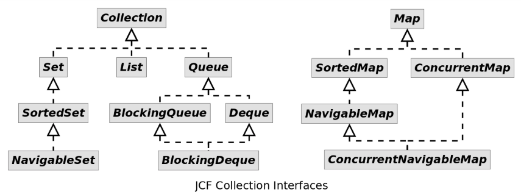
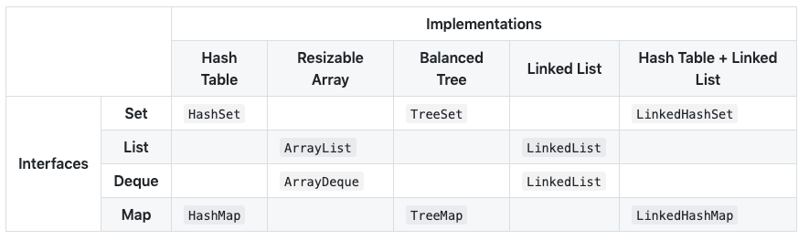

## 接口

为了规范容器的行为，统一设计，JCF定义了14种容器接口（collection interfaces），它们的关系如下图所示：

*Map*接口没有继承自*Collection*接口，因为*Map*表示的是关联式容器而不是集合。但Java为我们提供了从*Map*转换到*Collection*的方法，可以方便的将*Map*切换到集合视图。 上图中提供了*Queue*接口，却没有*Stack*，这是因为*Stack*的功能已被JDK 1.6引入的*Deque*取代。

## 实现

## 总结

